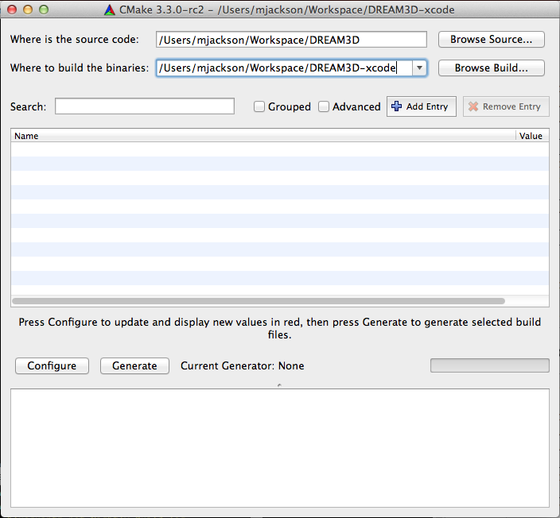
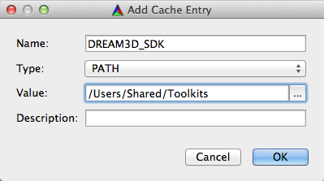
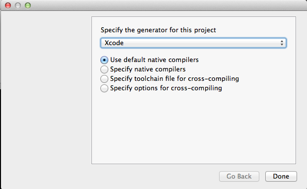
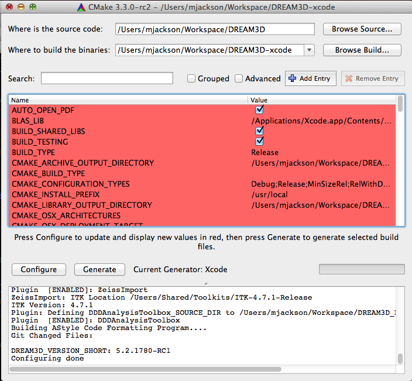

Compiling DREAM3D {#compilingdream3d}
========

# Preliminaries #

A Compiler suite for your Operating System (Visual Studio, Xcode, GCC). The following table lists the compilers that DREAM3D is commonly compiled against.

| Compiler Version | Notes |  
|  ------	| ------	|  
| Visual Studio 2013 Pro & Express/Community SP4 | 64 Bit builds |  
| Xcode 5.1.1 (or Greater) (OS X Version 10.8, 10.9, 10.10) | 64 bit Intel Only |  
| GCC 4.7.x or Clang (Ubuntu 14.04) | 64 Bit Intel Only |  

## Note for MinGW/MSys/Cygwin ##

Due to incompatibilities of HDF5 and these environments we can not support compiling DREAM3D using these environments. Visual Studio Community 2013 is Free for anyone to use and has no restrictions on the software produced and its distribution.

# Installing Dependent Libraries ##

A tutorial is available for [Windows 7/8](http://dream3d.bluequartz.net/?p=954) and [OS X](http://dream3d.bluequartz.net/?p=930) that covers the installation of a DREAM3D_SDK using either prebuilt binaries (Windows) or a shell script (OS X). Please use those web sites. The instructions below are for special cases where using the precompiled binaries is not a viable option for the developers environment.

# Building DREAM3D #

## Getting the Source Code ##

Use Git to clone the repository located [http://github.com/dream3d/dream3d](http://github.com/dream3d/dream3d).

## Getting Unit Test Data Files ##

Use Git to clone the repository located [http://github.com/dream3d/DREAM3D_Data](http://github.com/dream3d/DREAM3D_Data) into a location on your hard drive. **Be sure to adjust the DREAM3D_DATA_DIR variable to the appropriate location**. See next section.

## Setting up DREAM3D for CMake Configuration ##

Once the SDK is installed (Windows) or compiled (OS X, Linux) a file with the name DREAM3D_SDK.cmake can be found in the _DREAM3D\_SDK_ directory. This file defines all the installed locations of all of the dependent libraries.

Note that if you are on Linux or use something like MacPorts to install all the dependencies then you can substitute the appropriate paths instead of reusing the DREAM3D_SDK_ROOT variable. On linux, for example, if installing a dependency from a package-manager like apt-get one would set most of the installation locations to "/usr/". 

**Note: The paths may be different on your system**

When running CMake (either from the command line or from the GUI) be sure to set the CMake variable "DREAM3D_SDK=/Users/Shared/DREAM3D_SDK" (Or the correct path for your system). This should be all that is needed for a successful cmake configuration run.

## CMake configuration from the command line ##

	[user] $ cd DREAM3D
	[user] $ mkdir ../DREAM3D-Build && cd ../DREAM3D-Build
	[user] $ cmake -DDREAM3D_SDK=/Users/Shared/DREAM3D_SDK -DCMAKE_BUILD_TYPE=Debug ../DREAM3D

Once you have configured DREAM3D for building using CMake then simply open the generated solution file (DREAM3DProj.sln), Xcode project (DREAM3DProj.xcodeproject) or use **make** or **Ninja** from a terminal to compile DREAM3D.

	

 You may need to click configure a few times until all red highlights are gone. Once all red highlighted rows are gone then click the "Generate" button to generate your projects files.
 

