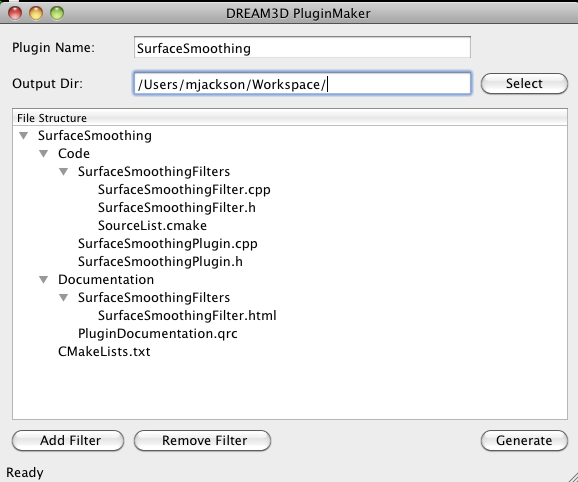

# DevHelper #

## Introduction ##

Creating a plugin for the DREAM.3D Application involves many different types of files being created and being placed in the correct positions in the project directory. To alleviate the developer of the tedious task of creating all of these files there is a shortcut that has been written using the CMake build system. Nicely enough there is a **DevHelper** application that the developer can launch and fill in a few pieces of information and then have all the files generated with skeleton source code. This minimal set of files will compile with DREAM.3D but will have no functionality. The developer now needs to add their own algorithms to filter the results and produce what they need. The program ensures that all the proper files are created, named and placed properly within a defined file structure.

## What is it used for? ##

## What is it *NOT* used for? ##

## How to use it ##

### Creating a Plugin ###

### Adding a filter to an existing plugin ###

