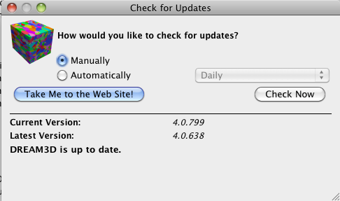

DREAM3D Development Notes {#developmentnotes}
=========

## Intro
  This is just a dumping ground for ideas that we are working on.

## Help Index Generation
Be able to automatically generate a cross referenced Help/Filter index. The index would allow the user to look up what filters produce which arrays. Ideally we would add something to the macros used in the DataCheck() function that would automatically add those arrays to some global index.

        struct CreatedArrayHelpIndexEntry
        {
        Filter Name
        Filter Human Label
        FIlter Group
        Filter SubGroup
        Array Default Name
        Array Group (Cell | Field | Ensemble )
        Array Type (int | float | double | ...)
        Num. Components
        Description
        }

This structure is implemented as a class in DREAM3DLib/Common/CreatedArrayHelpIndexEntry.h

What about using the QAssistant APIs to allow the user to search through the documentation files? Doesn't QAssistant index the files that you feed it?

-------------------
## Version Check Protocol (Started) ##

Create a user interface (see image below) based on a menu selection that displays a dialog that allows the user to check for an update to DREAM3D.

Initial implementation in _QtSupport/DREAM3DUpdateCheckDialog_

**Items to Complete**

+ Do we need to add a _close_ button to the UI?
+ The "How Often" Radio button needs to store the users selection and get this information back to the DREAM3D_UI class so it can be stored.
+ When reading the preferences on startup the code needs to be written to figure out if an update check needs to be run.
+ When quitting or closing the DREAM3DUpdateCheckDialog the settings from the dialog need to be saved back to the users preferences file
+ The code that does the actual update check (network code) may need to be extracted from the Dialog so it can be used without the dialog or just implement enough of an API in the DREAM3DUpdateCheckDialog class so that you can run the update check and get an answer without actually showing the dialog
    - What to do if there is an update? Pop up the dialog?
+ Users behind Proxy Servers will not be able to use this feature. We will need to put in a QNetworkProxy option at some point.

-------------------
## Having Hyperlinks in the Error Messages (Started) ##
Implemented an ItemDelegate in _QtSupport/HtmlItemDelegate.h_ file that will allow the use of limited HTML in the text. I was able to put in the hyperlinks but there are a few things wrong.

1. PipelineMessage that gets sent back has the "Human Label" for the filter and NOT the actual class name which is needed.
    + We need to find a way to get the actual class name passed through the PipelineMessage class. If you add another member variable to the PipelineMessage class then you will need to update ALL the source codes that call _addErrorMessage()_ which could be interesting or maybe you can use Polymorhphism to your advantage and call "getClassName()" from the "addErrorMessage()" method in the AbstractFilter class?
2. Text interaction is NOT allowed for the TableItemWidget or QTableView. This is going to need to be set either through QDesigner or through the code.

-------------------

## StatsGenerator Template File Selection ##

StatsGenerator should open to a dialog that displays a list of *templates* that the user can select from to build a synthetic structure. A tree structure to group the templates on the left with a grid of icons to choose from for that group on the right. 

+ QListView has this ability to show Icons. 
+ We need to create some sort of Icon.
+ We need to create all the template files
    - We need to also have the matching pipelines built for each file
+ The user can also select an empty statistics file and build up their own from that

-------------------
## Export Binary File
We should be able to export any of the arrays into a raw binary file for import into other analysis programs. The filter also may want to output a text file that describes the data in the file (Dims, type, endian ...)

-------------------
## Export Slice IPF Images ##

A filter to generate images of the grains with IPF coloring for XY/YZ/XZ planes. The filter would require the Crystal Structure Ensemble data and the Euler Angles.

-------------------
## H5EBSD & XDMF

Figure out a way to write an XDMF image for the H5EBSD files so we do not have to import into a DREAM3D, write the results, then load in ParaView.

## Grain Face Curvature Updates
Add user specified option to use the Normals for the fitting routine or NOT use the normals. Update documentation with some of the equations for the curve fitting portion of the calculation. Use LATEX to generate the equation images.

-------------------
## Surface Mesh Output

Figure out how to write an XDMF file that has a non-conformal mesh, ie, 2 triangles so the user can extract single grains. This can be solved with the use hyperslabs in the XDMF file. DREAM3D needs a class that can properly write those
hyperslabs

-------------------
## Parallelize Synthetic Generators

Initial threading of PackPrimaryGrains was performed using the parallel\_for() construct from the Threading Building Blocks (TBB) package. We are achieving a decent speed up on multi-core hardware. We could probably realize more speed ups just using more efficient algorithms.
   
Thread up the InsertPrecipitates code. It is essentially the same as the PackPrimaryGrains code.

-------------------
## DREAM3D Reader

Allow the data being read into DREAM3D to be appended to the data container if it does not already exist. Currently when reading the DREAM3D file the entire data containers are wiped out. If the same array is read then the user could have the option to over write the existing array with the data from the file. This opens up the ability to append files together or get data from several different sources.  

-------------------
## PipelineRunner Program

This program should be able to use as an input a Pipeline text file saved from the GUI. The requires the use of Qt libraries to read the .ini style file and the sometimes specially encoded QVariant class within the .ini file. In order to do this I tried linking against the generated widgets library and simply invoking a PipelineBuilderWidget class but Qt borked on that saying that we needed to have a QApplication running which is will probably start popping up QWidgets on the screen which is not really what we want.
  
One idea was to further break apart the QFilterWidget and to have something like a QFilterProxy object that holds the values from the gui but before the gui stuffs those values into the actual Filter instance object. The QFilterProxy would simply inherit from the QObject class so that we can use the QObject's property system which reading from the QSettings file is going to require. Either that or we generate a QFilterProxy file for each filter like we do for the QFilterWidgets which will add to the amount of code that needs to be compiled but should work in the long run.

-------------------
## Image Processing Library Addition

We need to probably include ITK, VTK, OpenCV or some other image processing library in DREAM3D if possible rather than writing each filter individually. Lets ride on the coat-tails of someone else.

-------------------
## Image Filters

Now that we can import an image we should create a filter that can export a volume as a stack of images and do the coloring based on one of the arrays in the Cell Data like grain Ids or IPF Colors.
Add option to the Image Image to collapse from RGBA to just RGB. There is also the filter that converts color images into gray scale images.

-------------------
## Execute External Program Filter

We should be able to write a filter that takes the location of a program and the arguments to that program and then DREAM3D will execute that program with the given arguments. Pair this up with the export/import of binary data or images and you now have a way to do somethings in DREAM3D, fork to MatLab or IDL and the bring the output data back into DREAM3D. If enough time we given I would use the Widget for "Comparison" Threshold filter so clicking the "+" button would add another argument. This may make it easier for the user to group their arguments together if the argument list is very long. The preflight would make sure the program is available and maybe show the output from the program?

-------------------
## Voxel Dimensions During Pipeline

What about adding this information to the QFilterWidget and a "pop-up" window or "disclosable" piece of information?

-------------------
## Python Bindings

  We need to figure out if it is possible to auto generate python bindings for DREAM3D. This would come in very handy for writing python scripts for processing of data and using other python frameworks like PyQt and Image processing libraries written in python.
  
-------------------
## Tutorials

  We need more tutorials on the following:
  
+  Synthetic Structures with all sorts of different types displayed and generated
+  Importing more data types
+  Meshing and Smoothing a volume
+  cleaning up a volume, ie, getting rid of "bad" data voxels.
+  Concrete examples of each filter and the before and after with images. (THIS IS WHERE AN IMAGE EXPORT filter would come in handy as one could almost automate some of this)

-------------------
## DREAM3D_SDK ##

Create a few more variations on the DREAM3D_SDK for Visual Studio 2008, 2010 and 2012. We may be able to create one for OS X but not so sure.

-------------------
## Updated Build Documentation
  Prebuilt binaries for the DREAM3D SDK might be nice if possible.

-------------------
## Developer Opportunities
  
+  FEM File formats
+  Improved Meshing (Surface and Volume)
+  Image processing Filters
+  Python Bindings
  

   
