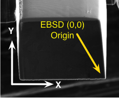

# EBSD HDF5 Data File Specification {#h5ebsdfile}

## Orientations, Reference Frames and Coordinate Systems
DREAM.3D's origin follows the sample coordinate system so that the physical location of the 0 row and 0 column voxel should visually appear in the lower left corner of a computer graphics display.

 "Sample Coordinate System (White) overlayed with EBSD Coordinate System (Yellow)")
@image latex Images/CoordinateSystem1.png "Sample Coordinate System (White) overlayed with EBSD Coordinate System (Yellow)" width=3in

Commercial EBSD acquisition systems do not typically follow this convention and DREAM.3D needs input from the user so that the proper transformations to the data can be applied during the Reconstruction and other analysis. Commercial EBSD software packages allow for some initial transformations of the data in which case the DREAM.3D environment does not have any way of determining if those transformations have already occured. During the import process the user is asked a few questions regarding the orientation of their EBSD data in relation to the sample coordinate system. Currently there are 3 items that must be answered otherwise undefined behavior may occur during any of the analysis algorithms.

- Some Commercial EBSD acquisition systems allow for a **scan rotation** which
rotates the sample coordinate system 180 degrees around the Z axis.
- Something here
- Should we rotate the Euler angles to bring them in line with the sample
reference frame?

## Introduction
The EBSD Data from multiple vendors are stored in a data file using the HDF5 file format library. While the general layout of the HDF5 file is the same between vendors there are details that are NOT the same between vendor because each vendors chooses to save different types of data. The top level datasets that deal with the basic volume information is the same for every file.

## HDF5 File Layout

### HDF5 Root Level Layout Specification

<table border="1px" cellspacing="3" cellpadding="2">
  <tr>
    <td colspan="4"> **H5Ebsd Specification** </td>
  </tr>
  <tr>
    <td colspan="4">Root Level Datasets and Groups</td>
  </tr>
<tr>
    <td>**Name**</td>
    <td>**HDF5 Type**</td>
    <td colspan="2">**Value**</td>
</tr>
<tr>
    <td>Index</td>
    <td>H5T_NATIVE_INT32</td>
    <td colspan="2">List of all Slice index values</td>
</tr>
<tr>
    <td>AlignEulers</td>
    <td>H5T_NATIVE_INT32</td>
    <td colspan="2"></td>
</tr>
<tr>
    <td>Manufacturer</td>
    <td>H5T_STRING</td>
    <td colspan="2">The **Manufacturer** currently is either _TSL_ or _HKL_</td>
</tr>
<tr>
    <td>Max X Points</td>
    <td>H5T_NATIVE_INT64</td>
    <td colspan="2">The maximum number of X points in the sample grid</td>
</tr>
<tr>
    <td>Max Y Points</td>
    <td>H5T_NATIVE_INT64</td>
    <td colspan="2">The maximum number of Y points in the sample grid</td>
</tr>
<tr>
    <td>ReorderArray</td>
    <td>H5T_NATIVE_UINT32</td>
    <td colspan="2">Reorder data into the correct reference frame</td>
</tr>
<tr>
    <td>RotateSlice</td>
    <td>H5T_NATIVE_UINT32</td>
    <td colspan="2">Rotate the data into the correct reference frame</td>
</tr>
<tr>
    <td>Stacking Order</td>
    <td>H5T_NATIVE_UINT32</td>
    <td colspan="2">Defines which slice corresponds to the Z=0 in the coordinate system. Optional Attribute
    of type H5T_STRING, with Name "Name" and Value ("Low To High" | "High To Low")</td>
</tr>
<tr>
    <td>X Resolution</td>
    <td>H5T_NATIVE_FLOAT</td>
    <td colspan="2">Resolution between sample points in the X direction</td>
</tr>
<tr>
    <td>Y Resolution</td>
    <td>H5T_NATIVE_FLOAT</td>
    <td colspan="2">Resolution between sample points in the Y direction</td>
</tr>
<tr>
    <td>Z Resolution</td>
    <td>H5T_NATIVE_FLOAT</td>
    <td colspan="2">Resolution between slices in the Z Direction</td>
</tr>
<tr>
    <td>ZEndIndex</td>
    <td>H5T_NATIVE_INT64</td>
    <td colspan="2">Starting Slice index</td>
</tr>
<tr>
    <td>ZStartIndex</td>
    <td>H5T_NATIVE_INT64</td>
    <td colspan="2">Ending Slice index (inclusive)</td>
</tr>
<tr>
    <td colspan="4">Slice Data organized by Slice index</td>
</tr>
</table>

### slicelayout Slice Group Specification

<table border="1px" cellspacing="3" cellpadding="2">
<tr>
    <td colspan="4"> **Slice Group Specification** </td>
</tr>
<tr>
  <td colspan="4">Each Slice is grouped into its own H5G_GROUP with the Name of
  the group simply the index of the slice. Within each slice group are 2 more groups
  with names **Data** and **Header**</td>
</tr>
<tr>
    <td>**Name**</td>
    <td>**HDF5 Type**</td>
    <td colspan="2">**Value**</td>
</tr>
<tr>
    <td>Data</td>
    <td>H5G_GROUP</td>
    <td colspan="2">Contains all the data columns</td>
</tr>
<tr>
    <td>Header</td>
    <td>H5G_GROUP</td>
    <td colspan="2">Contains all the header entries</td>
</tr>
</table>

## TSL Specification
 This section details the data to be imported from a .ang file into the .h5ebsd file
 
### TSL (.ang) Data Group Specification

<table border="1px" cellspacing="3" cellpadding="2">
<tr>
    <td colspan="4"> **TSL Data Group Specification** </td>
</tr>
<tr>
  <td colspan="4"></td>
</tr>
<tr>
    <td>**Name**</td>
    <td>**HDF5 Type**</td>
    <td colspan="2">**Value**</td>
</tr>
<tr>
    <td>Phi1</td>
    <td>H5T_NATIVE_FLOAT</td>
    <td colspan="2">Contains all the Phi1 data in a 1D Array with length equal to the total number of points.</td>
</tr>
<tr>
    <td>Phi</td>
    <td>H5T_NATIVE_FLOAT</td>
    <td colspan="2">Contains all the Phi data in a 1D Array with length equal to the total number of points.</td>
</tr>
<tr>
    <td>Phi2</td>
    <td>H5T_NATIVE_FLOAT</td>
    <td colspan="2">Contains all the Phi2 data in a 1D Array with length equal to the total number of points.</td>
</tr>
<tr>
    <td>X Position</td>
    <td>H5T_NATIVE_FLOAT</td>
    <td colspan="2">Contains all the X position data in a 1D Array with length equal to the total number of points.</td>
</tr>
<tr>
    <td>Y Position</td>
    <td>H5T_NATIVE_FLOAT</td>
    <td colspan="2">Contains all the Y position data in a 1D Array with length equal to the total number of points.</td>
</tr>
<tr>
    <td>Image Quality</td>
    <td>H5T_NATIVE_FLOAT</td>
    <td colspan="2">Contains all the Image Quality data in a 1D Array with length equal to the total number of points.</td>
</tr>
<tr>
    <td>Confidence Index</td>
    <td>H5T_NATIVE_FLOAT</td>
    <td colspan="2">Contains all the Confidence Index data in a 1D Array with length equal to the total number of points.</td>
</tr>
<tr>
    <td>PhaseData</td>
    <td>H5T_NATIVE_INT32</td>
    <td colspan="2">Contains all the PhaseData data in a 1D Array with length equal to the total number of points.</td>
</tr>
<tr>
    <td>SEM Signal</td>
    <td>H5T_NATIVE_FLOAT</td>
    <td colspan="2">Contains all the SEM Signal data in a 1D Array with length equal to the total number of points.</td>
</tr>
<tr>
    <td>Fit</td>
    <td>H5T_NATIVE_FLOAT</td>
    <td colspan="2">Contains all the Fit of Solution data in a 1D Array with length equal to the total number of points.</td>
</tr>
</table>

### TSL (.ang) Header Group Specification

<table border="1px" cellspacing="3" cellpadding="2">
<tr>
    <td colspan="4"> **TSL Header Group Specification** </td>
</tr>
<tr>
  <td colspan="4"></td>
</tr>
<tr>
    <td>**Name**</td>
    <td>**HDF5 Type**</td>
    <td colspan="2">**Value**</td>
</tr>
<tr>
    <td>OriginalFile</td>
    <td>H5T_STRING</td>
    <td colspan="2">Path to the .ctf file that was imported</td>
</tr>
<tr>
    <td>OriginalHeader</td>
    <td>H5T_STRING</td>
    <td colspan="2">Contains the original header from the imported .ctf file</td>
</tr>
<tr>
    <td>TEM_PIXperUM</td>
    <td>H5T_NATIVE_FLOAT</td>
    <td colspan="2">Contains value for the header entry TEM_PIXperUM</td>
</tr>
<tr>
    <td>x-star</td>
    <td>H5T_NATIVE_FLOAT</td>
    <td colspan="2">Contains value for the header entry x-star</td>
</tr>
<tr>
    <td>y-star</td>
    <td>H5T_NATIVE_FLOAT</td>
    <td colspan="2">Contains value for the header entry y-star</td>
</tr>
<tr>
    <td>z-star</td>
    <td>H5T_NATIVE_FLOAT</td>
    <td colspan="2">Contains value for the header entry z-star</td>
</tr>
<tr>
    <td>WorkingDistance</td>
    <td>H5T_NATIVE_FLOAT</td>
    <td colspan="2">Contains value for the header entry WorkingDistance</td>
</tr>
<tr>
    <td>ElasticConstants</td>
    <td>H5T_STRING</td>
    <td colspan="2">Contains value for the header entry ElasticConstants</td>
</tr>
<tr>
    <td>GRID</td>
    <td>H5T_STRING</td>
    <td colspan="2">Contains value for the header entry GRID</td>
</tr>
<tr>
    <td>XSTEP</td>
    <td>H5T_NATIVE_FLOAT</td>
    <td colspan="2">Contains value for the header entry XSTEP</td>
</tr>
<tr>
    <td>YSTEP</td>
    <td>H5T_NATIVE_FLOAT</td>
    <td colspan="2">Contains value for the header entry YSTEP</td>
</tr>
<tr>
    <td>NCOLS_ODD</td>
    <td>H5T_NATIVE_INT32</td>
    <td colspan="2">Contains value for the header entry NCOLS_ODD</td>
</tr>
<tr>
    <td>NCOLS_EVEN</td>
    <td>H5T_NATIVE_INT32</td>
    <td colspan="2">Contains value for the header entry NCOLS_EVEN</td>
</tr>
<tr>
    <td>NROWS</td>
    <td>H5T_NATIVE_INT32</td>
    <td colspan="2">Contains value for the header entry NROWS</td>
</tr>
<tr>
    <td>OPERATOR</td>
    <td>H5T_STRING</td>
    <td colspan="2">Contains value for the header entry OPERATOR</td>
</tr>
<tr>
    <td>SAMPLEID</td>
    <td>H5T_STRING</td>
    <td colspan="2">Contains value for the header entry SAMPLEID</td>
</tr>
<tr>
    <td>SCANID</td>
    <td>H5T_STRING</td>
    <td colspan="2">Contains value for the header entry SCANID</td>
</tr>
<tr>
    <td>Phases</td>
    <td>H5G_GROUP</td>
    <td colspan="2">Group that contains a subgroup for each phase where the name
    of each subgroup is simply the index of the phase starting at 1.</td>
</tr>
</table>

### TSL (.ang) Phase Group Specification

<table border="1px" cellspacing="3" cellpadding="2">
<tr>
    <td colspan="4"> **TSL Phase Group Specification** </td>
</tr>
<tr>
  <td colspan="4"></td>
</tr>
<tr>
    <td>**Name**</td>
    <td>**HDF5 Type**</td>
    <td colspan="2">**Value**</td>
</tr>
<tr>
    <td>Categories</td>
    <td>H5T_NATIVE_INT32</td>
    <td colspan="2"></td>
</tr>
<tr>
    <td>Formula</td>
    <td>H5T_STRING</td>
    <td colspan="2"></td>
</tr>
<tr>
    <td>Info</td>
    <td>H5T_STRING</td>
    <td colspan="2"></td>
</tr>
<tr>
    <td>LatticeConstants</td>
    <td>H5T_NATIVE_FLOAT</td>
    <td colspan="2"></td>
</tr>
<tr>
    <td>LatticeConstants</td>
    <td>H5T_STRING</td>
    <td colspan="2"></td>
</tr>
<tr>
    <td>NumberFamilies</td>
    <td>H5T_NATIVE_INT32</td>
    <td colspan="2"></td>
</tr>
<tr>
    <td>Phase</td>
    <td>H5T_NATIVE_INT32</td>
    <td colspan="2"></td>
</tr>
<tr>
    <td>Symmetry</td>
    <td>H5T_NATIVE_INT32</td>
    <td colspan="2"></td>
</tr>
<tr>
    <td>hklFamilies</td>
    <td>H5G_GROUP</td>
    <td colspan="2">Contains all the HKL Family information where the number of datasets
    contained in this group is the number of HKL Families</td>
</tr>
</table>

### TSL (.ang) HKLFamily Group Specification

<table border="1px" cellspacing="3" cellpadding="2">
<tr>
    <td colspan="4"> **TSL HKLFamily Group Specification** </td>
</tr>
<tr>
  <td colspan="4"></td>
</tr>
<tr>
    <td>**Name**</td>
    <td>**HDF5 Type**</td>
    <td colspan="2">**Value**</td>
</tr>
<tr>
    <td>{Based on Index of the family}. If there are 4 families then there are 4
    data sets with names "0", "1", "2" and "3".</td>
    <td>Custom: See Below</td>
    <td colspan="2">typedef struct
{@n
    int h;@n
    int k;@n
    int l;@n
    int s1;@n
    float diffractionIntensity;@n
    int s2;@n
} HKLFamily_t;</td>
</tr>
</table>

## HKL Specification
 This section details the data to be imported from a .ctf file into the .h5ebsd file

### HKL (.ctf) Data Group Specification

<table border="1px" cellspacing="3" cellpadding="2">
<tr>
    <td colspan="4"> **HKL Data Group Specification** </td>
</tr>
<tr>
  <td colspan="4">1D Array of Values where the number of elements in the array is equal to the total number of points per 2D Slice.</td>
</tr>
<tr>
    <td>**Name**</td>
    <td>**HDF5 Type**</td>
    <td colspan="2">**Value**</td>
</tr>
<tr>
    <td>Phase</td>
    <td>H5T_NATIVE_INT32</td>
    <td colspan="2"></td>
</tr>
<tr>
    <td>X</td>
    <td>H5T_NATIVE_FLOAT</td>
    <td colspan="2"></td>
</tr>
<tr>
    <td>Y</td>
    <td>H5T_NATIVE_FLOAT</td>
    <td colspan="2"></td>
</tr>
<tr>
    <td>Z</td>
    <td>H5T_NATIVE_FLOAT</td>
    <td colspan="2">Note that this ONLY appears in a "3D" .ctf data file</td>
</tr>
<tr>
    <td>Bands</td>
    <td>H5T_NATIVE_INT32</td>
    <td colspan="2"></td>
</tr>
<tr>
    <td>Error</td>
    <td>H5T_NATIVE_INT32</td>
    <td colspan="2"></td>
</tr>
<tr>
    <td>Euler1</td>
    <td>H5T_NATIVE_FLOAT</td>
    <td colspan="2">In 2D files these are in Degrees. In 3D files these are in Radians</td>
</tr>
<tr>
    <td>Euler2</td>
    <td>H5T_NATIVE_FLOAT</td>
    <td colspan="2">In 2D files these are in Degrees. In 3D files these are in Radians</td>
</tr>
<tr>
    <td>Euler3</td>
    <td>H5T_NATIVE_FLOAT</td>
    <td colspan="2">In 2D files these are in Degrees. In 3D files these are in Radians</td>
</tr>
<tr>
    <td>MAD</td>
    <td>H5T_NATIVE_FLOAT</td>
    <td colspan="2"></td>
</tr>
<tr>
    <td>BD</td>
    <td>H5T_NATIVE_INT32</td>
    <td colspan="2"></td>
</tr>
<tr>
    <td>BS</td>
    <td>H5T_NATIVE_INT32</td>
    <td colspan="2"></td>
</tr>
<tr>
    <td>GrainIndex</td>
    <td>H5T_NATIVE_INT32</td>
    <td colspan="2"></td>
</tr>
<tr>
    <td>GrainRandomColourR</td>
    <td>H5T_NATIVE_UINT8</td>
    <td colspan="2"></td>
</tr>
<tr>
    <td>GrainRandomColourG</td>
    <td>H5T_NATIVE_UINT8</td>
    <td colspan="2"></td>
</tr>
<tr>
    <td>GrainRandomColourB</td>
    <td>H5T_NATIVE_UINT8</td>
    <td colspan="2"></td>
</tr>
</table>

### HKL (.ctf) Header Specification

<table border="1px" cellspacing="3" cellpadding="2">
<tr>
    <td colspan="4"> **TSL HKLFamily Group Specification** </td>
</tr>
<tr>
  <td colspan="4"></td>
</tr>
<tr>
    <td>**Name**</td>
    <td>**HDF5 Type**</td>
    <td colspan="2">**Value**</td>
</tr>
<tr>
    <td>OriginalFile</td>
    <td>H5T_STRING</td>
    <td colspan="2">Path to the .ctf file that was imported</td>
</tr>
<tr>
    <td>OriginalHeader</td>
    <td>H5T_STRING</td>
    <td colspan="2">Contains the original header from the imported .ctf file</td>
</tr>
<tr>
    <td>Prj</td>
    <td>H5T_STRING</td>
    <td colspan="2">Contains value for the header entry Prj</td>
</tr>
<tr>
    <td>Author</td>
    <td>H5T_STRING</td>
    <td colspan="2">Contains value for the header entry Author</td>
</tr>
<tr>
    <td>JobMode</td>
    <td>H5T_STRING</td>
    <td colspan="2">Contains value for the header entry JobMode</td>
</tr>
<tr>
    <td>XCells</td>
    <td>H5T_NATIVE_INT32</td>
    <td colspan="2">Contains value for the header entry XCells</td>
</tr>
<tr>
    <td>YCells</td>
    <td>H5T_NATIVE_INT32</td>
    <td colspan="2">Contains value for the header entry YCells</td>
</tr>
<tr>
    <td>XStep</td>
    <td>H5T_NATIVE_FLOAT</td>
    <td colspan="2">Contains value for the header entry XStep</td>
</tr>
<tr>
    <td>YStep</td>
    <td>H5T_NATIVE_FLOAT</td>
    <td colspan="2">Contains value for the header entry YStep</td>
</tr>
<tr>
    <td>ZStep</td>
    <td>H5T_NATIVE_FLOAT</td>
    <td colspan="2">Contains value for the header entry ZStep</td>
</tr>
<tr>
    <td>ZCells</td>
    <td>H5T_NATIVE_FLOAT</td>
    <td colspan="2">Contains value for the header entry ZCells</td>
</tr>
<tr>
    <td>AcqE1</td>
    <td>H5T_NATIVE_FLOAT</td>
    <td colspan="2">Contains value for the header entry AcqE1</td>
</tr>
<tr>
    <td>AcqE2</td>
    <td>H5T_NATIVE_FLOAT</td>
    <td colspan="2">Contains value for the header entry AcqE2</td>
</tr>
<tr>
    <td>AcqE3</td>
    <td>H5T_NATIVE_FLOAT</td>
    <td colspan="2">Contains value for the header entry AcqE3</td>
</tr>
<tr>
    <td>Mag</td>
    <td>H5T_NATIVE_INT32</td>
    <td colspan="2">Contains value for the header entry Mag</td>
</tr>
<tr>
    <td>Coverage</td>
    <td>H5T_NATIVE_INT32</td>
    <td colspan="2">Contains value for the header entry Coverage</td>
</tr>
<tr>
    <td>Device</td>
    <td>H5T_NATIVE_INT32</td>
    <td colspan="2">Contains value for the header entry Device</td>
</tr>
<tr>
    <td>KV</td>
    <td>H5T_NATIVE_INT32</td>
    <td colspan="2">Contains value for the header entry KV</td>
</tr>
<tr>
    <td>TiltAngle</td>
    <td>H5T_NATIVE_FLOAT</td>
    <td colspan="2">Contains value for the header entry TiltAngle</td>
</tr>
<tr>
    <td>TiltAxis</td>
    <td>H5T_NATIVE_FLOAT</td>
    <td colspan="2">Contains value for the header entry TiltAxis</td>
</tr>
<tr>
    <td>Phases</td>
    <td>H5G_GROUP</td>
    <td colspan="2">Group that contains a subgroup for each phase where the name
    of each subgroup is simply the index of the phase starting at **1.**</td>
</tr>
</table>

### HKL (.ctf) Phase Group Specification

<table border="1px" cellspacing="3" cellpadding="2">
<tr>
    <td colspan="4"> **TSL Phase Group Specification** </td>
</tr>
<tr>
  <td colspan="4"></td>
</tr>
<tr>
    <td>**Name**</td>
    <td>**HDF5 Type**</td>
    <td colspan="2">**Value**</td>
</tr>
<tr>
    <td>Comment</td>
    <td>H5T_STRING</td>
    <td colspan="2">Contains value for the header entry Comment</td>
</tr>
<tr>
    <td>Internal1</td>
    <td>H5T_STRING</td>
    <td colspan="2">Contains value for the header entry Internal1</td>
</tr>
<tr>
    <td>Internal2</td>
    <td>H5T_STRING</td>
    <td colspan="2">Contains value for the header entry Internal2</td>
</tr>
<tr>
    <td>LatticeAngles</td>
    <td>H5T_NATIVE_FLOAT</td>
    <td colspan="2">Contains value for the header entry Lattice Angles in a 1x3 array</td>
</tr>
<tr>
    <td>LatticeDimensions</td>
    <td>H5T_NATIVE_FLOAT</td>
    <td colspan="2">Contains value for the header entry Lattice Dimensions in a 1x3 array</td>
</tr>
<tr>
    <td>LaueGroup</td>
    <td>H5T_NATIVE_INT32</td>
    <td colspan="2">Contains value for the header entry LaueGroup plus an H5T_STRING Attribute which is the string name of the Laue Group@n
    for example "Hexagonal-High 6/mmm"</td>
</tr>
<tr>
    <td>SpaceGroup</td>
    <td>H5T_NATIVE_INT32</td>
    <td colspan="2">Contains value for the header entry SpaceGroup</td>
</tr>
<tr>
    <td>PhaseName</td>
    <td>H5T_STRING</td>
    <td colspan="2">Contains value for the header entry PhaseName</td>
</tr>
</table>

## h5ebsd3 Detailed Description

The **Stacking Order** refers to the order in which the z slices are stacked
together when they are read from the file. The enumerations are also in the
EbsdLibConstants.h header file.

As a further explanation if the ordering is **"Low To High"** then the slice with the lowest number is positioned at Z=0 in 3D Cartesian space. For example if your data set is numbered from 23 to 86 with file names of the form Slice\_023.ang and you select "Low To High" then the data inside of file Slice\_023.ang will be positioned at Z=0 during any method that has to deal with the data. The opposite of this is if the user were to select to have their data **"High to Low"** in which case the file with name Slice\_086.ang will be positioned at Z=0 and the file with name "Slice_023.ang" will be positioned at Z=64.

 
