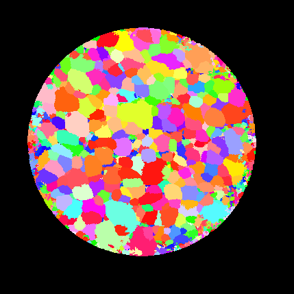
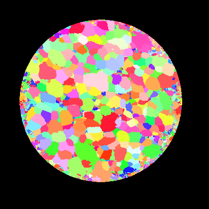
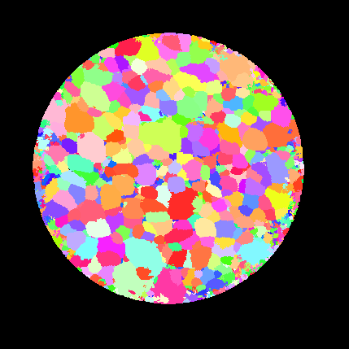

# Reference Frame Notes #

When dealing with **orientation** data such as Euler angles, Quaternions and Rodrigues vectors, the user will often need to ensure that the proper convention is followed to transform data from the **sample** reference frame to the **crystal** reference frame. DREAM.3D makes the following assumptions about reference frames:

+ Only Passive Rotations are used, i.e., rotations between reference frames;
+ A rotations always transforms the **sample** reference frame to the **crystal** reference frame.

DREAM.3D can represent orientations in seven different forms:

| Name | Abbr. | Number of Components |
|------|-----|-----------------|
| Eulers | e | 3 |
| Rodrigues | r | 4 |
| Orientation Matrix | o | 3x3 |
| Quaternion | q | 4 (< x, y, z > w) Note the order of the data. Vector-Scalar |
| Axis-Angle | a | 4 (< ax0, ax1, ax2 >, w)
| Cubochoric | c | 3 |
| Homochoric | h | 3 |

## Master Table of Available Conversions ##

In many cases, a direct transformation is available from one representation to another; in some cases, an intermediate representation is used, e.g., from homochoric (h) to Euler (e), DREAM.3D first transforms to an axis angle pair (a), then to an orientation matrix (o), and finally to Euler angles.

| From/To |  e   |  o   |  a   |  r   |  q   |  h   |  c   |
|  -      |  -   |  -   |  -   |  -   |  -   |  -   |  -   |
|  e      |  -   |  X   |  X   |  X   |  X   |  a   | ah   |
|  o      |  X   |  --  |  X   |  e   |  X   |  a   | ah   |
|  a      |  o   |  X   | --   |  X   |  X   |  X   |  h   |
|  r      |  o   |  a   |  X   | --   |  a   |  X   |  h   |
|  q      |  X   |  X   |  X   |  X   | --   |  X   |  h   |
|  h      |  ao  |  a   |  X   |  a   |  a   | --   |  X   |
|  c      | hao  |  ha  |  h   |  ha  | ha   |  X   | --   |

## Filters to Assist the User ##

When importing EBSD data through the various readers (.ang, .ctf files), there are a number of filters that can assist the user in performing the necessary transformations. The following is a non-exhaustive list of filters that will help the user perform various manipulations on the orientation data.

**NOTE:** When importing data generated by non-EBSD instruments, it is very important to know what conventions were used to represent the rotations/orientations; an incorrect interpretation of these conventions **will** lead to incorrect results.

| Filter | Discussion |
|--------|------------|
| Rotate Euler Reference Frame | This will rotate the Crystal Reference frame. Input Orientation Data is possibly changed |
| Rotate Sample Reference Frame | This will rotate the actual data into new locations in an Image Geometry array |
| Rodrigues Convertor | DREAM.3D expects Rodrigues vectors to have 4 components, where the 4th component is the length of the vector. This filter will convert 3 component Rodrigues vectors to the internal 4 component convention |
| Generate Quaternion Conjugate | This uses an input set of Quaternions and generates the conjugate quaternions. A copy of the input array is made and changes are made to that array |
| Generate Orientation Matrix Transpose | This will generate the transpose of an array of 3x3 matrices. A copy of the input array is made and changes are made to that array |

## Examples of what can go wrong ##

In this section, we show an IPF generated from data imported from a LabDCT experiment. The LabDCT input data provided 3 component Rodrigues vectors which were converted to the 4 component internal format. The LabDCT program generated the IPF on the left, and DREAM.3D generated the IPF on the right, after application of the Rodrigues vector conversion. Note that while some of the grain colors match up, most do not. This is because the LabDCT output was generated with the convention that a rotation transforms the **Crystal** reference frame  to the **Sample** reference frame, *which is the opposite of what DREAM.3D expects*.

| LabDCT Generated IPF 001 Colors | DREAM.3D Generated IPF 001 Colors |
|---------------------------------|-----------------------------------|
|    |  |

While both transformations (Crystal-to-Sample and Sample-to-Crystal) are passive rotations (they convert reference frames into one another), the transformations are each other's inverse. DREAM.3D always expects a rotation angle to be positive and in the interval [0,pi]; thus, computing the inverse of a rotation involves changing the sign of the rotation axis unit vector.  Depending on the rotation representation, the inverse of a rotation can then be implemented by computation of:

+ the negative of the 3-component Rodrigues vector (use the Attribute Array Calculator filter) [note that this also works for the homochoric and cubochoric representations, and for the axis vector of the axis-angle pair]
+ the conjugate of the Quaternion (Generate Quaternion Conjugate filter)
+ the transpose of the Orientation Matrix (Generate Orientation Matrix Transpose filter)

When the input LabDCT Rodrigues vectors are multiplied by -1 **before** conversion to the internal 4-component format, then the following IPF is generated, showing perfect agreement with the original LabDCT IPF map. This example shows that it is absolutely crucial to know and understand the conventions that were used to generate orientation data in any type of diffraction experiment **and** to ensure that the correct conversions are applied upon loading the data into DREAM.3D.

