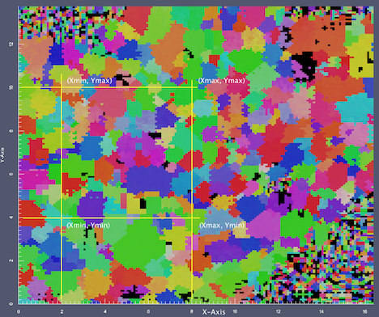
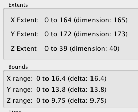
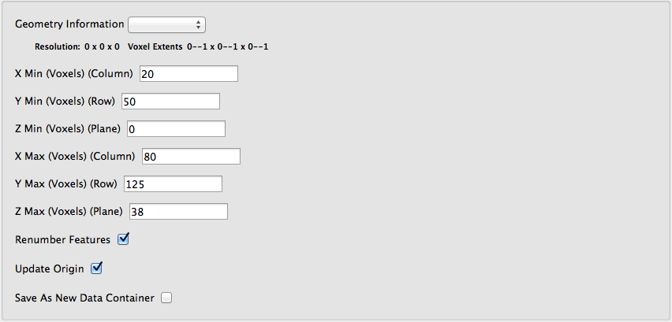
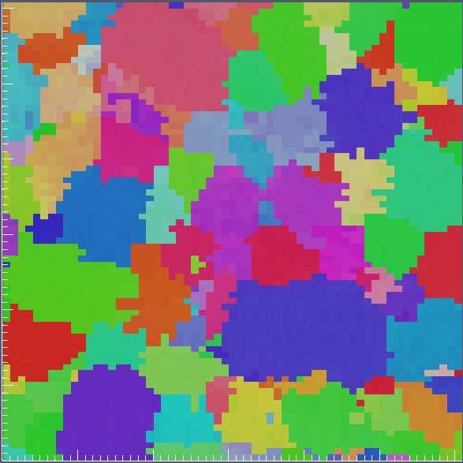

# Cropping Data  #

Cropping data in DREAM.3D can help reduce the time for processing by removing data that the user decides should not be analyzed. The **Filter** that accomplishes this task is the [Crop Image Geometry](@ref cropimagegeometry) **Filter**. Note that since this **Filter** uses 3D voxel indices as the minimum and maximum values that define the region of interest, it will _only_ work on **Image Geometries**. The easiest way to work through cropping the data is to initially run a **Pipeline** that writes out a .dream3d file and then load the .xdmf file into [ParaView](http://www.paraview.org). In the _Information_ tab, ParaView will display the extents of the data. For this example, note that the data extent in voxels is [(0, 164), (0, 172), (0, 39)] and in real space units (microns) is [(0, 16.4), (0, 13.8), (0, 9.75)]. These units correspond to a resolution of (0.1, 0.08, 0.25).

-----

-----

 Because the display in ParaView shows the values in microns, you need to convert those values to voxels (or just estimate if that is good enough). For this example, we want to crop out a section from (2, 8) in *X* and (4, 10) in *Y*, while capturing all of *Z*.

-------

------

The general formula to figure this out is the following.

    (real space) * (resolution) = voxel

Applying this to the sample data gives the following table:

| Axis | Min | Max |
|---------|-----|-----|
| X | 2 / 0.1 = 20 | 8 / 0.1 = 80 |
| Y | 4 / 0.08 = 50 | 10 / 0.08 = 125 |
| Z | 0 / 0.25 = 0 | 9.75 / 0.25 = 39 -1 |

**We subtract 1 from the max Z value because the internal arrays are zero based!**

These voxel values can then be entered into the [Crop Image Geometry](@ref cropimagegeometry) **Filter**.

------

------

After the **Filter** executes, the data from the volume of interest is cropped out.

