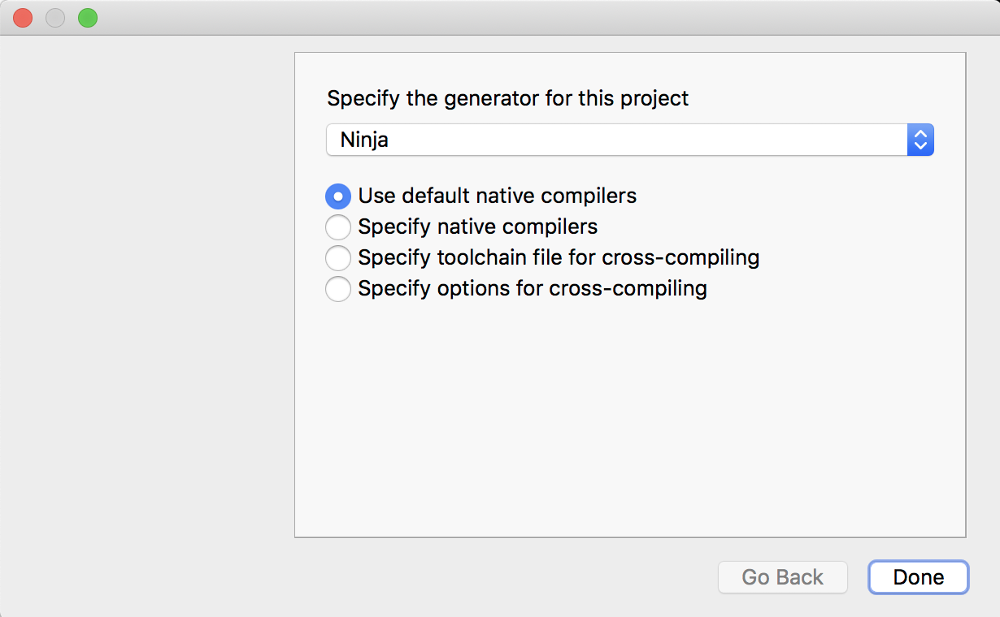

# macOS Build Instructions #

Follow the instructions to create an SDK here.

[Making_an_SDK_OSX](https://github.com/bluequartzsoftware/DREAM3DSuperbuild/blob/develop/docs/Making_an_SDK_OSX.md)

## Downloading Required Repositories ##

DREAM3D is build from several Git repositories all hosted at [http://www.github.com/bluequartzsoftware](http://www.github.com/bluequartzsoftware). Those repositories are:

    http://www.github.com/bluequartzsoftware/CMP
    http://www.github.com/bluequartzsoftware/SIMPL
    http://www.github.com/bluequartzsoftware/SIMPLView
    http://www.github.com/bluequartzsoftware/DREAM3D

There are a few optional repositories if the developer wants to mirror as close as possible the 
official DREAM.3D releases. Those are:

    http://www.github.com/bluequartzsoftware/ITKImageProcessing
    http://www.github.com/bluequartzsoftware/SimulationIO
    http://www.github.com/dream3d/DREAM3DReview
    http://www.github.com/dream3d/ImageProcessing
    http://www.github.com/dream3d/UCSBUtilities

These repositories should be cloned into a directory structure that matches the following:

    /Users/[USER-NAME]/Workspace/CMP
    /Users/[USER-NAME]/Workspace/SIMPL
    /Users/[USER-NAME]/Workspace/SIMPLView
    /Users/[USER-NAME]/Workspace/DREAM3D
    /Users/[USER-NAME]/Workspace/DREAM3D_Plugins/
    /Users/[USER-NAME]/Workspace/DREAM3D_Plugins/DREAM3DReview
    /Users/[USER-NAME]/Workspace/DREAM3D_Plugins/ITKImageProcessing
    /Users/[USER-NAME]/Workspace/DREAM3D_Plugins/SimulationIO
    /Users/[USER-NAME]/Workspace/DREAM3D_Plugins/UCSBUtilities

The "/Users/\[USER-NAME\]/Workspace" prefix can be what ever the developer wants it to be. Anything under that prefix is mandatory. For example if the developer wants to use /opt/DREAM3D-Dev that is entirely possible or C:/Users/you/Desktop/DREAM3D-Dev on Windows. The following shell script can be used to
efficiently clone all the repositories. This script shouls also work in Windows from 
a MSysGit Bash terminal.

    #!/bin/sh
    DEV_ROOT=$HOME/DREAM3D-Dev
    BRANCH=develop
    mkdir $DEV_ROOT
    cd $DEV_ROOT
    git clone -b ${BRANCH} ssh://git@github.com/bluequartzsoftware/CMP
    git clone -b ${BRANCH} ssh://git@github.com/bluequartzsoftware/SIMPL
    git clone -b ${BRANCH} ssh://git@github.com/bluequartzsoftware/SIMPLView
    git clone -b ${BRANCH} ssh://git@github.com/bluequartzsoftware/DREAM3D
    mkdir DREAM3D_Plugins
    cd DREAM3D_Plugins
    git clone -b ${BRANCH} ssh://git@github.com/bluequartzsoftware/ITKImageProcessing
    git clone -b ${BRANCH} ssh://git@github.com/bluequartzsoftware/SimulationIO
    git clone -b ${BRANCH} ssh://git@github.com/dream3d/DREAM3DReview
    git clone -b ${BRANCH} ssh://git@github.com/dream3d/ImageProcessing
    git clone -b ${BRANCH} ssh://git@github.com/dream3d/UCSBUtilities
    echo "Creating Build Directory...."
    cd $DEV_ROOT
    mkdir DREAM3D-Build

## Setup ##

+ If you are using _Makefiles_ or _Ninja_ as your build system you will need to decide which type of
build you would like: **Debug** or **Release**.
+ If you are using QtCreator the default is to use _Makefiles_ but QtCreator itself will try to configure the project.
+ If you are using Xcode you don't need to worry about setting the build type.
+ You will need to remember where you installed the *DREAM3D_SDK*.

The following example assumes that the DREAM3D_SDK is located in **/Users/Shared/DREAM3D_SDK** and you have another directory **/Users/[USER-NAME]/Workspace/** that has the DREAM3D sources:

## Run CMake (GUI) ##

Launch the "CMake-Gui.app" and fill in the *Where is the source code* and * "Where to build the binaries* text fields in a similar manner to shown in the following image.

Set a few CMake variables that are needed. The most important is the *DREAM3D\_SDK* variable. This should point to the DREAM3D_SDK directory. See the image for an example.

The next two variables are only important if you are going to use an IDE or command line development that does *NOT* include Xcode.

+ CMAKE_MAKE_PROGRAM should point to the _ninja_ executable that either already exixts or was downloaded from [GitHub](https://github.com/ninja-build/ninja/releases)

+ CMAKE_BUILD_TYPE should be set to either Debug or Release. If you are using Xcode this does *NOT* need to be set

Once those cache variables are set your CMake-Gui window should look something like below.

Click the "Configure" button and then select the type of *Generator*. Once this is set it *cannot* be changed without a complete recompile of DREAM3D. (*NOT* the SDK, just the sources). CMake has the idea that each _type_ of build (Debug or Release) should be placed in a separate directory (unless Visual Studio or Xcode is being used). 

Once you have selected the generator, click the *Done* button to start the configuration.

If CMake was able to find everything on your system then the developer only needs to now click the *Generate* button.

The *Generate* step is what actually creates the IDE files or the ninja/makefiles. As a short cut and if you are sure all the settings are correct you can just click the Generate button and CMake will rerun a Configure step and *then* run the generate step.

You are now ready to compile DREAM3D using either the command line or the IDE. If you are using Xcode then you should open the DREAM3DProj.xcodeproj file and use Xcode to build DREAM.3D.

## Run CMake (Command Line) ##

Invoke CMake with the following command

    [user@host] $ cd /Users/[USER-NAME]/Workspace
    [user@host] $ mkdir DREAM3D-Builds
    [user@host] $ cd DREAM3D-Builds
    [user@host] $ mkdir Release
    [user@host] $ cd Release
    [user@host] $ cmake -G Ninja -DDREAM3D_SDK=/PATH/TO/DREAM3D_SDK -DCMAKE_BUILD_TYPE=Release ../../DREAM3D

This will tell _CMake_ to configure a build (binary) folder (the current folder) and also generate the build files. In this example we are using the **Ninja** build system. Most Linux/MacOS distributions will need to install this. You can either use your package manager (ninja-build) or download a binary from [GitHub](https://github.com/ninja-build/ninja/releases). An alternate method is to just use the default _Makefiles_ which can be done in the following way:

    [user@host] $ cd /Users/[USER-NAME]/Workspace
    [user@host] $ mkdir DREAM3D-Builds
    [user@host] $ cd DREAM3D-Builds
    [user@host] $ mkdir Release
    [user@host] $ cd Release
    [user@host] $ cmake -DDREAM3D_SDK=/PATH/TO/DREAM3D_SDK -DCMAKE_BUILD_TYPE=Release ../../DREAM3D

Assuming that nothing goes wrong you are now ready to compile DREAM.3D. Using the command prompt again to issue either the _make_ or _ninja_ commands depending on what you using when configuring.

    [user@host] $ ninja

or

    [user@host] $ make -j

Once the compilation is complete the DREAM.3D executable will be located in "/Users/[USER-NAME]/Workspace/DREAM3D-Builds/Release/Bin". The user can then just execute the program like usual.

## Packaging ##

If you would like to build a redistributable package then from within the build directory issue the "cpack" command.

    [user@host] $ cpack.

When that ends there will be a "DREAM3D_XXXXXXXXX.tar.gz" file in the "/Users/[USER-NAME]/Workspace/DREAM3D-Builds/Release" directory.
