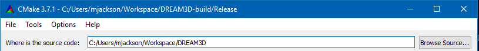
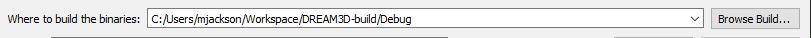
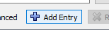
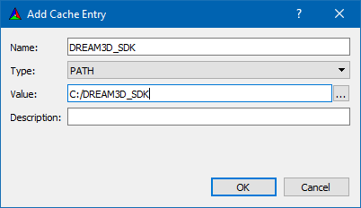
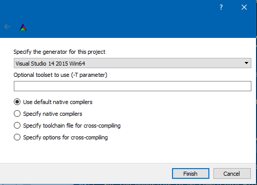
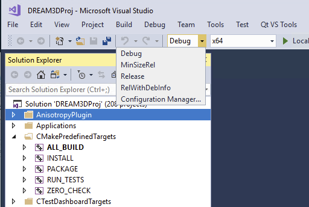
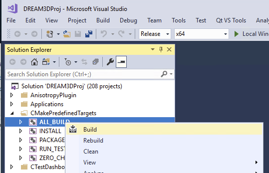
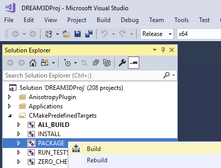

# Configuring and Building DREAM.3D on Windows #

[Windows SDK Instructions](https://github.com/bluequartzsoftware/DREAM3DSuperbuild/blob/develop/docs/Making_an_SDK_Windows.md)

Next, download the source code repositories by following the instructions on the [SourceDownload](SourceDownload/index.html) page.

## Setup ##

DREAM.3D is built using Visual Studio 2017, either the **Free** community edition or the **Pro** paid version. Both versions will give the exact same results. DREAM.3D is compiled as a **64 Bit** application.

Using _CMake-Gui.exe_ the developer can configure a build directory for DREAM.3D

Launch CMake-Gui.exe and select the DREAM3D source directory as in figure 1:

Next set the _Binary_ Directory as in figure 2.

Next add an entry for the location to the DREAM3D_SDK directory (Figure 4) by clicking the "Add Entry" button (Figure 3.)

At this point the CMake-Gui application should look something like the following (Figure 5)

Now click the "Confiugre" button. CMake will ask you which generator to use. Please select the version of Visual Studio that you have installed (VS 15 2017 is the current as of FEB 2019). *Also not that you want the generator that ends with __Win64__*

After selecting the generator CMake will inspect your system for compilers and then locate all of the
dependent libraries. After that is complete and assuming no CMake errors the state of the CMake-Gui should
look similar to figure 7:

Assuming no errors the user can click the **Generate** button to create the Visual Studio Solution files (DREAM3DProj.sln) which the user can open to compile DREAM.3D.

After opening the DREAM.3D Visual Studio solution file, use the drop down menu to select a _Release_ build (see figure 8)

and then proceed to build the entire solution (see figure 9)

## Packaging ##

If you want to create a redistributable package for your organization then simply select the _PACKAGE_ target to compile (figure 10)

At the completion of the PACKAGE phase a ZIPPED archive called DREAM3D-XXXXX.zip will be saved into the Binary directory.

