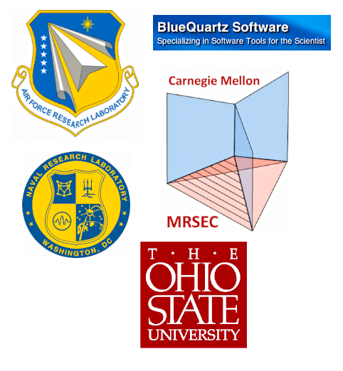

What is DREAM.3D? {#acknowledgements}
========

## Introduction ##
Welcome to DREAM.3D, an open source, cross-platform and modular software package that allows users to reconstruct, instantiate, quantify, mesh, handle and visualize multidimensional, multimodal data. The core software package has many major functionalities, including:

@li Import a series of Electron Backscatter Diffraction (EBSD) data files (either TSL .ang or HKL .ctf) or images (.bmp, .jpeg, .tif or .png) as a 3D volume and export the data packed into a single HDF5 data file in order to reduce data size and clutter
@li Alignment, cleaning, reconstruction, segmentation and analysis of imported data
@li Statistics, either synthetically created or from real data, can be used to generate a statistically equivelent material structure
@li Reconstructed and synthetic volumes can be surfaced meshed to allow export into FEM or other simulations.

The above items represent only a subset of the specific capabilities of DREAM.3D.  In general, DREAM.3D can be considered a generic tool for processing multidimensional, multimodal data. While DREAM.3D was originally designed to analyze microstructure data, the development of an abstract and powerful [data structure](@ref datastructure) allows for analysis of not just generic materials data, but also multidimensional data in general.  

DREAM.3D makes data analysis simple and straight forward, while providing state-of-the-art functionality. The development of more features is always on going and the DREAM.3D development team welcomes your feedback, whether you are first time user or seasoned scientist! 

## Getting Help ##
Please consider signing up for the <a href="https://groups.google.com/forum/?hl=en#!forum/dream3d-users">DREAM.3D Users Google group</a>! It's the fastest way to ask your DREAM.3D questions, get help with using DREAM.3D, and connect with both developers and the community at large.  If you are interested in contributing to the DREAM.3D project, please visit our <a href="https://github.com/dream3d/DREAM3D">GitHub page</a>, where all the DREAM.3D source code is hosted, and also sign up to the <a href="https://groups.google.com/forum/?hl=en#!forum/dream3d-developers">DREAM.3D Developers Google group</a> to get help with compiling and adding to DREAM.3D. If you find an error with DREAM.3D or want to request a new feature, please head over to GitHub and [open up an issue](https://github.com/dream3d/DREAM3D/issues).

## Contributing to DREAM.3D ##
Want to contribute to DREAM.3D? We welcome community contributions! The DREAM.3D project utilizes the [fork and pull](https://help.github.com/articles/using-pull-requests/) model for development. Feel free to head over the to [DREAM.3D GitHub page](https://github.com/dream3d/DREAM3D) to get started. Have a **Plugin** you'd like to see distributed with the DREAM.3D binary, but don't want it merged into the main DREAM.3D repository? We also offer _curated_ **Plugins** that are stored on our parent [GitHub page](https://github.com/dream3d/). These **Plugins** are ones we really like, and so we distribute them with the DREAM.3D binaries, but the original authors of the **Plugins** remain responsible for maintaining them. Feel free to contact the DREAM.3D development team if you're interesting in curated **Plugins**.

## Nightly Builds ##
Want the latest DREAM.3D has to offer? Try downloading a [nightly build](http://dream3d.bluequartz.net/binaries/experimental/)! These binaries are built every night from the head of our development branch, meaning they have all the latest features. Be aware that they may also have bugs or instabilities.

## History of DREAM.3D ##
The history of DREAM.3D is rooted in two parallel research efforts:

+ The first was the graduate research project of Michael Groeber, under the advisement of Dr. Somnath Ghosh, at The Ohio State University (2003-2007).  The key developments under this project were the creation of many of DREAM.3D's current filters for reconstructing serial section experimental datasets, quantifying microstructural features in 3D and generating statistically equivalent microstructures.
+ The second research effort was carried out by the research group of Dr. Tony Rollett at Carnegie Mellon University over a number of graduate student projects (see names below) and years (~2000-2011). The key developments under these projects were the development of a synthetic microstructure builder, microstructure clean-up tools, surface mesh generation and quantification tools for microstructural features.

The tools developed under these efforts generally remained as command line executables with limited portability due to lack of documentation and flexibility.  In an effort to extend the capabilites of these tools to the larger materials community, Dr. Chris Woodward of the Air Force Research Laboratory (AFRL) funded Mike Jackson of BlueQuartz Software to create Graphical User Interfaces (GUIs), common data structures and documentation for the tools developed in the research effort of Groeber and Ghosh (2009-2011). After the initial phase of development (2011), Jackson and Groeber approached Rollett, Lee, Sintay, Chan and Tucker and proposed the unification of the parallel efforts.  The Rollett group accepted the proposal and graciously made available all of their algorithms and source code.  It was at this point that DREAM.3D was named and the vision for the software was truly solidified.

Over the next couple of years (2011-2013), additional researchers contributed code to extend the capabilities of DREAM.3D.  Specifically, the grain boundary-centric tools of Dr. Dave Rowenhorst (Naval Research Laboratory) and Dr. Greg Rohrer (Carnegie Mellon University) greatly augmented the functionality of the package.

By 2013, Jackson and Groeber had fully documented the tools, created a Software Developer's Kit (SDK) and generated tools for adding plugins to the package, making the software package readily usable and extensible. As the community surrounding DREAM.3D continued to grow, Jackson formed BlueQuartz Software into an LLC to better provide professional support and allow for additional growth.  In 2014, Dr. Sean Donegan joined BlueQuartz Software from the Rollett group to provide another full-time developer with materials expertise.  In late 2014, BlueQuartz also added  Joseph Kleingers and Sally Connell as full-time developers with computer science backgrounds.

During the growth of BlueQuartz Software through 2014, the core [data structure](@ref datastructure) of DREAM.3D was redesigned to allow for greater user flexibility.  This change also allowed the tool to expand outside of microstructural analysis to include most areas of materials research, and ultimately to multidimensional data analysis in general. These efforts spurred the release of the current version of DREAM.3D, version 6, which represents a great step forward in the DREAM.3D experience.  

## Funding Sources ##
Parts of DREAM.3D were written under US Air Force (AFRL) Contract FA8650-07-D-5800 and Naval Research Labs (NRL) Contract N00173-07-C-2068. Many others have contributed to the code including the following (non-exhaustive) list:

## Major Contributing Institutions ##

@image latex Images/DREAM3D_Contributors.png "Contributing Institutions " width=4.75in

## List of Code Contributors (CC) and Vision Contributors (VC) ###

### Air Force Research Laboratory (AFRL) ###

+ Dr. Michael A. Groeber (VC, CC)
+ Dr. Adam Pilchak (VC, CC)
+ Dr. Megna Shah (VC, CC)
+ Dr. Michael Uchic (VC)
+ Dr. Chris Woodward (VC)

### BlueQuartz Software ###

+ Mr. Michael A. Jackson (VC, CC)
+ Dr. Sean P. Donegan (VC, CC)
+ Dr. Dennis Dimiduk (VC)
+ Mr. Joseph B. Kleingers (CC)
+ Ms. Sally Connell
+ Dr. Megna Shah (VC, CC)

### Ohio State University/Johns Hopkins University ###

+ Dr. Somnath Ghosh (VC)

### Carnegie Mellon University ###

+ Dr. Tony Rollett (VC, CC)
+ Dr. Greg Rohrer (CC)
+ Dr. Marc De Graef (CC)
+ Dr. Sukbin Lee (CC)
+ Dr. Joseph C. Tucker (VC, CC)
+ Dr. Lisa Chan (CC)
+ Dr. Stephen Sintay (CC)
+ Dr. Abhijeet Brahme (CC)
+ Dr. David Saylor (CC)
+ Dr. Joe Fridy (CC)
+ Dr. Patrick Callahan (CC)
+ Dr. Shlomo Taasan (CC)

### Naval Research Laboratory (NRL) ###

+ Dr. Dave Rowenhorst (VC, CC)

### Other Institutions ###

+ Mr. William Lenthe (VC, CC) (University of California, Santa Barbara)
+ Mr. Matthew Priddy (CC) (Georgia Tech University)
+ Mr. Jarrell Waggoner (CC) (Univ. South Carolina)