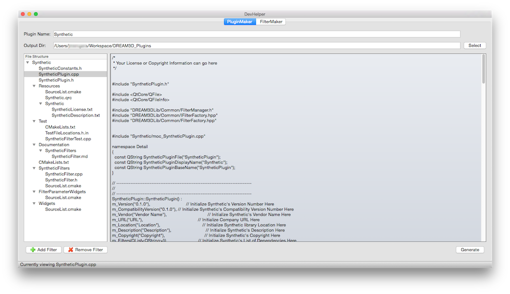
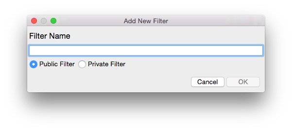
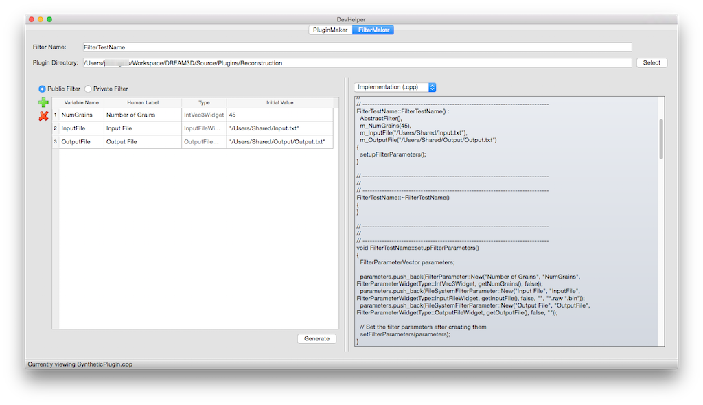
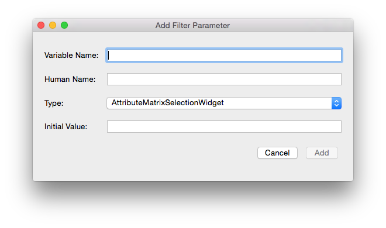

DevHelper {#devhelper}
========

**DevHelper** is a developer tool that allows the user to generate the _skeleton_ code necessary to create a new **Plugin** or **Filter**.  **DevHelper** _does not_ create a functioning **Filter** automatically, and _is not_ a development environment. Instead, it streamlines the development process by auto-generating most of the "boiler plate" code that is necessary for a working **Plugin** or **Filter**.

**DevHelper** is divided into two sub-tools: 

+ **PluginMaker**: Generates skeleton code for new **Plugins**
+ **FilterMaker**: Generates skeleton code for new **Filters** in existing **Plugins**

It is highly recommended that developers use **DevHelper** to create their **Plugins** and **Filters**, because it provides all of the necessary skeleton code required for compilation in DREAM.3D. Additionally, the code created adheres to the DREAM.3D styles and standards.

## PluginMaker ##

-------------------

@image latex Images/DevHelper/DevHelper-Image001.png "DevHelper Main Window - PluginMaker" width=6in

-------------------

The **PluginMaker** tab of the **DevHelper** interface is quite simple.  This tab contains all the elements needed to create a new plugin.

- The two fields called _Plugin Name_ and _Output Dir_ allow the user to set the new **Plugin** name and the output directory where the new **Plugin** will ultimately be generated

- The two buttons in the bottom left corner of the screen labeled _Add Filter_ and _Remove Filter_ will add or remove additional **Filters** to/from the new **Plugin**

- The structure of the new **Plugin** and the contents of the selected file is displayed in the center

- The _Generate_ button generates the new **Plugin** and its files in the output directory specified

### Using PluginMaker ###
1. Choose a **Plugin** name and type it in the _Plugin Name_ field
2. Choose an output directory by selecting it with the _Select_ button or typing it in the _Output Dir_ field
3. Press the _Add Filter_ button in the bottom left corner to add additional **Filters**. After pressing the button, the _Add New Filter Dialog_ will appear. Type in the new **Filter's** name, select either public or private, and then press _OK_

@image latex Images/DevHelper/DevHelper-Image003.png "Add New Filter Dialog" width=6in
4. Continue adding new **Filters** as needed
5. If a **Filter** has been added erroneously and needs to be removed, just select one of the **Filter's** files in the tree (the **Filter's** .cpp, .h, or .md files) and press _Remove Filter_
6. Peruse the tree and look over the files that will be generated for accuracy
7. When everything is correct, press the _Generate_ button.

The **Plugin** now exists in the directory that was specified in the _Output Dir_ field.

## FilterMaker ##

-------------------

@image latex Images/DevHelper/DevHelper-Image002.png "DevHelper Main Window - FilterMaker" width=6in

-------------------

The **FilterMaker** tab contains all the elements needed to create a new **Filter** inside an existing plugin.

- The two fields called _Filter Name_ and _Plugin Directory_ allow the user to set the name of the new **Filter** and the top level directory of the **Plugin** where the **Filter** will be stored

- The left pane contains the table of current **Filter** parameters.  This is empty when **DevHelper** first starts up

- The green plus and red minus icons along the left side are buttons that add and remove **Filter** parameters to/from the **Filter** parameter table

- An option just above the **Filter** parameters buttons allows the user to select whether the **Filter** will be public or private

- The right pane allows the user to see what will be generated in each file before clicking the _Generate_  button.

- The combo box in the right pane displays which file is currently being viewed

### Using FilterMaker ###
1. Choose a **Filter** name and type it in the _Filter Name_ field
2. Choose the top level directory of the **Plugin** that you want to add the **Filter** to, and type it in the _Plugin Directory_ field.  The directory can also be selected using the _Select_ button
3. Choose whether to make the **Filter** public or private using buttons in the left pane
4. Press the _green plus_ icon to add a new **Filter** parameter.  The _Add Filter Parameter Dialog_ will appear

@image latex Images/DevHelper/DevHelper-Image004.png "Add Filter Parameter Dialog" width=6in
5. In the _Add Filter Parameter Dialog_, choose a _Variable Name_, _Human Name_, and _Initial Value_, and type them in the appropriate fields.  Choose the widget type that your new filter parameter will be using.  Press **Add**.
6. The new **Filter** parameter will appear in the **Filter** parameters table.  Any value except *Type* can be changed inline, so feel free to rename values as necessary
7. If a **Filter** parameter has been added erroneously and needs to be removed, just select the **Filter** parameter's row and press the _red minus_ icon.
8. Use the combo box in the right pane to look at each file's contents for accuracy.  The **Filter** parameters in the table in the left pane should be created and initialized in the code in the right pane.
9. When everything is correct, press the _Generate_ button.

The **Filter** now exists in the top level plugin folder that was specified in the _Plugin Directory_ field. Additionally, the _SourceList.cmake_ file for that **Plugin** is automatically updated with the new **Filter**.