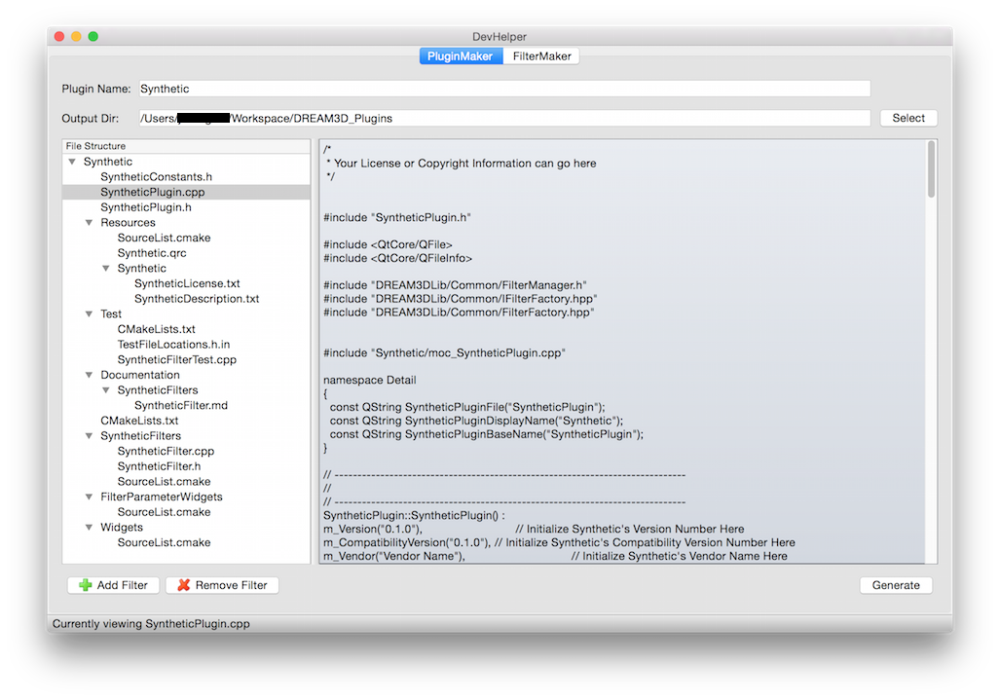
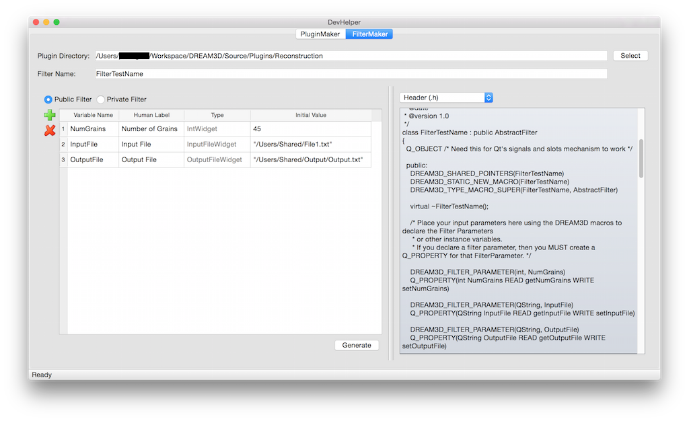

DevHelper {#devhelper}
========

## Introduction ##
**DevHelper** is a developer tool that allows the user to generate the code necessary to create a new plugin or filter.  The user can generate a new plugin with the sub-tool called **PluginMaker**.  The user can also generate a filter inside an existing plugin with the sub-tool called **FilterMaker**.

It is highly recommended that developers use DevHelper to create their plugins and filters, because it provides all of the skeleton code required to compile the plugin or filter successfully with DREAM3D.

## User Interface ##

As you can see from the screenshot above, the **PluginMaker** tab of the DevHelper interface is quite simple.  This tab contains all the elements needed to create a new plugin.

- There are two fields called **Plugin Name** and **Output Dir** where the user can input the name of the new plugin and the output directory where the new plugin will ultimately be generated.

- There are buttons in the bottom left corner of the screen labeled **Add Filter** and **Remove Filter** that will add or remove additional filters to/from the new plugin.

- The structure of the new plugin and the contents of the selected file is displayed in the center.

- Finally, the **Generate** button generates the new plugin and its files in the output directory specified.

The **FilterMaker** tab contains all the elements needed to create a new filter inside an existing plugin.

- There are two fields called **Filter Name** and **Plugin Directory** where the user can input the name of the new filter and the top-level directory of the plugin where the filter will be stored.