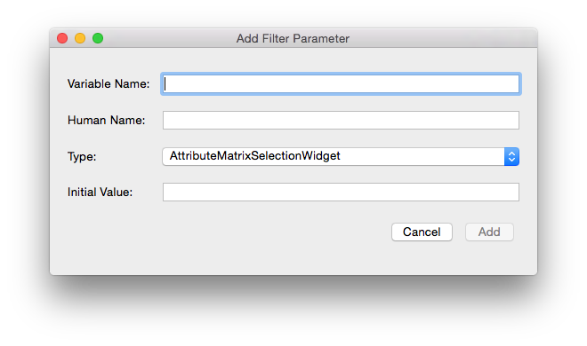

DevHelper {#devhelper}
========

## Introduction ##
**DevHelper** is a developer tool that allows the user to generate the code necessary to create a new plugin or filter.  The user can generate a new plugin with the sub-tool called **PluginMaker**.  The user can also generate a filter inside an existing plugin with the sub-tool called **FilterMaker**.

It is highly recommended that developers use DevHelper to create their plugins and filters, because it provides all of the skeleton code required to compile the plugin or filter successfully with DREAM3D.

## PluginMaker - User Interface ##

As you can see from the screenshot above, the **PluginMaker** tab of the DevHelper interface is quite simple.  This tab contains all the elements needed to create a new plugin.

- There are two fields called **Plugin Name** and **Output Dir** where the user can input the name of the new plugin and the output directory where the new plugin will ultimately be generated.

- There are buttons in the bottom left corner of the screen labeled **Add Filter** and **Remove Filter** that will add or remove additional filters to/from the new plugin.

- The structure of the new plugin and the contents of the selected file is displayed in the center.

- The **Generate** button generates the new plugin and its files in the output directory specified.

##PluginMaker - Instructions##
1. Choose a plugin name and write it in the **Plugin Name** field.
2. Choose an output directory by selecting it with the **Select** button or writing it in.
3. Press the **Add Filter** button in the bottom left corner to add additional filters; upon pressing the button, the **Add New Filter Dialog** will pop-up.  Write in the new filter's name, select either public or private, and then press OK.

4. Continue adding new filters as needed.
5. If a filter has been added erroneously and needs to be removed, just select one of the filter's files in the tree (the filter's .cpp, .h, or .md files) and press **Remove Filter**.
6. Peruse the tree and look over the files that will be generated for accuracy.
7. When everything is correct, press the **Generate** button.

The plugin now exists at the directory that was specified in the **Output Dir** field.

##FilterMaker - User Interface##

The **FilterMaker** tab contains all the elements needed to create a new filter inside an existing plugin.

- There are two fields called **Filter Name** and **Plugin Directory** where the user can input the name of the new filter and the top-level directory of the plugin where the filter will be stored.

- The left pane contains the table of current filter parameters.  This is empty when DevHelper first starts up.

- The green plus and red minus icons along the left side are buttons that add and remove filter parameters to/from the filter parameter table.

- There is an option just above the filter parameters buttons to select whether the user wants the filter to be public or private.

- The right pane allows the user to see what will be generated in each file before clicking the **Generate** button.

- The combo box in the right pane displays which file is currently being viewed.

##FilterMaker - Instructions##
1. Choose a filter name and write it in the **Filter Name** field.
2. Choose the top-level directory of the plugin that you want to add the filter to, and write it in the **Plugin Directory** field.  The directory can also be selected using the **Select** button.
3. Choose whether to make the filter public or private using buttons in the left pane.
4. Press the **green plus** icon to add a new filter parameter.  The **Add Filter Parameter Dialog** will appear.

5. In the Add Filter Parameter dialog, choose a Variable Name, Human Name, and Initial Value and write them in the appropriate fields.  Choose the widget type that your new filter parameter will be using.  Press **Add**.
6. The new filter parameter will appear in the filter parameters table.  Any value except *Type* can be changed in-line, so feel free to rename values as necessary.
7. If a filter parameter has been added erroneously and needs to be removed, just select the filter parameter's row and press the **red minus** icon.
8. Use the combo box in the right pane to look at each file's contents for accuracy.  The filter parameters in the table in the left pane should be created and initialized in the code in the right pane.
9. When everything is correct, press the **Generate** button.

The filter now exists in the top-level plugin folder that was specified in the **Plugin Directory** field.