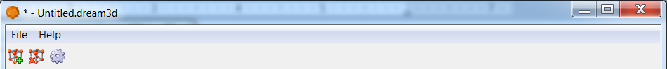
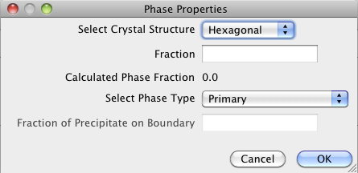
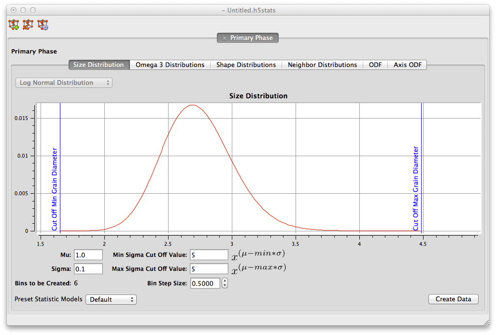
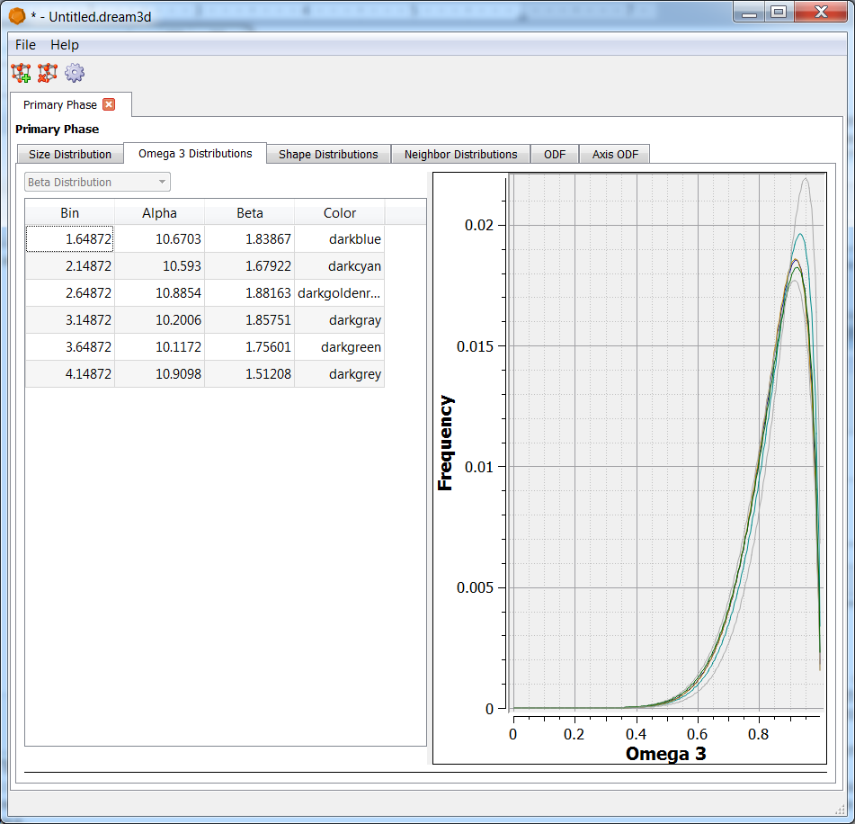
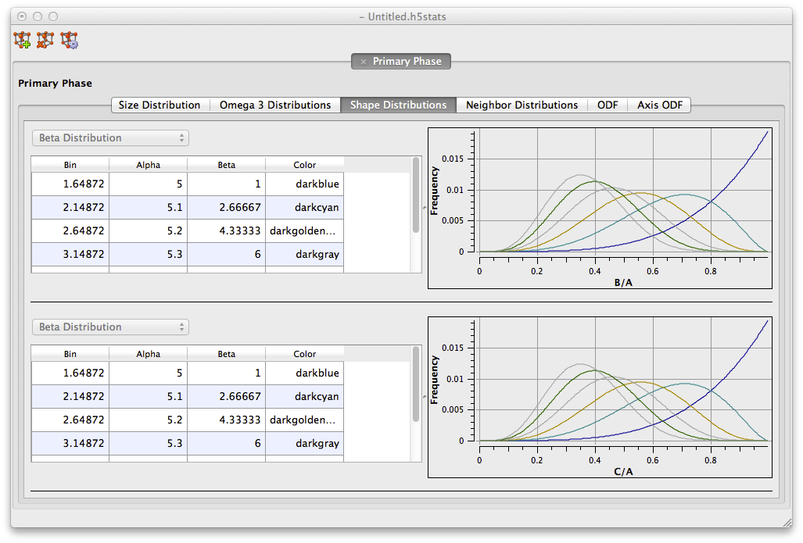
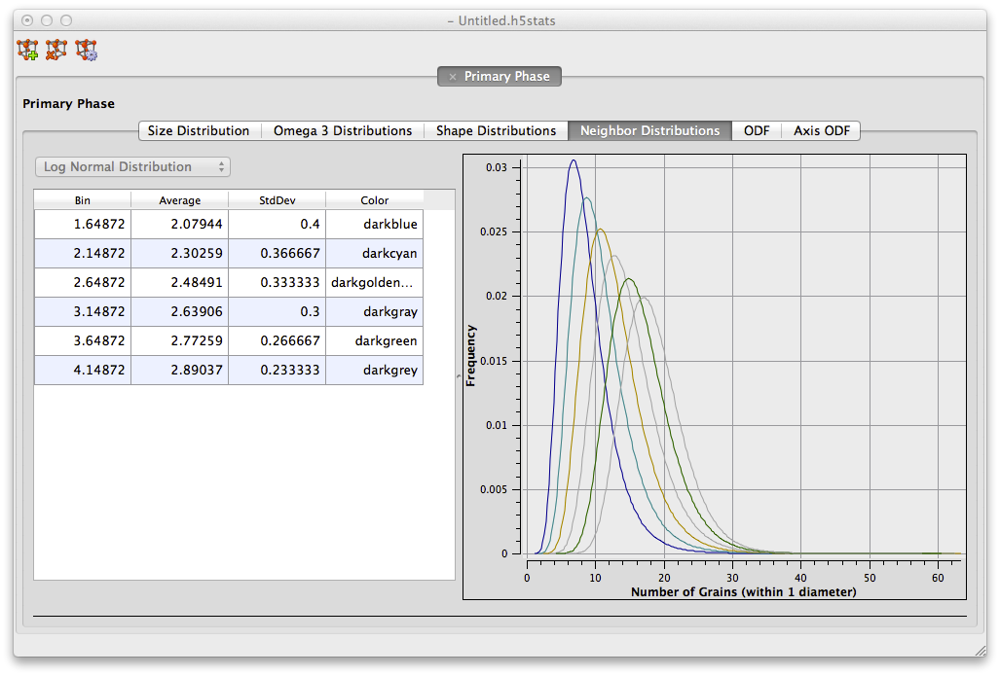
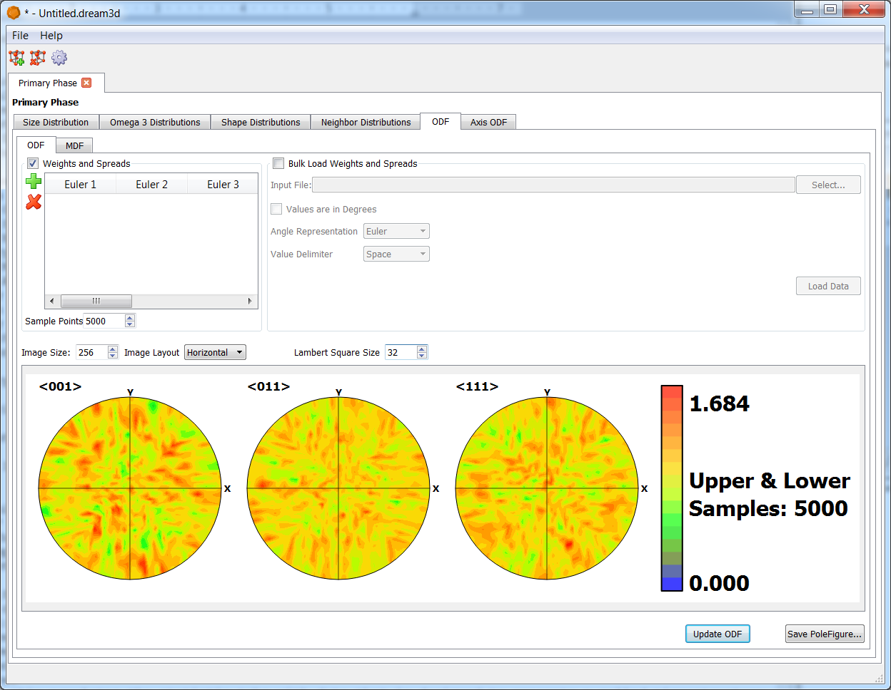
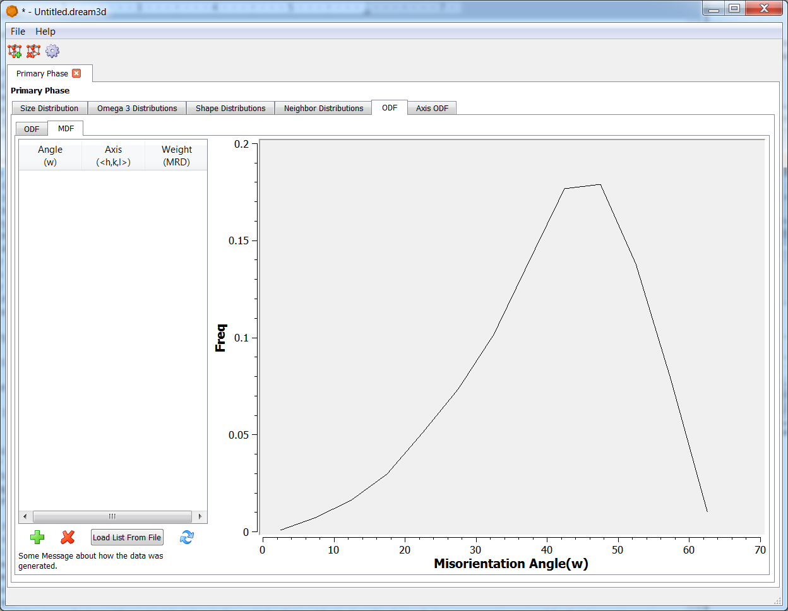
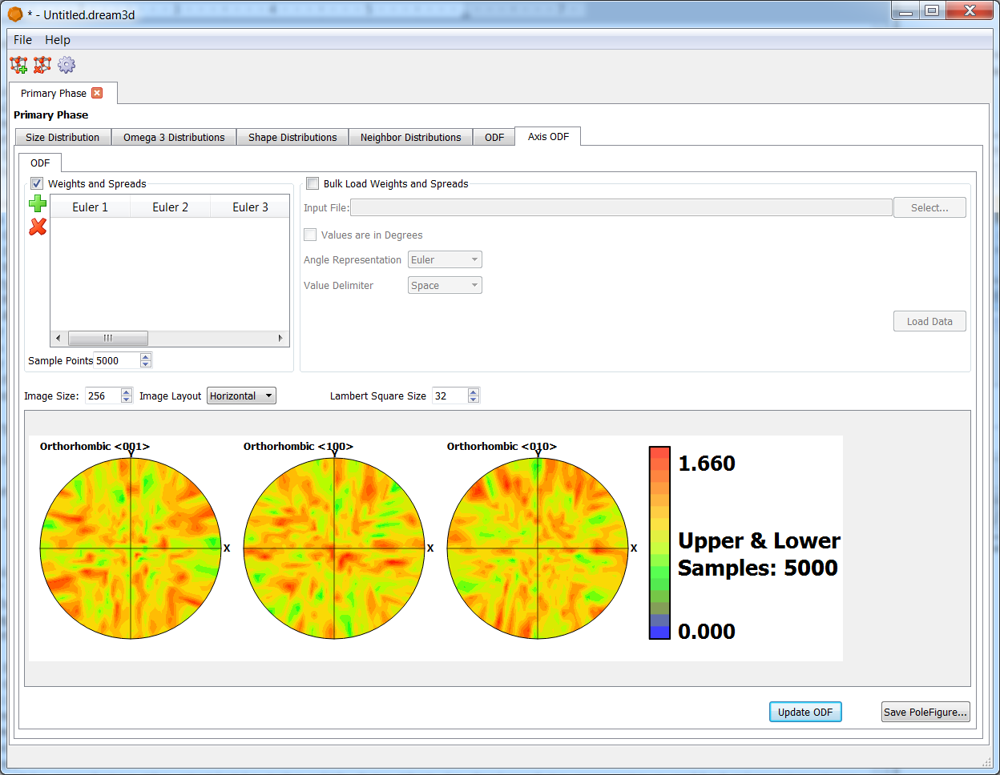

StatsGenerator {#statsgenerator}
========

The **StatsGenerator** program was created as an auxiliary tool to DREAM.3D in order to allow users to quickly generate a set of statistics that can be used to create a synthetic microstructure. Using this program, the user can generate the necessary statistics that describe a microstructure, with the aid of visual plots of the statistics, and save them to a DREAM.3D file. The saved DREAM.3D file can then be used in a DREAM.3D pipeline to generate a synthetic microstructure.

The set(s) of statistics that can be generated in this program correspond to the set(s) used by "**Feature** packing algorithms" in DREAM.3D.  DREAM.3D chooses to classify **Features** in *Phase Types*, which define the set of statistics used to describe the key metrics for those **Features**.  The *Phase Types* that can currently be selected in DREAM.3D are Primary, Precipitate and Matrix.  The statistics that describe each of these *Phase Types* are listed below:

+ **Primary**: {Volume fraction}, {crystal structures}, size, shape (aspect ratios), Omega3, number of neighbors, ODF (crystallographic orientation), MDF, axis ODF (morphological orientation)  
+ **Precipitate**: {Volume fraction}, {crystal structures}, {fraction on **Feature** boundary}, size, shape (aspect ratios), Omega3, radial distribtion function (RDF), ODF (crystallographic orientation), MDF, axis ODF (morphological orientation)  
+ **Matrix**: {Volume fraction}, {crystal structure} 

*Stats designated with a { } are located on the Phase Properties Manager*

## Phase Properties ##

@image latex Images/image009.png "Phase Properties Buttons" width=6in 

The user can add, remove or modify properties of the phase by clicking the *Phase Properties Buttons* at the top of the **StatsGenerator** GUI. The Plus Button allows the user to add a phase, the Minus Button allows the user to remove a phase and the Wheel Button allows the user to edit the currently selected phase.

@image latex Images/image002.png "Phase Properties Manager" width=6in 

The *Phase Properties Manager* is a pop-up window where the user can enter information about the phase for which statistics are currently being generated. The follow are a list of what can be set in the manager:
  
+ Select Crystal Structure: This allows the user to specify the crystal structure of the phase.
+ Fraction: This is the volume fraction of the phase. The Calculated Phase Fraction is updated as more phases are added, by scaling the current total of all the phases fractions to 1 (in case the user's total is not equal to 1 when finished).
+ Select Phase Type: This specifies the type of the phase. Currently, the three types of phases are Primary, Precipitate and Matrix. Note that the first phase is defaulted to Primary and cannot be changed. If the user does not wish to have a Primary phase, then a second phase can be added and the initial Primary phase can then be removed.
+ Fraction of Precipitate on Boundary: If the phase type is set to Precipitate, then the user must specify the number fraction (0.0 - 1.0) of the precipitates that are located on grain boundaries of the primary phase. This value will be scaled to 1 if the user's value is larger than 1. The value is keyed to -1 for Primary phases.

## Size Distribution Tab ##

@image latex Images/image001.png "Size Distribution GUI" width=6in 

The plot displayed on this tab is the actual size distribution of the features that will be placed for this phase.  The x-axis is the equivalent sphere diameter (ESD) of the feature.  ESD mean the diameter of a sphere that has the equivalent volume of the feature.  The units of ESD in this plot are in arbitrary units of length (ie meters, millimeters, microns, nanometers, etc).  The y-axis of the plot is the probability of sampling that ESD from the distribution.  The parameters listed below are what define the size distribution and how it is binned for correlation with other statistical desciptors to be described later.  When entering the parameters that define the size distribution, it is generally a good work flow to iteratively adjust the parameters while watching the plot until the plot looks 'satisfactory' with respect to the location of the peak and the length of the 'tails', rather that be overly concerned witht he parameter values themselves.

These parameters define the size distribution itself:
  + **Mu** This is the average value of the lognormal grain size distribution. Note that this is the average value of log(ESD).  This value is in the same arbitrary units of length as the plot, but is not the 'average feature size'.  
  + **Sigma** This is the standard deviation of the lognormal grain size distribution.  Note that this is  not the standard deviation of the actual feature size distribution, but of the 'log-ed' values.  This is what controls the length of the 'tails' of the distribution.
  + **Sigma Cut Off Value** This allows the user to truncate the distribution to remove very large (or small) features.  These values show up as blue vertical lines on teh plot and only the portion of the feature size distribution between the two blue vertical lines can be sampled from.

These parameters control the binning of the feature size distribution:
  + **Bin Step Size**  This is the size of bin to use in segregating the feature size distribution into classes for correlating other statistics to feature size. The point of creating size classes in the feature size distribution is that it allows the user to give different shape or number of neighbors distributions to features at different points along the feature size distribution. For example, if the user wanted to have small features be spherical while making large features elongated.  IF the user has no desire to have different statistics for different sizes, then a large value can be used to create a single size class.  Note that the *Bins to be Created* value is displayed in the bottom left corner, which tells the user for the given *Bin Step Size* how many size classes will be created along the feature size distribution.

These options set the initial defaults for the correlated statistics: 
  + **Preset Statistic Models** This allows the user to select a _morphological-type_ of microstructure to populate the default data. The two options currently provided are:
    - Equiaxed: this populates the statistic tabs with data that is designed to generate a random equiaxed microstructure.
    - Rolled: this populates the statistic tabs with data that is designed to generate a rolled microstructure with elongated grains with user defined aspect ratios.  If this preset is selected, the user is prompted to enter:
        - A Axis Length: this is the length of the longest axis of the **Feature(s)**.
        - B Axis Length: this is the length of the intermediate axis of the **Feature(s)**.
        - C Axis Length: this is the length of the shortest axis of the **Feature(s)**.

*The values entered for these axis lengths DO NOT need to be actual lengths, but rather are used to establish aspect ratios, so they need only be relative*

After all information is entered to the user's desire on the Size Distribution Tab:
  + **Create Data** This locks in the values the user has entered and populates the other tabs with default values. The user can move through the other tabs and change any default values if desired.

## Omega3 Tab ##

@image latex Images/image003.png "Omega 3 GUI" width=6in 

+ Bin: This column is calculated from the size distribution and cannot be changed.
+ Alpha: This is the alpha parameter of a Beta distribution. Omega 3 is normalized and can only be between 0 and 1 to insure that the Beta distribution is a good fit.
+ Beta: This is the beta parameter of the Beta distribution.
+ Color: This allows the user to change colors of the curves for
  image creation or easier identification during stats generation.
  

## Shape Distribution Tab ##

@image latex Images/image004.png "Shape Distribution (Aspect Ratios) GUI" width=6in 
  
+ Bin: This column is calculated from the size distribution and cannot be changed.
+  Alpha: This is the alpha parameter of a Beta distribution. B/A, C/A and C/B are normalized and can only be between 0 and 1 to insure that the Beta distribution is a good fit.
+ Beta: This is the beta parameter of the Beta distribution.
+ Color: This allows the user to change colors of the curves for image creation or easier identification during stats generation.
  

## Neighbor Distribution Tab ##

@image latex Images/image005.png "Number of Neighbors Distribution GUI" width=6in 

+ Bin: This column is calculated from the size distribution and cannot be changed.
+ Alpha: This is the alpha parameter of a Power Law distribution.
    + This is the exponent of a Power Law Distribution
+ Beta: This is the beta parameter of a Power Law distribution.
+ Color: This allows the user to change colors of the curves for image creation or easier identification during stats generation.
  

## ODF Tab ##

@image latex Images/image006.png "ODF (Crystallographic Orientation) GUI" width=6in 

**Weights and Spreads Sub-Tab**

- Euler 1-3: These are the Euler angles that define an orientation that the user would like to increase in weight.
- Weight: This is the weight in MRD (multiples of random distribution).
- Sigma: This is the spread to use in blurring out the orientation chosen. The value corresponds to the number of bins in Rodrigues (orientation) space that it takes for the MRD value entered in the Weight column to reduce to 0.0 (decreasing quadratically from the bin of the entered orientation).
- Calculate ODF: This builds the ODF and then creates pole figures (PFs) for the user to inspect.
      
    
**Pole Figure (PF) Sub-Tabs**

- There are three PFs formed for each of the crystal structures that can be chosen (though they are of different directions for the different crystal structures).
      
    
**MDF Sub Tab** This sub-tab will display the baseline MDF for the generated ODF.  The  implemented algorithm proceeds by randomly sampling pairs of orientations from  the ODF and calculating the misorientation (axis-angle only). Only the angle is plotted in the misorientation distribution plot.  The user can also add axis-angle pairs to increase in weight.

@image latex Images/image007.png "MDF GUI" width=6in 
  
- Angle: This is the angle of the misorientation to increase in weight.
- Axis: This is the axis of the misorientation to increase in weight.  If the crystal structure being used for the phase is Hexagonal, then this axis is in the 3-index, orthogonal convention, not the true (hkil) convention.
- Weight: This is the weight in units of MRD (multiples of random) of the entered misorientation.
    
    
 

## Axis ODF Tab ##

  
@image latex Images/image008.png "Axis ODF (Morphological Orientation) GUI" width=6in 

**Weights and Spreads Sub-Tab**
      
- Euler 1-3: These are the Euler angles that define an orientation that the user would like to increase in weight.
- Weight: This is the weight in MRD (multiples of random) to be assigned to the orientation listed.
- Sigma: This is the spread to use in blurring out the orientation chosen. The value corresponds to the number of bins in Rodrigues (orientation) space it takes for the MRD value entered in the Weight column to reduce to 0.0 (decreasing quadratically from the bin of the entered orientation).
- Calculate ODF: This builds the ODF and then creates pole figures (PFs) for the user to inspect.
      
    
**Pole Figure (PF) Sub-Tabs**
      
There are three pole figures formed, which correspond to the location of the 3 principal axes of the grains to be generated (i.e a > b > c).
