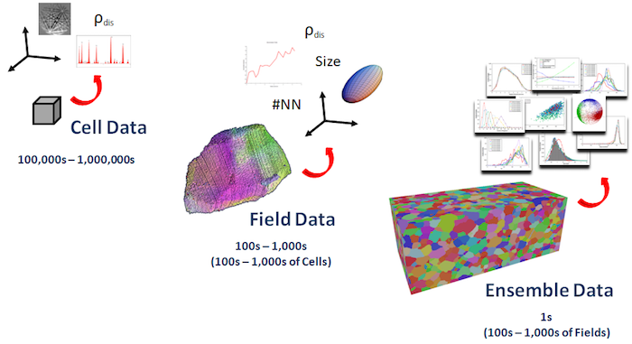

DREAM.3D Data Structure {#datastructure}
=========

DREAM3D uses a data structure that is based on the concepts of combinatorial topology and common methods for describing mesh structures.  Any topological network (in 2- or 3-D) can be decribed with a the following hierarchy:

@image latex Images/DataStructure-2.png "DREAM3D Data Structure " width=6in 

If the mesh (or network) is 2-D, then the *Volume* element does not exist and the *Face* element is the highest level element. For typical *voxel-based* data, the *voxels* are the *Volume* elements and within DREAM.3D are referred to  as **Cells**.  Similarly, in a surface mesh with triangular patches, the triangles are the *Face* elements and within DREAM.3D are referred to  as **Faces**.  This topology is required to describe the "mesh" or "structure" of the data itself and is not/cannot be adjusted/defined by the user. 

However, once the topology of the "structure" is set, the user can begin *grouping* topological elements into higher level features of the "structure".  Below is an example of this grouping for a *voxel-based* dataset of a polycrystalline metal.

@image latex Images/DataStructure-1.png "DREAM.3D Data Structure " width=6in 

DREAM.3D uses two additional levels above the topological levels required to define the "structure" of the data.  These two levels are called: **Feature** and **Ensemble**.  These levels allow the user to *group* topological elements together based on criteria of similarity.  For the example above, the **Cells** are *grouped* to identify **Features** (i.e. grains) by applying a criterion of similar crystallographic orientation (i.e. neighboring **Cells** with similar orientation are said to belong to the same **Feature**).  The **Features** are then *grouped* to identify **Ensembles** by a criterion of similar phase (i.e. all grains of the same phase in the dataset are said to belong to the same **Ensemble**).  The grouping criteria are at the discretion of the user, because these additional levels are not required for description of the "structure", but rather are organizational levels for describing the information that lives on the "structure".  

At each level, DREAM.3D creates a *Map* to store information/data about the individual elements at that level.  Additional information about the maps of the DREAM.3D data structure and "typical" data are given below:

## Vertex ##
  - Map of attributes associated with single *points*.    
  - Measured values (i.e. Orientation, Chemistry, Greyscale, etc.) - generally measured data is not represented at the **Vertex** level, but the user could choose to store measured values at the **Vertices** rather than the more typical **Cell**-centered convention.
  - Calculated values (i.e. Curvatures, Coordination, etc.) - these calculated values are typically values associated with the connectivity or geometry of the "mesh" or "structure" itself. 

## Edge ##
  - Map of attributes associated with edges of **Faces**.    
  - Measured values - data is not typically measured at the **Edge** level.
  - Calculated values (i.e. Curvatures, Coordination, etc.) - these calculated values are typically values associated with the connectivity or geometry of the "mesh" or "structure" itself. 

## Face ##
  - Map of attributes associated with surface patches.    
  - Measured values - data is not typically measured at the **Face** level.
  - Calculated values (i.e. Bounding Feature Ids, Normals, Curvature, etc.) - these calculated values are typically IDs to the higher level maps (**Feature** and **Ensemble**), related to gradients of the measured values, values associated with the connectivity or geometry of the "mesh" or "structure" itself or relationships to values calculated in the higher level maps. 

## Cell ##
  - Map of attributes associated with single *datapoints* - often these *datapoints* are not truly *volumes*, but rather point-probe measurements that are homogenized over the volume nearest to each probe-point.    
  - Measured values (i.e. Orientation, Chemistry, Greyscale, etc.) - typically this is the level at which most data is actually acquired.
  - Calculated values (i.e. Feature Ids, Kernel Avg. Misorientation, Euclidean Distance, etc.) - these calculated values are typically IDs to the higher level maps (**Feature** and **Ensemble**), related to gradients of the measured values or relationships to values calculated in the higher level maps. 

## Feature ##
  - Map of attributes associated with sets of *datapoints* - generally *elements* in this map are sets of contiguous **Cells** that have some aspect of similarity, often in their measured values (i.e. orientation, chemistry, greyscale, etc.).
  - Measured values (i.e. Avg. Stresses, Avg. Strains, etc) - some measurement techniques are capable of measuring values averaged over an entire **Feature** (i.e. High Energy Diffraction Microscopy). 
  - Calculated values (i.e. Avg. Orientation, Size, Shape, No. of Neighbors, etc.) - generally there is little measured data at this level and these values are calculated from averaging the measured data from the **Cells** that constitute each **Feature** or geometrically describe the size and/or shape of the set of **Cells**.

## Ensemble ##
  - Map of attributes associated with sets of **Features**
  - Measured/Set values (i.e. Crystal Structure, Phase Type, etc.) - measured values at the **Ensemble** level are usually user-defined parameters during the data collection or during analysis within DREAM.3D.
  - Calculated values (i.e. Size Distribution, No. of Features, ODF, etc.) - these values are typically descriptions of the distribution of values from the lower level **Feature** map.  

@htmlonly
|   | Navigation |    |
|----|---------|------|
| [Back](acknowledgements.html) | [Top](index.html) | [Next Section](supportedfileformats.html) |
@endhtmlonly