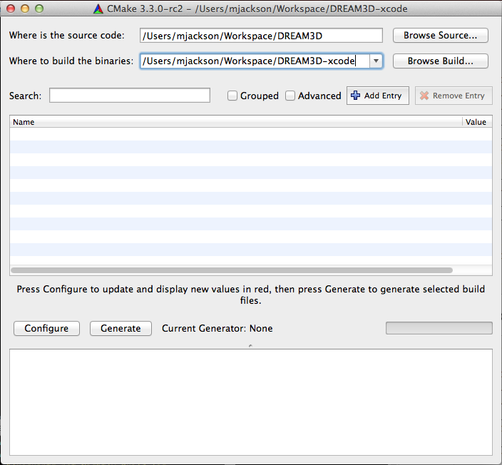
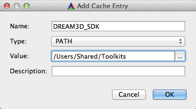
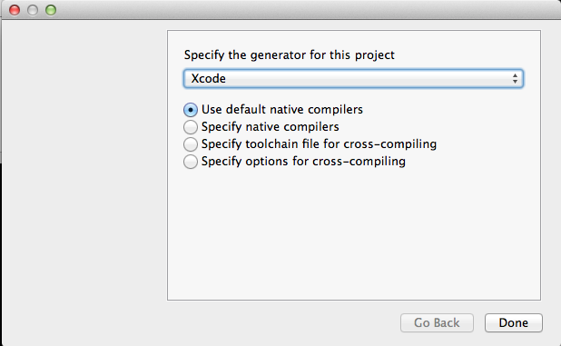
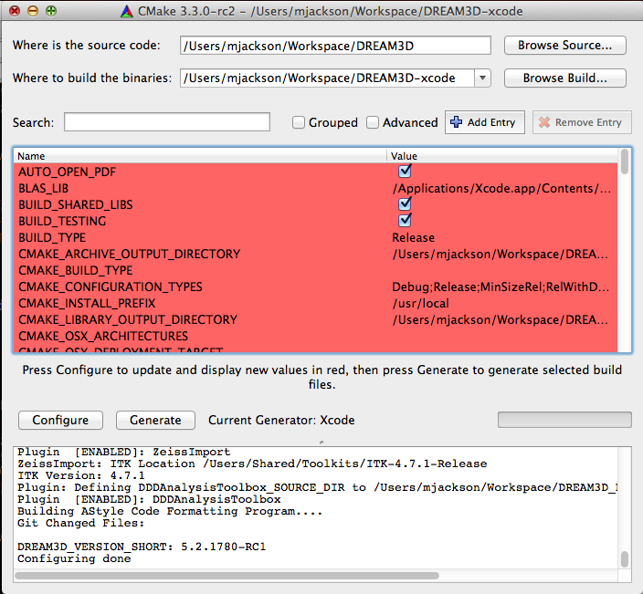

Compiling DREAM.3D {#compilingdream3d}
========

# Preliminaries #

A compiler suite (Visual Studio, Xcode, GCC, etc.) for your operating system is necessary. The following table lists the compilers that DREAM.3D is commonly compiled against.

| Compiler Version | Notes |  
|  ------	| ------	|  
| Visual Studio 2013 Pro & Express/Community SP4 | 64 bit builds |  
| Xcode 5.1.1 (or Greater) (OS X Version 10.8, 10.9, 10.10) | 64 bit Intel Only |  
| GCC 4.7.x or Clang (Ubuntu 14.04) | 64 bit Intel Only |  

## Note for MinGW/MSys/Cygwin ##

Due to incompatibilities of HDF5, compiling DREAM.3D using these environments is not supported. Visual Studio Community Edition 2013 is a freely available alternative with no restrictions on use.

## Installing Dependent Libraries ##

A tutorial is available for [Windows 7/8](http://dream3d.bluequartz.net/?p=954) and [OS X](http://dream3d.bluequartz.net/?p=930) that covers the installation of a DREAM.3D software development kit (SDK using either prebuilt binaries (Windows) or a shell script (OS X). Please use these web sites for reference. Additional information on compiling external libraries can be found [here](@ref compilingexternallibraries).

# Building DREAM.3D #

## Getting the Source Code ##

Use git to clone the [DREAM.3D repository](http://github.com/dream3d/dream3d).

## Getting Unit Test Data Files ##

Use git to clone the [DREAM.3D data repository](http://github.com/dream3d/DREAM3D_Data). **Be sure to adjust the DREAM3D_DATA_DIR CMake variable to the appropriate location**. See the next section for more information.

## Setting Up DREAM.3D for CMake Configuration ##

Once the SDK is installed (Windows) or compiled (OS X, Linux), a file with the name DREAM3D_SDK.cmake can be found in the _DREAM3D\_SDK_ directory. This file defines all the installed locations for all of the dependent libraries.

Note that if you are on Linux or use an OS X package library (MacPorts, Homebrew, etc.) to install all the dependencies, you must substitute the appropriate paths instead of reusing the DREAM3D_SDK_ROOT variable. On Linux, for example, if installing a dependency from a package manager like apt-get, one would set most of the installation locations to "/usr/". 

**Note: The paths may be different on your system**

When running CMake (either from the command line or from the GUI) be sure to set the CMake variable "DREAM3D_SDK=/Users/Shared/DREAM3D_SDK" (Or the correct path for your system). This should be all that is needed for a successful CMake configuration run.

## CMake Configuration from the Command Line ##

	[user] $ cd DREAM3D
	[user] $ mkdir ../DREAM3D-Build && cd ../DREAM3D-Build
	[user] $ cmake -DDREAM3D_SDK=/Users/Shared/DREAM3D_SDK -DCMAKE_BUILD_TYPE=Debug ../DREAM3D

Once you have configured DREAM.3D using CMake, simply open the generated solution file (DREAM3DProj.sln), Xcode project (DREAM3DProj.xcodeproject) or use **make** from a terminal to compile DREAM.3D.

## CMake Configuration from the CMake GUI ##

	

You may need to click configure a few times until all red highlights are gone. Once all red highlighted rows are gone click the "Generate" button to generate your projects files.

