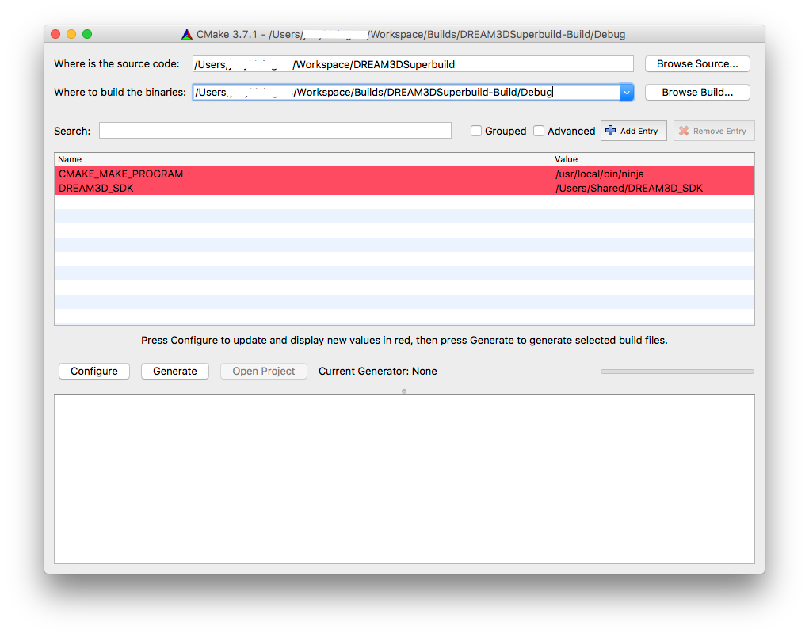

Configuring and Building DREAM.3D {#configure_and_build_dream3d}
========
<a name="prerequisites">
## Prerequisites ##
</a>

These prerequisites need to be completed before configuring and building DREAM.3D.

If you have already fulfilled all of these prerequisites, skip to the [Setting Up DREAM.3D for CMake Configuration](#cmake_config) section.

<a name="compiler_suite">
### Install a Compiler Suite ###
</a>

A compatible compiler needs to be installed on your system to be able to build DREAM.3D.

For more information, please visit [Installing a Compiler Suite](@ref compiler_suite).

<a name="downloading_dream3d">
### Download the Source Code for DREAM.3D ###
</a>

The source code for DREAM.3D must be downloaded using Git.

For more information, please visit [Downloading the Source Code for DREAM.3D](@ref source_download).

<a name="installing_sdk">
### Install the DREAM.3D SDK ###
</a>

Developers of DREAM.3D must use the Superbuild build system to install a DREAM.3D SDK.

For more information, please visit [Installing the DREAM.3D SDK](@ref sdk_install).

<a name="cmake_config">
## Setting Up DREAM.3D for CMake Configuration ##
</a>

Once the SDK is installed (Windows) or compiled (OS X, Linux), a file with the name DREAM3D_SDK.cmake can be found in the DREAM3D_SDK directory. This file defines all the installed locations for all of the dependent libraries.

**Note**: If you are on Linux or use an OS X package library (MacPorts, Homebrew, etc.) to install all the dependencies, you must substitute the appropriate paths instead of reusing the DREAM3D_SDK_ROOT variable. On Linux, for example, if installing a dependency from a package manager like apt-get, one would set most of the installation locations to "/usr/". 

### Procedure ###
1. Open the **DREAM3D_SDK.cmake** file in the **DREAM3D_SDK** folder.  Check that the path to every dependency is set correctly.  For example, the paths to Qt, HDF5, Boost, Qwt, and others may be written incorrectly and may need to be updated to whatever path each one is located at on the file system.

2. Open CMake and set the **Where is the source code** path to */Users/[YOUR-HOME-FOLDER]/Workspace/DREAM3D*.

3. Set the **Where to build the binaries** path to */Users/[YOUR-HOME-FOLDER]/Workspace/Builds/DREAM3D-Build/Debug*.

4. We are going to create a CMake variable.  Press the **Add Entry** button.

5. Set the **Name** to *DREAM3D_SDK*.  Set the **Type** to *PATH* and set the **Value** to the location of the DREAM3D_SDK folder that we created earlier (An OS X *Add Cache Entry* example is below).
**OS X**: */Users/Shared/DREAM3D_SDK*)
**Windows**: C:\DREAM3D_SDK

6. Repeat steps 3 & 4, except set **Name** to *CMAKE_MAKE_PROGRAM*, **Type** to *FILEPATH*, and **Value** to the path to our ninja executable that we added earlier (*/usr/local/bin/ninja*).

7. You should now have two variables, DREAM3D_SDK and CMAKE_MAKE_PROGRAM.

When running CMake (either from the command line or from the GUI) be sure to set the CMake variable "DREAM3D_SDK=/Users/Shared/DREAM3D_SDK" (Or the correct path for your system). This should be all that is needed for a successful CMake configuration run.

## CMake Configuration from the Command Line ##

	[user] $ cd DREAM3D
	[user] $ mkdir ../DREAM3D-Build && cd ../DREAM3D-Build
	[user] $ cmake -DDREAM3D_SDK=/Users/Shared/DREAM3D_SDK -DCMAKE_BUILD_TYPE=Debug ../DREAM3D

Once you have configured DREAM.3D using CMake, simply open the generated solution file (DREAM3DProj.sln), Xcode project (DREAM3DProj.xcodeproject) or use **make** from a terminal to compile DREAM.3D.

## CMake Configuration from the CMake GUI ##

	

You may need to click configure a few times until all red highlights are gone. Once all red highlighted rows are gone click the "Generate" button to generate your projects files.

## Note for MinGW/MSys/Cygwin ##

Due to incompatibilities of HDF5, compiling DREAM.3D using these environments is not supported. Visual Studio Community Edition 2013 is a freely available alternative with no restrictions on use.

---
**Next Page**: [Creating a Filter](@ref creating_a_filter).

**Previous Page**: [Installing the DREAM.3D SDK](@ref sdk_install).
