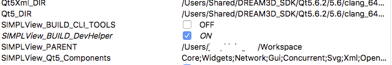
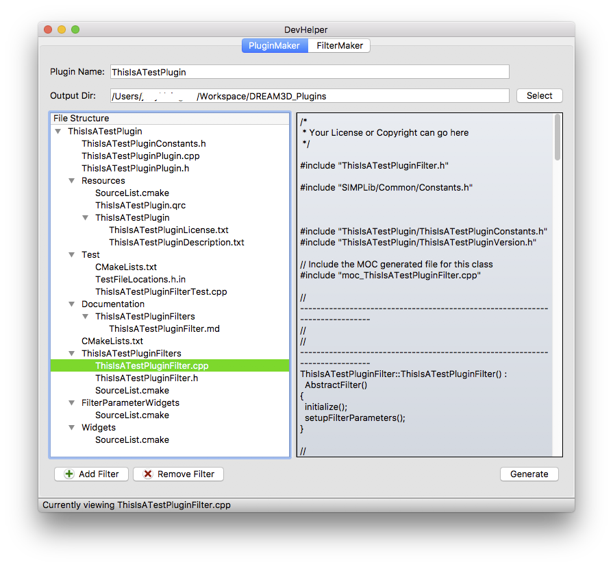
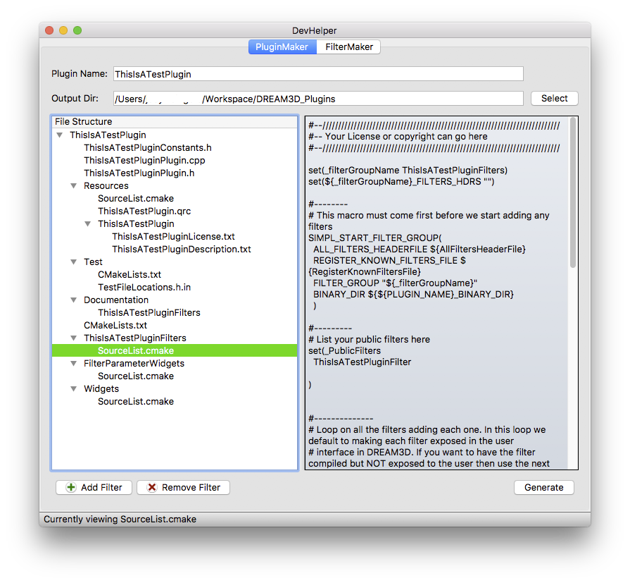
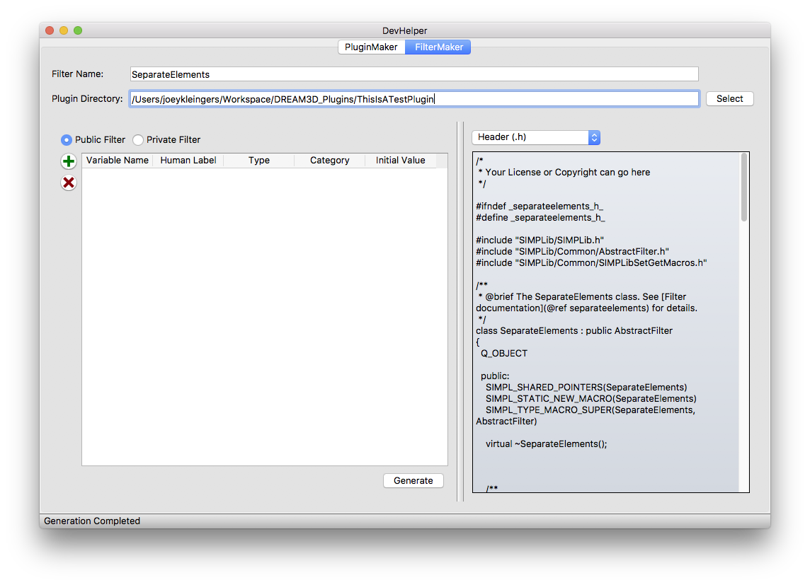

Creating A Filter {#creating_a_filter}
=========
<a name="prerequisites">
## Prerequisites ##
</a>

These prerequisites will get your system set up with a DREAM.3D SDK and compiling DREAM.3D.

If you have already fulfilled all of these prerequisites, skip to the [Using DevHelper to Create a Filter](#creating_a_filter) section.

<a name="compiler_suite">

### Install a Compiler Suite ###

</a>

A compatible compiler needs to be installed on your system to be able to build DREAM.3D.

For more information, please visit [Installing a Compiler Suite](http://dream3d.bluequartz.net/binaries/Help/DREAM3D/compiler_suite.html).

<a name="downloading_dream3d">

### Download the Source Code for DREAM.3D ###

</a>

The source code for DREAM.3D must be downloaded using Git.

For more information, please visit [Downloading the Source Code for DREAM.3D](http://dream3d.bluequartz.net/binaries/Help/DREAM3D/source_download.html).

<a name="installing_sdk">

### Install the DREAM.3D SDK ###

</a>

Developers of DREAM.3D must use the Superbuild build system to install a DREAM.3D SDK.

For more information, please visit:

**Windows** - <a href="https://github.com/bluequartzsoftware/DREAM3DSuperbuild/blob/develop/docs/Making_an_SDK_Windows.md">Configuring and Building DREAM.3D</a>

**Mac OS X** - <a href="https://github.com/bluequartzsoftware/DREAM3DSuperbuild/blob/develop/docs/Making_an_SDK_OSX.md">Configuring and Building DREAM.3D</a>

**Linux** - <a href="https://github.com/bluequartzsoftware/DREAM3DSuperbuild/blob/develop/docs/Making_an_SDK_Linux.md">Configuring and Building DREAM.3D</a>

<a name="configure_and_build_dream3d">

### Configure and Build DREAM.3D ###

</a>

DREAM.3D needs to be configured with CMake and compiled on your system so that the DevHelper tool can be used to create a filter.

For more information, please visit:

**Windows** - [Configuring and Building DREAM.3D](http://dream3d.bluequartz.net/binaries/Help/DREAM3D/windows_configure_and_build_dream3d.html)

**Mac OS X** - [Configuring and Building DREAM.3D](http://dream3d.bluequartz.net/binaries/Help/DREAM3D/osx_configure_and_build_dream3d.html)

**Linux** - [Configuring and Building DREAM.3D](http://dream3d.bluequartz.net/binaries/Help/DREAM3D/linux_configure_and_build_dream3d.html)

<a name="creating_a_filter">
## Using DevHelper to Create a Filter ##
</a>

DREAM.3D includes a tool called DevHelper that will automatically generate the required skeleton code for new plugins and filters that are compatible with DREAM.3D.

**Note**: It is **STRONGLY RECOMMENDED** that this tool be used by DREAM.3D developers to create new plugins and filters.

We will use the DevHelper tool to create a new filter.

### Instructions ###
1. Create a new folder called **DREAM3D_Plugins** in the Workspace folder.  On **Windows**, this is at *C:\\Users\\[YOUR-USER-DIRECTORY]\\Workspace\\DREAM3D_Plugins*.  On **OS X**, this is at */Users/[YOUR-HOME-DIRECTORY]/Workspace/DREAM3D_Plugins*.

2. Open CMake and set the **Where is the source code** path to your DREAM3D source folder.  On **Windows**, this is at *C:\\Users\\[YOUR-USER-DIRECTORY]\\Workspace\\DREAM3D*.  On **OS X**, this can be found at */Users/[YOUR-HOME-DIRECTORY]/Workspace/DREAM3D*.

3. Set the **Where to build the binaries** path to DREAM3D's Release directory.  On **Windows**, this is at *C:\\Users\\[YOUR-USER-DIRECTORY]\\Workspace\\Builds\\DREAM3D-Build\\Release*.  On **OS X**, this can be found at */Users/[YOUR-HOME-DIRECTORY]/Workspace/Builds/DREAM3D-Build/Release*.

4. The DevHelper tool is turned off by default when first compiling DREAM.3D, so new developers will need to turn it on.  Turn **SIMPLView_BUILD_DevHelper** on in the CMake GUI.

5. Re-configure and re-generate the DREAM3D project files by pressing **Configure** and then **Generate**.  Then open your preferred IDE and build DREAM.3D.  For a refresher on how to do these things, refer to the [Configure and Build DREAM.3D](#configure_and_build_dream3d) section above.

6. Launch the DevHelper executable inside the **Bin** folder of your DREAM.3D Release build directory.  For **Windows**, this is located at *C:\\Users\\[YOUR-USER-DIRECTORY]\\Workspace\\Builds\\DREAM3D-Build\\Release\\Bin\\DevHelper.exe*.  For **OS X**, this is at */Users/[YOUR-HOME-DIRECTORY]/Workspace/Builds/DREAM3D-Build/Release/Bin/DevHelper.app*

7. If you already have an **existing** plugin that you wish to store the new filter in, skip to [Step 11](#step_11).

8. To create a new plugin, we are going to use the **PluginMaker** tab in the DevHelper interface.  Set the **Plugin Name** field to the name of the new plugin.  Set the **Output Dir** field to the **DREAM3D_Plugins** directory that was created in Step 1.

9. The **PluginMaker** tab creates an empty filter with the plugin by default.  This is useful for people who just want to make a generic filter that goes with the plugin.  However, this is not what we want to do for this tutorial.  Select the [PLUGIN-NAME]Filter.cpp file in the tree view and press the **Remove Filter** button.  This will remove the default filter from the plugin.

10. Press the **Generate** button to generate the plugin into the **DREAM3D_Plugins** directory.
<a name="step_11">
11. </a> Click on the **FilterMaker** tab.  This is the section of the interface that allows us to generate a filter.

12. Set the **Filter Name** field to the name of the new filter.  Set the **Plugin Directory** field to the top-level directory of the plugin that you wish to store the new filter in.

	**Note**: For more information on how to use DevHelper to generate filter parameters, please visit .
	

13. Press the **Generate** button to generate the filter inside the specified plugin.

---
**Next Page**: [Writing a Filter](http://dream3d.bluequartz.net/binaries/Help/DREAM3D/writingafilter.html)

**Previous Page (Windows)**: [Configuring and Building DREAM.3D](http://dream3d.bluequartz.net/binaries/Help/DREAM3D/windows_configure_and_build_dream3d.html)

**Previous Page (OS X)**: [Configuring and Building DREAM.3D](http://dream3d.bluequartz.net/binaries/Help/DREAM3D/osx_configure_and_build_dream3d.html)

**Previous Page (Linux)**: [Configuring and Building DREAM.3D](http://dream3d.bluequartz.net/binaries/Help/DREAM3D/linux_configure_and_build_dream3d.html)