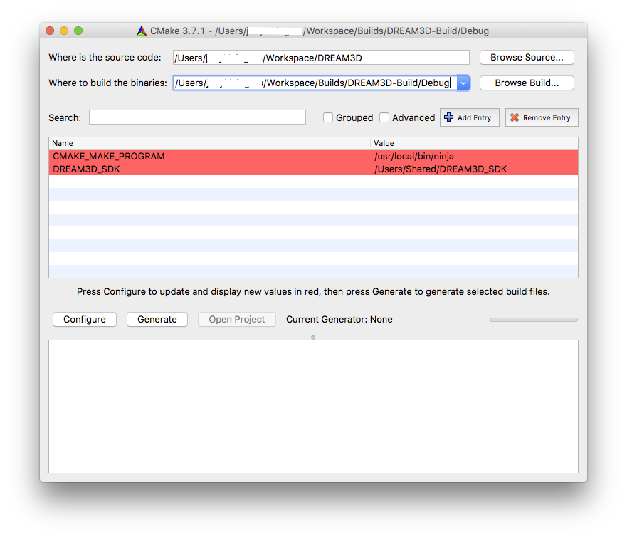
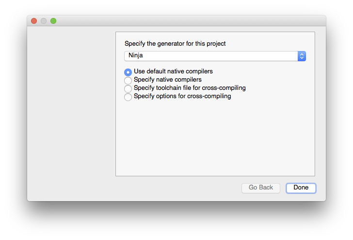
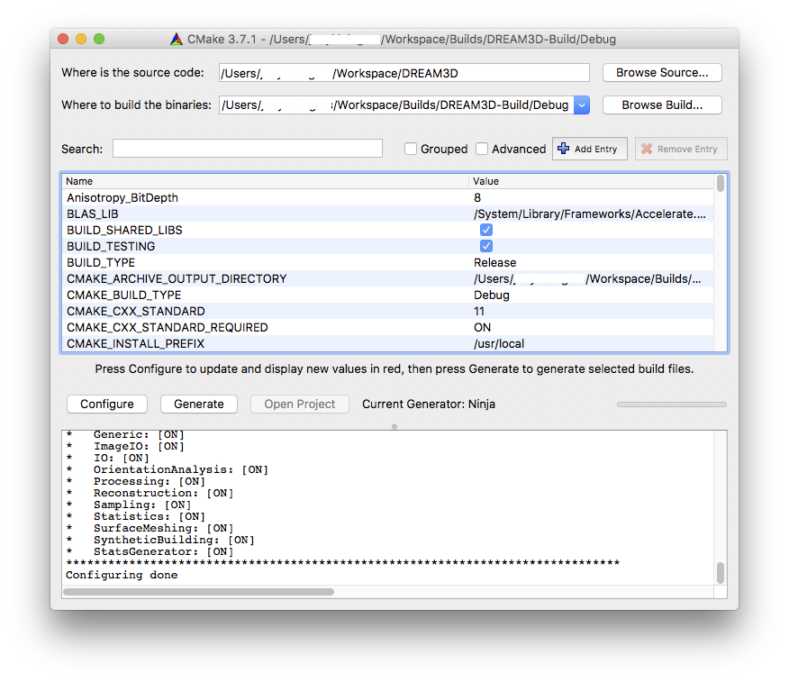

Configuring and Building DREAM.3D on Mac OS X {#osx_configure_and_build_dream3d}
========

<a name="prerequisites">

## Prerequisites ##

</a>

These prerequisites need to be completed before configuring and building DREAM.3D.

If you have already fulfilled all of these prerequisites, skip to the [Setting Up DREAM.3D for CMake Configuration](#cmake_config) section.

<a name="compiler_suite">

### Install a Compiler Suite ###

</a>

A compatible compiler needs to be installed on your system to be able to build DREAM.3D.

For more information, please visit [Installing a Compiler Suite](http://dream3d.bluequartz.net/binaries/Help/DREAM3D/compiler_suite.html) (external link).

<a name="installing_sdk">

### Install the DREAM.3D SDK ###

</a>

Developers of DREAM.3D must use the Superbuild build system to install a DREAM.3D SDK.

For more information, please visit <a href="https://github.com/bluequartzsoftware/DREAM3DSuperbuild/blob/develop/docs/Making_an_SDK_OSX.md">Making an SDK</a>.

<a name="cmake_config">

## Setting Up DREAM.3D for CMake Configuration ##

</a>

Once the SDK is installed, a file with the name DREAM3D_SDK.cmake can be found in the DREAM3D_SDK directory at */Users/Shared/DREAM3D_SDK/DREAM3D_SDK.cmake*. This file defines all the installed locations for all of the dependent libraries.

**Note**: If you use an OS X package library (MacPorts, Homebrew, etc.) to install all the dependencies, you must substitute the appropriate paths instead of reusing the DREAM3D_SDK_ROOT variable.

## Checking Paths of Dependencies ##
Open the **DREAM3D_SDK.cmake** file in the **DREAM3D_SDK** folder.  Check that the path to every dependency is set correctly.  For example, the paths to Qt, HDF5, Boost, Qwt, and others may be written incorrectly and may need to be updated to whatever path each one is located at on the file system.

## Instructions ##
There are different instructions to configure and generate the DREAM.3D project, depending on if you are using Qt Creator as your IDE or not.

### Using Qt Creator ###
1. Open Qt Creator and pull open the **Preferences** pane.

2. In the **Build & Run** vertical tab, choose the **Kits** horizontal tab.  Set up a new kit that uses the proper compiler, Qt installation, and CMake tool.  You may need to use the other horizontal tabs to point the kit to all of these items.

3. Set the CMake generator to **CodeBlocks - Ninja**.

4. Click the **Change...** button next to the **CMake Configuration** row.

5. Add these lines to the text field:
	CMAKE_MAKE_PROGRAM:STRING=/usr/local/bin/ninja
DREAM3D_SDK:STRING=/Users/Shared/DREAM3D_SDK

6. Press **Ok** to exit the preferences pane.

7. Use Qt Creator to open the CMakeLists.txt file at the top-level directory of the DREAM3D source directory located at */Users/[YOUR-HOME-DIRECTORY]/Workspace/DREAM3D/CMakeLists.txt*.

8. The project should configure automatically.  Press the **Build** button to build DREAM.3D.

### Using the CMake GUI ###
1. Open CMake and set the **Where is the source code** path to */Users/[YOUR-HOME-FOLDER]/Workspace/DREAM3D*.

2. Set the **Where to build the binaries** path to */Users/[YOUR-HOME-FOLDER]/Workspace/Builds/DREAM3D-Build/Debug*.

3. We are going to create a CMake variable.  Press the **Add Entry** button.

4. Set the **Name** to *DREAM3D_SDK*.  Set the **Type** to *PATH* and set the **Value** to */Users/Shared/DREAM3D_SDK*

5. Repeat steps 3 & 4, except set **Name** to *CMAKE_MAKE_PROGRAM*, **Type** to *FILEPATH*, and **Value** to the path to our ninja executable that we added earlier (*/usr/local/bin/ninja*).

6. You should now have two variables, DREAM3D_SDK and CMAKE_MAKE_PROGRAM.

7. Press the **Configure** button in CMake.

8. Set the generator to be compatible with whatever method you'll be using to work with DREAM.3D.  For example:
	For Xcode, set it to **Xcode**.
    For command line use, set it to **Unix Makefiles** or, if installed, **Ninja**.  Any generator can be used for command line, but these are the recommended ones.
    
	Make sure **Use default native compilers** is checked.

9. When the configuration is finished, make sure that **CMAKE_BUILD_TYPE** is set to *Debug*.

10. Press the **Configure** button in CMake again.  You may need to click **Configure** a few times until all the red highlights are gone.

11. Press the **Generate** button in CMake to generate the build files.

12. Repeat steps 1-10, except use path */Users/[YOUR-HOME-FOLDER]/Workspace/Builds/DREAM3D-Build/Release* for step 2 and set **CMAKE_BUILD_TYPE** to *Release* in step 9.

### Using the Command Line (Advanced Users Only) ###
Navigate to the DREAM3D directory, make a build directory, and navigate into your newly created build directory.  Configure DREAM.3D.

	[user] $ cd DREAM3D
	[user] $ mkdir ../DREAM3D-Build && cd ../DREAM3D-Build
	[user] $ cmake -DDREAM3D_SDK=/Users/Shared/DREAM3D_SDK -DCMAKE_BUILD_TYPE=Debug ../DREAM3D

## Building DREAM.3D ##
Once you have configured DREAM.3D, simply build DREAM.3D in your preferred IDE, or open the Terminal app and build DREAM.3D without an IDE.

---
**Next Page**: [Creating a Filter](http://dream3d.bluequartz.net/binaries/Help/DREAM3D/creating_a_filter.html)

**Previous Page**: <a href="https://github.com/bluequartzsoftware/DREAM3DSuperbuild/blob/develop/docs/Making_an_SDK_OSX.md">Making an SDK</a>
