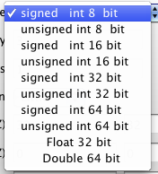

Raw Binary Reader {#rawbinaryreader}
======

## Group (Subgroup) ##

IO Filters

## Description ##

This filter is designed to read data stored in files on the users system that are stored in their
binary form versus ascii form. The data file should **NOT** have any type of header before the data in the file. The user should know exactly how the data is stored in the file and properly define this in the user interface. Not correctly identifying the type of data can cause serious issues because on a low level this filter is simply reading the data into a preallocated array and interpreted as the user defines. This filter can be used as a sort of bridge to read in binary data from sources like IDL and MatLab. 

The data is assumed to be on a rectilinear grid and will be stored in the Volume DataContainer. In a rectilinear grid the spacing on each axis is constant but each axis can have a different value. The spacing is also sometimes referred to as the _Resolution_ of the axis..

This filter will error out and block the pipeline from running if the total number of bytes that would need to be read from the file is larger than the actual file itself. The pipeline will not run at this point.

The user can use an input file that is actually **Larger** than the number of bytes required by the filter and the filter will only read the first part of the file unless an amount of bytes to skip is set. See more input parameters farther down the documentation.

### Scalar Type ###

Computer data comes in 10 basic types on modern 32bit and 64 bit operating systems. We can break the data into either integer or floating point data. With each of those types the number of bits that represent the value determine its maximum and minimum value. For integer data the standard types are 8, 16, 32 & 64 bit or 1, 2, 4, 8 byte integers. For floating point values there are either 32 bit or 64 bit (4 or 8 bytes). With the integer types the values can be either signed or unsigned integers. If an integer is signed that means it can take on negative values. If an integer type is unsigned then it can only take positive values but will have twice the positive value range as a signed integer.

@image latex RawBinaryReader-Types.png " " width=2in

---

### Dimensionality ###

 This tells the program how many dimensions are used to store the data: 1, 2 or 3 are the only valid values.

### Number of Components ###

This tells the program that for each point/pixel/voxel how many values are there. For example a gray scale image would typically have just a single value of type unsigned 8 bit integer. A color image will have at least 3 components for Red (R), Green (G) and Blue (B) and sometimes 4 values if the Alpha (A) is also stored. Euler angles are typically stored as a 3 component vector of 32 bit floating point values.

### Endian ###

This parameter tells the program which byte is _most significant_ for multi-byte values. Intel architecture computers are little endian while Power PC, Sun Sparc and DEC Alpha CPUs were Big endian. As an example we have the following:

**Byte Ordering Example for 32 Bit Signed Integer**

| Byte 0 | Byte 1 | Byte 2 | Byte 3 | Interpretation |
|---|---|---|---|----------------|
| FF | AA | 00 | 00 | -5636096 (Big Endian) |
| 00 | 00 | AA | FF | 43775 (Little Endian) |

So the user can see how it is very important to set this value properly

### Dimensions ###

This tells the program the number of elements in each of the 3 major dimension axis. For example a 2D Image that is 512 pixels wide by 384 pixels high would have values of:

| X | Y | Z |
|---|---|---|
| 512 | 384 | 1 |

while a 3D Data set of 128 x 256 x 64 (X, Y, Z) would have the following:

| X | Y | Z |
|---|---|---|
| 128 | 256 | 64 |

### Origin ###

This tells the program where in space the (0,0,0) element is located. The default is (0.0, 0.0, 0.0).

### Resolution ###

This tells the program the Resolution along each axis of the rectilinear grid.

### Over Ride Origin & Resolution ###

If this checkbox is checked (defaulted to ON) then the origin and resolution values from this filter will be applied to the Voxel Data Container. If the checkbox is left _unchecked_ then the origin and resolution values will NOT be applied to the Voxel Data Container

### Skip Header Bytes ###

If the raw binary file you are reading has a _header_ before the actual data begins in the file the user can instruct the filter to skip this header portion of the file. The user needs to know how many bytes the header is. 
 Another way to use this value is if the user wants to read data out of the interior of a file then they can set the number of bytes to skip at the beginning of the file.

### Output Array Name ###
This is the name of the array that the data should be stored as in the Voxel Data Container. Certain filters depend on specific names for the arrays that they require. If you are importing data in order to run a filter on the data then consulting the documentation for the specific filter should indicate an appropriate name to use for the created array.

-----

## IMPORTANT NOTES ##
Using this filter in combination with an existing pipeline that would already have data will OVER WRITE the Origin, Spacing and Resolution that is stored for the in memory voxel data. For instance reading a .dream3d data file with an origin of (0,0,0) and then using this filter to import more data but setting the origin in the filter to (10,5,12) will set the **Entire** voxel volume to have the new origin value.

-----

## Parameters ##

| Name | Type | Description |
|------|------| ----------- |
| Input File | File Path | Select binary file |
| Scalar Type | Enumeration | Data type |
| Dimensionality | Integer | Number of dimensions |
| Number Of Components | Integer |  |
| Endian | Enumeration |  |
| Dimensions | Integer | X,Y,Z |
| Origin | Integer | X,Y,Z |
| Resolution | Integer | X,Y,Z |
| Over Ride Origin & Resolution | Boolean |  |
| Skip Header Bytes | Integer | Number of bytes in the header |
| Output Array Name | String | Created array name |
| Add to Existing Data Container & Attribute Matrix | Boolean |  |
| Data Container Name | String | |
| Cell Attribute Matrix Name | String | |

## Required Geometry ##
Not Applicable

## Required Arrays ##

None

## Created Arrays ##

| Type | Default Name | Type | Component Dimensions | Description |
|------|--------------|-------------|---------|-----|
| Any | User set | Any | Any | |

## License & Copyright ##

Please see the description file distributed with this plugin.

## DREAM3D Mailing Lists ##

If you need more help with a filter, please consider asking your question on the DREAM3D Users mailing list:
https://groups.google.com/forum/?hl=en#!forum/dream3d-users

