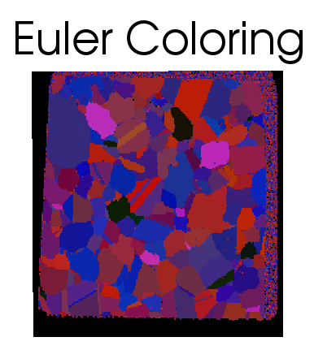

Generate Euler Colors {#generateeulercolors}
========

## Group (Subgroup) ##
Generic Filters (Misc)

## Description ##
This filter will generate an RGB color for each **Cell** that is calculated from the Euler Angles for the cell. **If you want IPF Colors this is NOT the filter for you**, use the [Generate IPF Colors](generateipfcolors.html) filter. The  algorithm is to assign a color component based on a scale of the following:

| Euler Component | Min Value (Radians) | Max Value (Radians) | Calculation |
|-----------------|---------------------|---------------------|-------------|
| phi1 (Euler 0)  |   0 | 2 Pi | phi1 / 2Pi \* 255 |
| Phi  (Euler 1)  | 0    | Pi | Phi / Pi \* 255 |
| phi2 (Euler 2) |   0 | 2 Pi | phi2 / 2Pi \* 255 |

### Example ###

Given the set of Euler Angles (0.43765, 0.265830, 5.583250) would result in RGB Values of [17, 21, 226].

------------------

@image latex EulerColor_1.png " " width=6in 

-------------------

@image latex IPFColor_1.png " " width=6in 

-------------------

## Input Options ##

None

## Required DataContainers ##

Voxel

## Required Arrays ##

| Type | Default Name | Description | Comment | Filters Known to Create Data |
|------|--------------|-------------|---------|------------------------------|
| Cell | CellEulerAngles | | These are the angles used to determine the colors | Read H5Ebsd File (IO), Match Crystallography (SyntheticBuilding) |

## Created Arrays ##

| Type | Name | Description | Comment |
|------|------|-------------|---------|
| Cell | EulerColors | | The RGB colors are encoded as an unsigned char triplet  |

### Authors ##
**Copyright:** 2013 Michael A. Groeber (AFRL), 2012 Michael A. Jackson (BlueQuartz Software)

**Contact Info:** dream3d@bluequartz.net

**Version:** 1.0.0

**License:** See the License.txt file that came with DREAM3D.

See a bug? Does this documentation need updated with a citation? Send comments, corrections and additions to [The DREAM3D development team](mailto:dream3d@bluequartz.net?subject=Documentation%20Correction)

