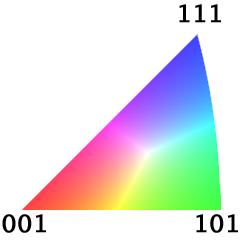

Generate IPF Colors {#generateipfcolors}
========

## Group (Subgroup) ##
Generic Filters

## Description ##
This filter will generate Inverse Pole Figure colors for Cubic or Hexagonal Crystal Structures. The __determination__ is based on the Crystal Structure Ensemble data
 which must be present for this filter to run. The user can enter the Reference direction and is defaulted to [001].

@image latex IPFFilterLegend.png

## Input Options ##

| Option | Type |
|-------|-------|
| X Reference Direction | Double |
| Y Reference Direction | Double |
| Z Reference Direction | Double |

## Required Arrays ##

| Type | Default Name | Comment |
|------|--------------|---------|
| Cell | CellEulerAngles |  |
| Cell | CellPhases |  |
| Ensemble | CrystalStructures |  |

## Created Arrays ##

| Type  | Comment | Suggested Name |
| ------|-------- | -------------- |
| Cell  | The RGB colors are encoded as an unsigned char triplet  |IPFColors  |

### Authors ##
**Copyright:** 2012 Michael A. Groeber (AFRL), 2012 Michael A. Jackson (BlueQuartz Software)

**Contact Info** dream3d@bluequartz.net

**Version** 1.0.0

**License** See the License.txt file that came with DREAM3D.
