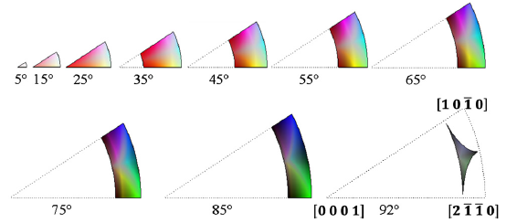

Generate Misorientation Colors {#generatemisorientationcolors}
========

## Group (Subgroup) ##
Generic Filters (Misc)

## Description ##
This filter will generate colors based on the method developed by C. Schuh and S. Patala for Cubic, Hexagonal, Tetragonal, or Orthorhombic Crystal Structures (currently only cubic high is working)[1]. Orientations are colored by disorientation relative to a reference orientation. The user can enter a reference orientation which is relative to the sample reference frame. The default reference orientation is the sample frame (misorientation from sample frame: 0 degrees about [001]).

The user is required to run a filter that will determine if a voxel should have it's color calculated by generating the _GoodVoxels_ array or an equivalent **boolean** array. Typically the **MultiThreshold Cells** or **Single Threshold Cells** filter is run _before_ this filter with an output array set to _GoodVoxels_.

### Important Implementation Notes ###
_The user should be aware of the crystal symmetry (Laue Group and Point Group) of their data. The Filter is only valid for certain point groups within a Laue group (See table below)._

### Color Output Notes ###

With other coloring methods such as IPF bad voxels which result from non-indexed EBSD scans can be colored with a black color (RGB= 0,0,0). Since the Misorientation Coloring scheme uses all possible colors, marking voxels in an image in such a way that the voxels stand out is not possible.

## Crystal Symmetry Implementations ##

|Crystal Symmetry (Laue) | Hermann–Mauguin  Symbol |Schoenflies Symbol | Laue Class | Implemented  (Legend) |
|------------------------|-------------------------|-------------------| -----------|-----------------------|
| Triclinic | 1, -1  |  C1, C1 | -1 | Not Implemented|
| Monoclinic | 2, m, 2/m | C2, Cs, C2h | 2/m | Not Implemented |
| Orthorhombic | 222,, 2/m 2/m 2/m | D2, D2h | mmm |  |
| Orthorhombic | mm2 | C2v | mmm | Not Implemented |
| Trigonal (Low)|3, -3 | C3, C3i | -3 | Not Implemented |
| Trigonal (High)  | 32, 3m, -32/m | D3, C3v, D3d | -3m | Not Implemented |
| Tetragonal (Low) | 4, -4, 4/m | C4, S4, C4h | 4/m | Not Implemented |
| Tetragonal (High) | 422,  4/m 2/m 2/m | D4, D4h | 4/mmm |  |
| Tetragonal (High) | 4mmm, -42m | C4v, D2d | 4/mmm | Not Implemented|
| Hexagonal (Low) | 6, -6, 6/m | C6, C3h, C6h | 6/m | Not Implemented |
| Hexagonal  (High)| 622, 6/m 2/m 2/m | D6, D6h | 6/mmm |  |
| Hexagonal  (High)| 6mm, -62m | C6v, D3h | 6/mmm | Not Implemented |
| Cubic (Low) | 23, 2/m-3 | T, Th | m-3 |  |
| Cubic (High) | 432, 4/m -3 2/m | O, Oh| m-3m |  |
| Cubic (High) | -43m | Td| m-3m | Not Implemented |

## Example Output Image ##

![Small IN100 courtesy of [2] showing a generally random texture](MisoColor_Small_IN100.png)

![Interstitial Free (IF) Steel courtesy of [3] showing a strong texture](Miso_fw-ar-IF1-avtr12-corr.png)

## Input Options ##

| Option | Type |
|-------|-------|
| x Reference Frame Misorientation Axis | Double |
| y Reference Frame Misorientation Axis | Double |
| z Reference Frame Misorientation Axis | Double |
| w Reference Frame Misorientation Angle| Double |

## Required DataContainers ##

Voxel DataContainer

## Required Arrays ##

| Type | Default Name | Description  | Filters Known to Create Data |
|------|--------------|------------|-----|
| Cell | CellQuats |  These are the orientations used to determine the colors | Find Cell Quaternions |
| Cell | CellPhases |  These are used to determine which ensemble the **Cell** belongs to | Read H5Ebsd File (IO), Pack Primary Phases (SyntheticBuilding), Insert Precipitate Phases (SyntheticBuilding), Establish Matrix Phase (SyntheticBuilding) |
| Cell | GoodVoxels | This is the boolean array that determines if a voxel will have its IPF Color generated or not. | [MultiThreshold Cells](multithresholdcells.html), [Single Threshold Cells](singlethresholdcells.html) |
| Ensemble | CrystalStructures |  These are the symmetries of the ensembles, which dictate orientation operations and which color palatte is used | Read H5Ebsd File (IO), Read Ensemble Info File (IO), Initialize Synthetic Volume (SyntheticBuilding) |

## Created Arrays ##

| Type | Name | Description |
|------|------|-------------|
| Cell | MisorientationColors | The RGB colors are encoded as an unsigned char triplet  |

### Authors ###

**Copyright:** 2013 William Lenthe (University of California Santa Barbara)

**Contact Info:** willlenthe@gmail.com

**Version:** 1.0.0

**License:** See the License.txt file that came with DREAM3D.

See a bug? Does this documentation need updated with a citation? Send comments, corrections and additions to [The DREAM3D development team](mailto:dream3d@bluequartz.net?subject=Documentation%20Correction)

## References ##

[1] Patala, S., Mason J., Schuh C., 2012. Improved representations of misorientation information for grain boundary science and engineering. Prog Mater Sci. 57, 1383-1425.

[2] Groeber M, Haley BK, , Uchic MD, Dimiduk DM, Ghosh S: 3D reconstruction and characterization of polycrystalline microstructures using a FIB–SEM system Data Sets. Materials Characterization 2006, 57:259—-273.

[3] Nathalie Allain-Bonasso, Francis Wagner, Stéphane Berbenni, David P. Field, A study of the heterogeneity of plastic deformation in IF steel by EBSD, Materials Science and Engineering: A, Volume 548, 30 June 2012, Pages 56-63, ISSN 0921-5093, http://dx.doi.org/10.1016/j.msea.2012.03.068.
(http://www.sciencedirect.com/science/article/pii/S0921509312004388)

[4] http://reference.iucr.org/dictionary/Laue_classes
