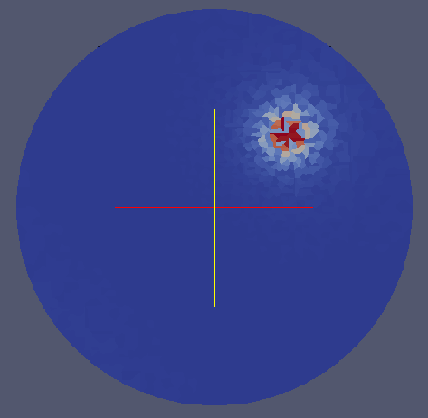

Visualize GBCD {#visualizegbcd}
======

## EXPERIMENTAL FILTER WARNING ##

__This filter is highly experimental and under heavy development. Future versions of DREAM3D may not have this filter or output completely different files. Please do not depend on this filter for long term research use.__

## Group (Subgroup) ##
IO Filters

## Description ##

**This is an experimental filter** that creates a few different types of visualization files based on regular and irregular grids of the GBCD data for DREAM3D. Currently there are 3 different types of output files that are created all of which can be visualized in ParaView.

-----

1: Stereographic Projection on a Regular Grid

-----

2: Stereographic Projection on an Irregular Grid

To generate this view in ParaView the user should load the .vtk file and then apply the Delauney 2D filter to the data.

-----

3: The GBCD Data where all the points are on a unit sphere but on an irregular grid.

To generate this view in ParaView the user should load the .vtk file and then apply the Delauney 3D filter to the data.

-----

## Parameters ##

| Name | Type |
|------|------|  
| Misorientation Angle | Floating Point value in DEGREES |  
| Misorientation Axis | Floating point 1x3 vector that is the rotation axis |

## Required DataContainers ##

SurfaceMesh

## Required Arrays ##

| Type | Default Name | Description | Comment | Filters Known to Create Data |
|------|--------------|-------------|---------|-----|
| 5 Dimension GBCD Array | GBCDArray | The 5 parameter GBCD data | | FindGBCD |  

## Created Arrays ##

None

## Authors ##

**Copyright:** 2013 Michael A. Groeber (AFRL), 2012 Michael A. Jackson (BlueQuartz Software)

**Contact Info:** dream3d@bluequartz.net

**Version:** 1.0.0

**License:**  See the License.txt file that came with DREAM3D.

