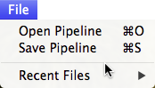

Import, Export & Favorite Pipelines {#importexportsavepipeline}
=========

## Saving and Loading a Predefined Pipeline
DREAM3D allows the user to _Export_ and _Import_ pipelines via the **File** menu and the **Save Pipeline** and **Open Pipeline** menu items. The pipeline files are saved in the _.ini_ file format popular among many other programs. This file format is a simple text file with delineated sections with _Key::Value_ entries. This makes the sharing of Pipelines mostly transparent between users. If a pipeline has filters that require files to be read from or written to and the pipeline file is passed to another user that does not have those same paths, then the new user may have to make the adjustments inside of DREAM3D after the pipeline is loaded.

-------

@image latex Images/ImportExport-1.png "Figure 1: File Menu" width=2in

-------

The following is a partial listing of a 3D EBSD reconstruction pipeline saved as a pipeline file:

	[PipelineBuilder]
	Number_Filters=15
	Name=Reconstruction
	
	[0]
	Filter_Name=ReadH5Ebsd
	InputFile=/Users/Shared/Data/Ang_Data/Small_IN100_Output/Small_IN100.h5ebsd
	ZStartIndex=1
	ZEndIndex=117
	UseTransformations=false
	ArraySelections_VoxelCell\size=4
	ArraySelections_VoxelCell\1\VoxelCell=Confidence Index
	ArraySelections_VoxelCell\2\VoxelCell=EulerAngles
	ArraySelections_VoxelCell\3\VoxelCell=Image Quality
	ArraySelections_VoxelCell\4\VoxelCell=Phases
	ArraySelections_VoxelFeature\size=0
	ArraySelections_VoxelEnsemble\size=2
	ArraySelections_VoxelEnsemble\1\VoxelEnsemble=CrystalStructures
	ArraySelections_VoxelEnsemble\2\VoxelEnsemble=MaterialName
	ArraySelections_SurfaceMeshPoint\size=0
	ArraySelections_SurfaceMeshFace\size=0
	ArraySelections_SurfaceMeshEdge\size=0
	ArraySelections_SolidMeshPoint\size=0
	ArraySelections_SolidMeshFace\size=0
	ArraySelections_SolidMeshEnsemble\size=0
	
	[1]
	Filter_Name=MultiThresholdCells
	OutputArrayName=GoodVoxels
	ComparisonInputs\size=2
	ComparisonInputs\1\ArrayName=Image Quality
	ComparisonInputs\1\CompOperator=1
	ComparisonInputs\1\CompValue=120
	ComparisonInputs\2\ArrayName=Confidence Index
	ComparisonInputs\2\CompOperator=1
	ComparisonInputs\2\CompValue=0.100000001490116
	
	[2]
	Filter_Name=IdentifySample
	
	[3]
	Filter_Name=AlignSectionsFeatureCentroid
	UseReferenceSlice=true
	ReferenceSlice=0

## Creating a Favorite Pipeline ##

If the user creates a pipeline that the user intends to use several times, then the user may want to save the pipeline to the _Favorites_ area. This can be accomplished by using the **Pipeline** menu and selecting the **Add Favorite**. If the user wants to remove a favorite at any time the user needs to select the **Remove Favorite** menu item.

--------------

@image latex Images/PipelineMenu.png "Pipeline Menu" width=3in

--------------

## Clearing the Pipeline ##

As a convenience for those situations where the user has created a large pipeline and the user would like to delete every filter from the pipeline, the **Pipeline Menu** also has a menu item to remove every filter from a pipeline and an associated keyboard shortcut.

@htmlonly

|   | Navigation |    |
|----|---------|------|
| [Back](creatingpipeline.html) | [Top](usermanual.html) | [Next Section](statsgenerator.html) |  
 
@endhtmlonly