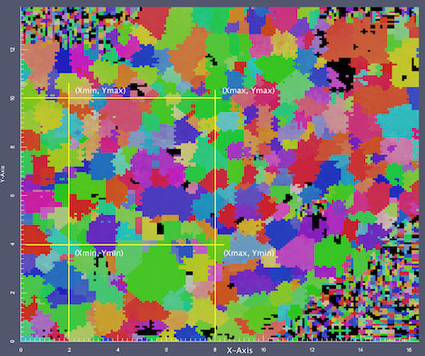

Cropping Data {#tutorialcroppingdata}
========

Cropping data in DREAM3D can help reduce the time to process data by removing data that the user decides should not be processed. The filter uses the 3D Voxel index as the minimum and maximum values to use for the region of interest. The easiest way to work through the data is to initially run a pipeline that writes out a .dream3d file and then load the .xdmf file into ParaView. In the _Information_ tab, ParaView will display the extents of the data. For this example, note that the data extent in Voxels is (0,164)(0,172)(0,39) and in Microns is (0, 16.4)(0, 13.8)(0, 9.75) which corresponds to a resolution of (0.1, 0.08, 0.25).

-----

@image latex CroppingImages/Annotated_Small.png "Region of interest for Cropping" width=3in

-----

 Because the display in ParaView shows the values in Microns, we need to convert those values to Voxels (Or just estimate if that is good enough). Again, for this example, we want to crop out a section from (2, 8) in X and (4, 10) in Y and all of Z.

-------

@image latex CroppingImages/ParaView_DataExtents.png "ParaView Data Properties" width=2in

------

The general formula to figure this out is the following.

    Micron * Resolution(Voxel/Micron) = Voxel

Applying this to our sample data gives the following table.

#### Example Calculation for Min/Max Voxels for Cropping ####
| Axis | Min | Max |
|---------|-----|-----|
| X | 2 / 0.1 = 20 | 8 / 0.1 = 80 |
| Y | 4 / 0.08 = 50 | 10 / 0.08 = 125 |
| Z | 0 / 0.25 = 0 | 9.75 / 0.25 = 39 -1 |

_We subtract 1 from the max Z value because the internal arrays are Zero Based._

Entering these values into the "Crop Volume" filter gives us the following:

@image latex CroppingImages/CropData_Filter.png "The Crop Data Filter" width=5in

After the filter executes, the data from the volume of interest is cropped out.

@image latex CroppingImages/Cropped_Data.png "Data Volume after cropping" width=3in

