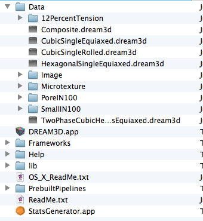

Downloading Example Data {#downloadingdata}
========

## Introduction ##

In order to use the prebuilt pipelines that are in the _Workshop_ folder the user will need to download from appropriate data from the [DREAM3D server](http://dream3d.bluequartz.net/downloads/index.html) first. After the archive is successfully downloaded then user will need to decompress the archive into the current DREAM3D distribution so that the decompressed "Data" directory replaces the current "Data" directory in the DREAM3D distribution. If performed correctly the resulting DREAM3D distribution folder should contain a hierarchy of files as shown in the figure below:

@latexonly
@image latex Images/DownloadExampleData1.png "Correct Setup of DREAM3D Example Data Directory" width=2in
@endlatexonly

