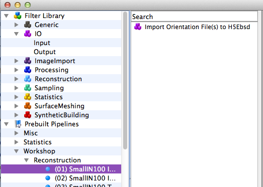
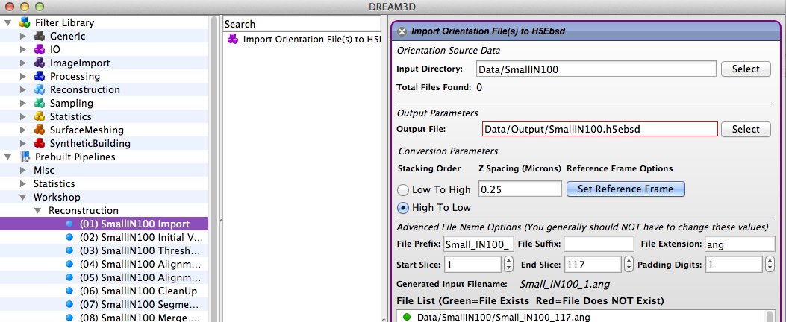

3D Orientation Data Reconstruction {#tutorialebsdreconstruction}
========
## Introduction ##

This tutorial uses a prebuilt pipeline to reconstruct a 3D data set of a Ni based Superalloy called the "Small IN100" data set. This data set was collected by M. Uchi et.al. at the US Air Force Research laboratory and is provided to the DREAM3D community. The data set consists of 117 slices of EBSD data where each slice is 189 x 201 scan points.

## Download the Sample Data ##
Download the compressed archive from [the DREAM3D web site](http://dream3d.bluequartz.net/Data/Small_IN100.zip). After downloading the zip we need to place the data into the *Data* folder that is part of the DREAM3D distribution. Regardless of operating system the DREAM3D distribution will have a directory called "Data". The user needs to decompress the **Small_IN100.zip** archive inside of the **Data** folder so that the resulting folder hierarchy is exactly as follows:

+ DREAM3D-DREAM3D-4.2.XX-XXX
	+ Data
		+ SmallIN100
			+ Small_IN100_X.ang
			+ Small_IN100_X.ang

Where the *.ang* files should be numbered from 1 to 117.

## First Steps: Convert the .Ang Files to an H5EBSD Archive ##

We want to convert the text based set of .ang files into a single binary archive file based on the [HDF5](http://www.hdfgroup.org) file specification. In order to do this the user needs to run a pipeline with a single filter, the  [Convert the Orientation Data](ebsdtoh5ebsd.html) filter. The easiest way to do this is to use a *Prebuilt Pipeline* that has all the proper settings ready to use. Using the following figure as a guide navigate to the *Prebuilt Pipelines->Workshop->Reconstruction* and double click on the **"(01) SmallIN100 Import"** pipeline. This will clear any current pipeline and insert the [Convert the Orientation Data](ebsdtoh5ebsd.html) filter. At this point the user can click the "**Go**" button to execute that pipeline. The output file will be stored in the Data/Output directory.

------------

@image latex Images/ex_reconstruction_10.png "Archiving the EBSD Data" width=2.5in

------------

@image latex Images/ex_reconstruction_12.png "Setting the reference frame for TSL data" width=3.0in

------------

@image latex Images/ex_reconstruction_14.png "Import Orientation Files filter gui" width=6.0in

------------

## Running the Reconstruction ##

To reconstruct the Small IN100 data set a complete pipeline is provided. The user should navigate to *Prebuilt Pipelines->Workshop->Reconstruction* and double click on **"(17) SmallIN100 Full Pipeline"**. This will clear any current pipeline and populate the pipeline area with all the necessary filters and their settings to reconstruct the Small IN100 data set. The user is encouraged to run this pipeline once as it stands and then visualize the results. After this step the user is encouraged to read the documentation files for each of the filters to gain an understanding of the processing being performed on the data. 

## Visualizing the Microstructure ##

After running the pipeline [ParaView](http://www.paraview.org) can be used to display the generated reconstruction. Start by launching ParaView and then opening the XDMF file that was generated as part of the pipeline. The name of the XDMF file will be the exact same as the DREAM3D file except it has a "**.xdmf**"  file extension. After you open the XDMF file and initially click the "**Apply**"  button the user should make a few selections within ParaView in order to render the reconstructed volume (See Figure below).

1. Select the *Surface* rendering type
2. Select the *IPFColor_Z* to color by
3. Click the "Gear" icon to activate the advanced rendering options
4. Uncheck the *Map Scalars* option

At this point the reconstructed volume will be mostly black. This is because the black voxels were outside of the scan area and have been marked as "bad" data (GoodVoxels=0) and when the "Generate IPF Colors" filter executed those voxels marked as "bad data" were given a black color since black is impossible to have on the IPF color scale. 

------------

@image latex Images/ex_reconstruction_40.png "Initial Rendering of the reconstructed Small IN100 data set showing bad voxels in black" width=6in

------------

In order to visually reveal more of the inner structure of the reconstructed volume the user should perform a *Threshold* filter within ParaView.  Using the next image as a guide click on the *Threshold* icon in the toolbar (circled in red). The user should select the "GoodVoxels" as the **Scalars** to filter on and set the range from **1** to **1**. When these values have be set the click the **Apply** button. When the filter completes the reconstruction volume will be shown without the bad voxels in view. If the user selects to color by "IPFColor_Z" then they will need to again uncheck the **Map Scalars** checkbox to have ParaView use the DREAM3D generated colors.

------------

@image latex Images/ex_reconstruction.png "Applying the Threshold filter using the toolbar" width=4.5in

------------

@image latex Images/ex_reconstruction_44.png "Visualizing the EBSD Data" width=3in

