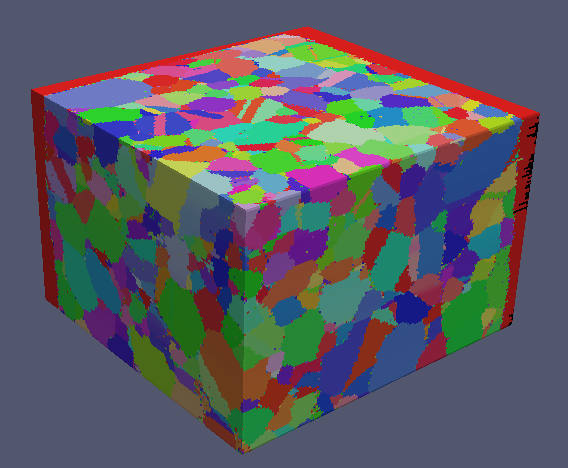

EBSD Reconstruction {#tutorialebsdreconstruction}
========

With the advent of 3D EBSD data collection systems the visualization of the collected data is typically the first order of business. Using the sample data set _Small IN100_ which is a Nickel based super alloy we can use DREAM3D to build a 3D reconstruction of the 2D slices. The order of operations for this type of work flow is the following:

1. Read H5Ebsd file
2. Determine which voxels are considered _good_.
3. Align the sections using a Misorientation Alignment filter
4. Segment the grains using a Misorientation Algorithm
5. Generate the IPF (Inverse Pole Figure) colors based on the Euler Angles
6. Write out a DREAM3D data file (with optional Xdmf file>

@image latex Images/ex_reconstruction.png "EBSD Reconstruction Pipeline" width=6in

After running the pipeline ParaView can be used to display the generated Xdmf file.

@image latex Images/ex_reconstruction_2.png "3D Reconstruction of EBSD based Orientation Data " width=6in

