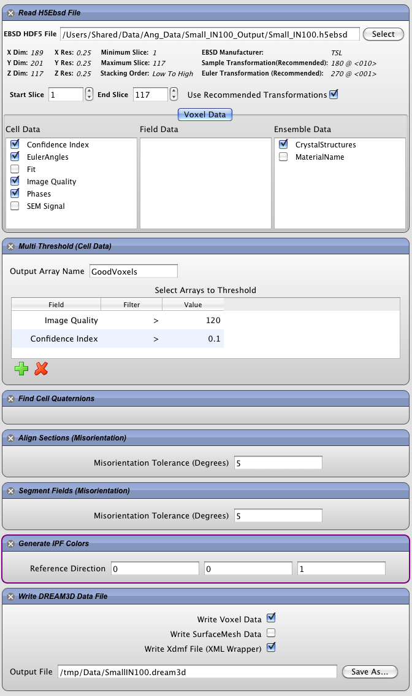

3D Orientation Data Reconstruction {#tutorialebsdreconstruction}
========

With the advent of 3D EBSD data collection systems, the visualization of the collected data is typically the first order of business. Using the sample data set _Small IN100_, which is collected from a Nickel based superalloy, we can use DREAM3D to build a 3D reconstruction of the 2D slices. The order of operations for this type of work flow is the following:

1. [Convert the Orientation Data](ebsdtoh5ebsd.html) to an H5Ebsd based archive file.
2. [Read H5Ebsd file](readh5ebsd.html).
3. [Determine which voxels are considered good](multithresholdcells.html).
4. [Find the Quaternions for each Cell](findcellquats.html).
5. [Align the sections](alignSectionsmisorientation.html) using a Misorientation Alignment filter.
6. [Segment the grains](ebsdsegmentgrains.html) using a Misorientation Algorithm.
7. [Generate the IPF](generateipfcolors.html) (Inverse Pole Figure) colors based on the Euler Angles.
8. [Write out a DREAM3D](datacontainerwriter.html) data file (with optional Xdmf file).

@image latex Images/ex_reconstruction.png "EBSD Reconstruction Pipeline" width=6in

After running the pipeline [ParaView](http://www.paraview.org) can be used to display the generated Xdmf file. There are a few options within ParaView that need to be set in order to show the encoded IPF colors; otherwise, ParaView will create a random color table for the visualization. Click on "Apply", and then do the following:

1. Set the representation to _Surface_.
2. Set the color to _IPFColor_.
3. Click the little gear icon to show the advanced options.
4. Uncheck the **Map Scalars** and **Interpolate Scalars**.

After all of these options are set, the visualized volume will display with the encoded IPF Colors. The user is free to use what ever coloring scheme the user would like; for example, coloring by the phase or Grain Id will also show grain boundaries.

@image latex Images/ex_reconstruction_3.png "3D Reconstruction of EBSD Orientation Data" width=6in

