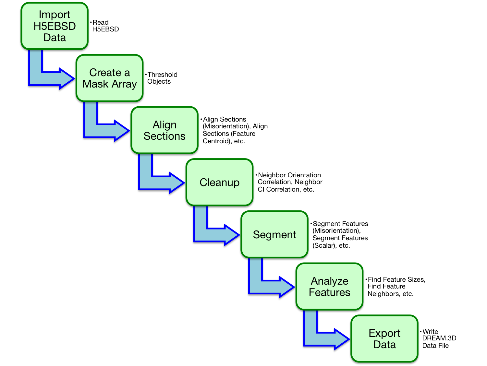
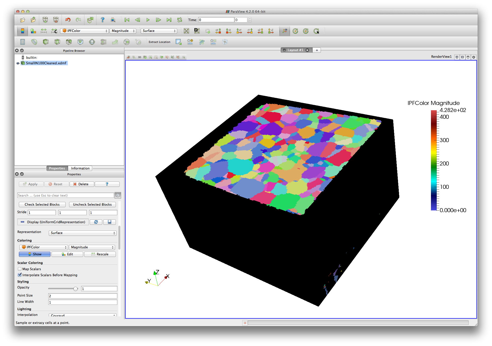
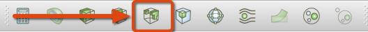
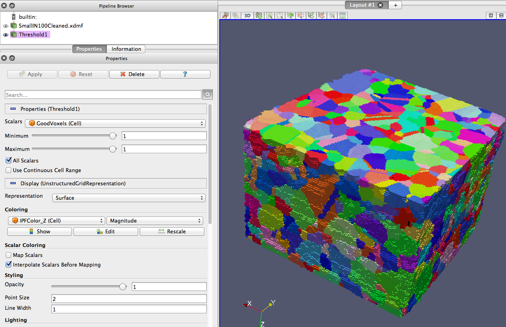

3D Orientation Data Reconstruction {#tutorialebsdreconstruction}
========

This tutorial uses a **Prebuilt Pipeline** to reconstruct a 3D data set of a Ni based superalloy called the "Small IN100" data set. This data set was collected by M. Uchic et. al. at the Air Force Research Laboratory (AFRL) and is provided to the DREAM.3D community as a learning tool. The data set consists of 117 slices of EBSD data where each slice is 189 x 201 scan points.

## Downloading the Example Data ##
Download the compressed archive named "SmallIN100.zip" from [the DREAM.3D nightly downloads web site](http://dream3d.bluequartz.net/binaries/experimental/). After downloading the archive, unzip the files and place the  "SmallIN100" folder into the DREAM.3D _Data_ folder. The _Data_ folder should be located at the same level as your DREAM.3D executable. The resulting folder hierarchy is exactly as follows:

  DREAM3D-XXXX
    Data
      SmallIN100
        Slice_1.ang
        Slice_2.ang
        ...

The .ang files should be numbered from 1 to 117.

## Convert the .ang Files to an H5EBSD Archive ##
The first step is to convert the text based set of .ang files into a single binary archive file based on the [HDF5](http://www.hdfgroup.org) file specification. In order to do this, run a **Pipeline** with a single **Filter**, the  [Import Orientation File(s) to H5EBSD](ebsdtoh5ebsd.html) **Filter**. The easiest way to do this is to use a **Prebuilt Pipeline** that has all the proper settings ready to use. Simply find the **Prebuilt Pipeline** named <i>(01) Small IN100 Import</i> in the **Prebuilt Pipelines View** and double click on it. This will open that **Pipeline** in a new DREAM.3D window. Assuming you have placed the .ang files in the correct location, all the parameters for the **Filter** should be set correctly, and you can simply click *Go* to execute that pipeline. The output H5EBSD file will be stored in the *Data/Output* directory.

Note that if you are attempting to import a stack of EBSD data other than the Small IN100 data set, the <i>(01) Small IN100 Import</i> **Pipeline** will not generally have the correct settings enabled. Instead, you will most likely have to modify the parameters of the [Import Orientation File(s) to H5EBSD](ebsdtoh5ebsd.html) **Filter** to get the correct settings. Consult the [Import Orientation File(s) to H5EBSD documentation](ebsdtoh5ebsd.html) for details. Pay special attention to setting your reference frame!

## Running the Reconstruction ##
A complete **Prebuilt Pipeline** has been provided that reconstructs the Small IN100 dataset. Find the **Prebuilt Pipeline** named <i>(15) Small IN100 Full Reconstruction</i> in the **Prebuilt Pipelines View** and double click on it to open the **Pipeline** in a new DREAM.3D window. This **Pipeline** should have all the correct **Filters** and settings for an ideal reconstruction of the Small IN100 data set. Simply click *Go* and allow the **Pipeline** to finish. It will write a .dream3d file and a .xdmf file to the *Data/Output* directory. More on the use of the .xdmf file can be found in the [Visualizing the Microstructure](#vismicro) section below.

The actual components of the **Prebuilt Pipeline** are important to understand if you plan to deal with novel data in the future. After importing the H5EBSD file using the [Read H5EBSD File](@ref readh5ebsd) **Filter**, a first general step is to create a _mask_ that defines which voxel elements are "good" and which are "bad". Most experimental approaches will leave data points that are definitely not part of the actual material, or were simply unable to be measured. For example, the experiment may have overscanned the specimen, resulting in extra regions of data with no material. To flag these "bad" points, use the [Threshold Objects](@ref multithresholdobjects) **Filter**, which will apply a set of user-defined logic checks to create a boolean _mask_ array. This array is necessary for many of the cleanup and reconstruction filters in DREAM.3D. After obtaining this _mask_ array, the next general step is to _align_ the 2D slices. Alignment is usually necessary since specimens can move slightly during an experiment, causing drift between slices. DREAM.3D provides several different **Filters** to enable alignment. The user may then wish to apply _cleanup_ routines, such as [Replace Element Attributes With Neighbor Values](@ref replaceelementattributeswithneighborvalues). Once sufficiently cleaned, it is time to _segment_ the data elements into **Features**. For EBSD data, it is often best to [segment features by misorientation](@ref ebsdsegmentfeatures). This process should identify the grains within the microstructure. Equipped with a reconstructed set of 3D **Features**, the user is now free to use DREAM.3D to analyze the **Features**, interrogating their shapes, sizes, etc. Finally, you can save your data for later use and visualization by running the [Write DREAM.3D Data File](@ref datacontainerwriter) **Filter**. Note that this general workflow is flexible, and should be modified depending on the underlying data being processed. A good place to learn more about the individual capabilities of **Filters** during the reconstruction process is the [Filter Documentation](@ref filterdocumentation), especially the [Reconstruction](@ref reconstructionfilters), [Processing](@ref processingfilters) and [Orientation Analysis](@ref orientationanalysisfilters) sections.

------------

@image latex Images/ebsdreconstruction.png "General Workflow for EBSD Reconstruction" width=6in

------------

<a name="vismicro">
## Visualizing the Microstructure ##
</a>

After reconstructing the Small IN100 data set, [ParaView](http://www.paraview.org) can be used to display the generated microstructure. Start by launching ParaView and then opening the Xdmf file that was generated as part of the pipeline. The name of the Xdmf file will be the exact same as the DREAM.3D file except for the .xdmf file extension. After opening the Xdmf file and clicking the _Apply_ button, the user should make a few selections within ParaView in order to render the reconstructed volume:

1. Select the *Surface* rendering type
2. Select the *IPFColor* to color by
3. Click the _Gear_ icon to activate the advanced rendering options
4. Uncheck the *Map Scalars* option

At this point the reconstructed volume will be mostly black. This is because the black voxels were outside of the scan area and have been marked as "bad" data.  The [Generate IPF Colors](@ref generateipfcolors) **Filter** keyed off this "bad" data and gave those voxels a black color since black is impossible to have on the IPF color scale.

------------

@image latex Images/ex_reconstruction_40.png "Initial Rendering of the Reconstructed Small IN100 Data Set Showing Bad Voxels in Black" width=6in

------------

In order to visually reveal more of the inner structure of the reconstructed volume, the user should perform a *Threshold* filter within ParaView.  Click on the *Threshold* icon in the toolbar (circled in red). The user should select the _ThresholdArray_ to threshold on and set the range from **1** to **1**. Once ready, click the _Apply_ button. When the filter completes, the reconstruction volume will be shown without the black voxels in view. If you select to color by *IPFColor* again, don't forget to uncheck the *Map Scalars* checkbox to have ParaView use the DREAM.3D generated colors.

------------

@image latex Images/ParaViewToolbar.png "Applying the Threshold Filter Using the Toolbar" width=4.5in

------------

@image latex Images/ex_reconstruction_44.png "Visualizing the EBSD Data" width=3in

