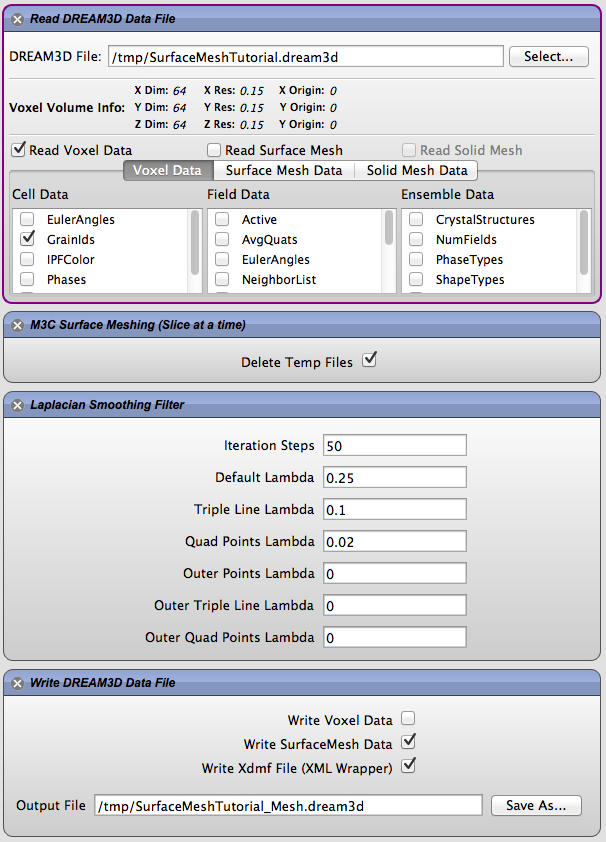
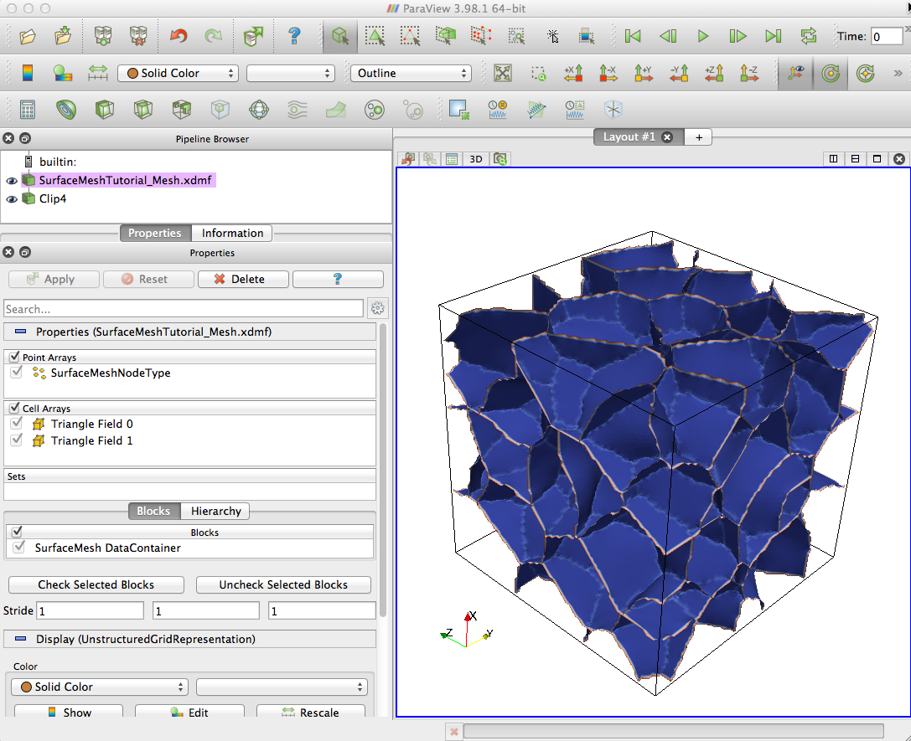

Surface Meshing Tutorial {#tutorialsurfacemeshingtutorial}
========

## Surface Mesh Definitions
Creating a surface mesh in DREAM3D can be accomplished in several ways. There are a pair of filters [Multi-Material Marching Cubes (Slice at a Time)](#m3cslicebyslice) and [Quick Surface Mesh](#quicksurfacemesh) that will generate a triangular based mesh of the primary **Feature** for you. The terminology of the underlying data structures is something that the user should understand so that the user can be well informed. We start out by defining a triangle **T**,  which we will call a  **Face**. Each Triangle has three (3) **Vertices** (V0, V1, V2) which are  referred to as a **Point**, **Vertex** and/or **Node** interchangeably within DREAM3D.

@image latex Images/TriangleSmall.png " " width=1.75in

These data structures are declared in DREAM3D in the following code:

    typedef struct
    {
        Float_t pos[3];
    } Vert_t;

    typedef struct
    {
        signed int verts[3];
    } Face_t;

DREAM3D stores all the vertices in a single array. DREAM3D has the notion of a "shared vertex list" where each vertex is only listed once in the vertex list. Each Triangle is then created by referencing three(3) indexes out of the vertex list to form the three(3) points of the triangle.

## Vertex & Triangle Attributes
DREAM3D filters can attach _attributes_ to each vertex or triangle. These attributes can be _scalar_ or _vector_ of any numerical type. Some attributes are dependent on the winding of the triangle. From OpenGL the normal is computed via a right-hand-rule, and, so, proper triangle winding is important when visualizing the mesh and also is important to some filters such as the [Grain Face Curvature Filter](#grainfacecurvaturefilter). This is why there are filters such as [Reverse Triangle Winding](#reversetrianglewinding) and [Verify Triangle Winding](#verifytrianglewinding) in order to ensure proper winding and normal calculations.

## Surface Mesh Data Container
To support the creation and manipulation of a surface mesh DREAM3D introduced a new data container type called the ``SurfaceMeshDataContainer`` and has  the shared vertex array and triangle array as its core properties. These arrays have default names given to them which are defined in ``DREAM3DLib/Common/Constants.h``

    const std::string SurfaceMeshNodes("SurfaceMeshNodes");
    const std::string SurfaceMeshTriangles("SurfaceMeshTriangles");

In order to stay consistent with the VoxelDataContainer and its terminology, DREAM3D refers to _Vertex Attributes_ as **Cell** data and _Triangle Attributes_ as **Feature** data. There are also convenience methods that are named ``setPointData(...)``, ``setFaceData(...)`` and ``setEdgeData(...)`` that map loosely to the **Cell**, **Feature** and **Ensemble** syntax of the ``VoxelDataContainer``

In the filter documentation the following terminology will be used:

+ Vertex Array: Refers to the shared vertex array stored in the ``SurfaceMeshDataContainer``
+ Triangle Array:  Refers to the triangle array stored in the ``SurfaceMeshDataContainer``
+ Edge Array: Refers to the edge array stored in the ``SurfaceMeshDataContainer``

## Edge Data
 Update with algorithm to generate Unique Edge Ids

## Surface Meshing Tutorial
For this tutorial we are going to be using a pre-made DREAM3D data file. The file is a Single Phase Synthetic Structure that was quickly generated using the Synthetic Microstructure Creation abilities of DREAM3D. There are other options that exist to create a surface mesh. One can read in a Ph or Dx file, use the Raw Binary Reader to read in the Raw Grain Ids from a binary file or have an already existing set of Grain Ids from a DREAM3D pipeline that segmented the grains for you.

@image latex Images/SurfaceMeshingPipeline.png "Surface Meshing Pipeline" width=4.5in

Start by adding the "Read DREAM3D Data File" filter. Select the file that you just downloaded and then only check the "GrainIds" data under the "Cell Data" section. This will ensure that this is the only data that is loaded from the file. Because creating the mesh can take large amounts of memory, we only want to load the data necessary. 

Next add in the "M3C Surface Meshing (Slice at a time)" filter which will create the actual surface mesh. Leave the option to "Delete Temp Files" checked ON. The files are in a binary format meant for debugging if things go wrong during the meshing.

After we get the surface mesh we could simply write out a DREAM3D file or a VTK legacy file, but we are selecting to also smooth the surface mesh to prepare it for other analyses.

In order to smooth the mesh, we now add the "Laplacian Smoothing Filter" which takes 7 arguments. The first argument is the number of iterations of smoothing to use. The remaining 6 arguments are two (2) sets of three (3) arguments where you can set the lambda value for the bulk nodes, triple line nodes and quad point nodes for both the "inside triangles" and those triangles that touch the outer surface of the model. The user should understand that a side effect of the Laplacian smoothing algorithm is shrinkage of the actual value due to movement of the nodes. If enough iterations are run and all 6 arguments have valid value (0 to 1), then the volume can collapse on itself. This is why we have the 6 arguments to alleviate some of the shrinkage by pinning the outer shell of triangles in place and only allowing the internal triangles to move. We can also allow the bulk triangles to move more than the triple line or quad point nodes.

Finally, after the Smoothing filter, add a "Write DREAM3D Data File" filter. Be sure to check the option to write the SurfaceMesh Data and also make sure the "Write Xdmf File" is also checked. After smoothing, the mesh can be viewed with ParaView, as seen in the image below. See the DREAM3D documentation for more details on the exact storage layout of the mesh within the DREAM3D data file.

@image latex Images/SurfaceMeshingResult.png "Surface Meshing Resulting Mesh" width=6in
