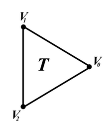
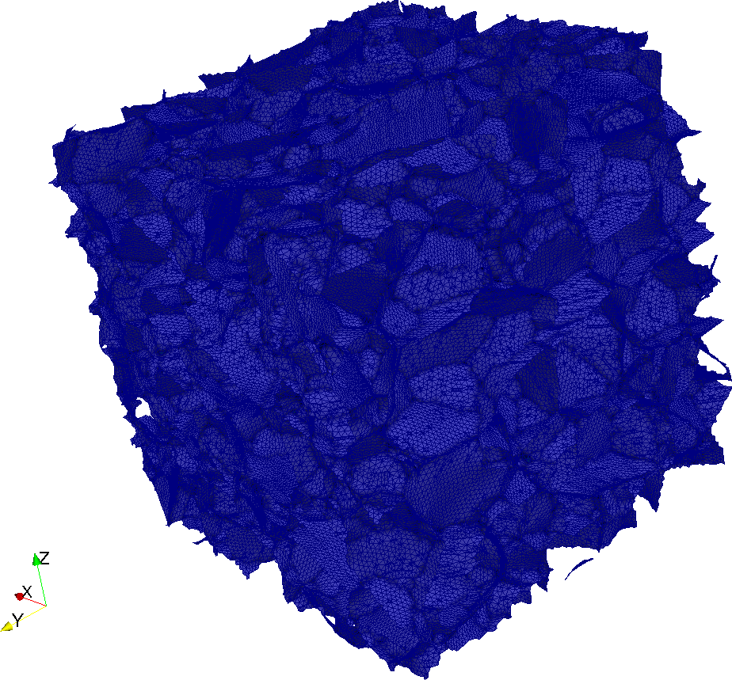

Surface Meshing {#tutorialsurfacemeshingtutorial}
========

Creating a surface mesh in DREAM.3D can currently be accomplished by using the [Quick Surface Mesh](@ref quicksurfacemesh) **Filter**. This **Filter** will surface mesh a set of **Features** that exists on an **Image Geometry**. For example, you could mesh a structure [created synthetically](@ref tutorialsyntheticsingle), or mesh a structure [reconstructed from a serial sectioning experiment](@ref tutorialebsdreconstruction). The [Quick Surface Mesh](@ref quicksurfacemesh) **Filter** is "quick" because it simply draws triangles across the voxel faces of an **Image Geometry**.  Thus, the result of the **Filter** is a **Triangle Geometry** where the boundaries between **Features** are defined by connected triangles. Note that this means that any given triangle is shared by _two_ **Features**.

Most **Geometry** objects in DREAM.3D are defined by their _shared vertex list_. A shared vertex list is a complete list of all the _unique_ vertices in a **Geometry**, defined by their spatial coordinates. The exception to this rule is an **Image Geometry**, which can be defined implicitly by its dimensions, resolution, and origin. All other **Geometries**, including a **Triangle Geometry**, will also have a list of _shared elements_, where the elements are the primary unit element of the **Geometry**. For example, a **Triangle Geometry** has primary elements that are triangles with three vertices, so such a **Geometry** will have a list of triangles that are defined by referencing the three _vertex Ids_ of which they are composed. 

-------------------

@image latex Images/TriangleSmall.png "Triangle/Face" width=6in

-------------------

As explained in the [data structure](@ref datastructure) section, **Attributes** can be associated with any of the _unit elements_ that make up a **Geometry**. The type of **Attribute Matrix** that holds these data is defined by the _dimensional topology_ of the underlying unit element. So for a **Triangle Geometry**, data can lie on the **Vertices**, the **Edges**, or the **Faces** of the triangles. For **Geometries** that have a shared vertex list, understanding the _winding_ of the **Vertices** is important. The winding defines the order you go around the object while labeling of the **Vertices**. For example, a **Triangle** can be wound going around _clockwise_ or _counter-clockwise_. In DREAM.3D, the "right hand rule" is adopted for windings. This means that the **Vertex** winding goes in a counter-clockwise manner. If the user desires, it is possible to [reverse the winding](@ref reversetrianglewinding) of a **Triangle Geometry**.

## Geometry Connectivity ##
Consider a **Triangle Geometry**. The least amount of information that is needed to describe this **Geometry** is a shared vertex list and a shared triangle list that indexes into the vertex list. However, it is often desirable to know more about the _connectivity_ of a given **Geometry**. This means knowing not just the **Vertices** and the **Faces**, but also the shared **Edges**. Additional connectivity information includes generating a list of triangle _neighbors_, or generating the reverse associations from **Vertices** to triangles. This sort of connectivity information can be [generated](@ref generategeometryconnectivity) within DREAM.3D. Additionally, due to the design of the **Geometry** objcets, all implemented **Geometries** can have their connectivities generated.

## Generating a Surface Mesh ##
There are several **Prebuilt Pipelines** that showcase the steps to generate a surface mesh, using the Small IN100 data set as an example. These **Pipelines** include <i>(01) SmallIN100 Quick Mesh</i> and <i>(02) SmallIN100 Smooth Mesh</i>. Ultimately, generating a surface mesh is as simple as running the [Quick Surface Mesh](@ref quicksurfacemesh) **Filter** on a set of **Features** defined on an **Image Geometry**. However, the resulting surface mesh is usually not satisfactory, since it will remain "blocky" from the original **Image Geometry**. To solve this problem, the user can _smooth_ the surface mesh by applying the [Laplacian Smoothing](@ref laplaciansmoothing) **Filter**. To understand the parameters of the Laplacian smoothing procedure, visit that **Filter's** [documentation](@ref laplaciansmoothing).

After running the **Prebuilt Pipelines** <i>(01) SmallIN100 Quick Mesh</i> and <i>(02) SmallIN100 Smooth Mesh</i>, a .dream3d file and a .xdmf file will be written to the _Data/Output_ directory. Opening the .xdmf in [ParaView](http://www.paraview.org) does not yield what you may expect. First, make sure that you are only viewing the **Data Container** that contains your **Triangle Geometry**. Even when doing this, the surface mesh will still look "incorrect". To get a view of what the internal meshed surfaces look like, apply ParaView's *Threshold* filter on the *SurfaceMeshNodeTypes* array. This array is a set of **Attribute** data that sits on the **Vertices** of the surface mesh. The array defines an integer Id that indentifies what _kind_ of node it is:

| Id Value | Node Type |
|----------|-----------|
| 2 | Normal **Vertex** |
| 3 | Triple Line |
| 4 | Quadruple Point |
| 12 | Normal **Vertex** on the outer surface |
| 13 | Triple Line on the outer surface |
| 14 | Quadruple Point on the outer surface |

Thus, to see the internal mesh structure, simply apply the ParaView *Threshold* filter for the values _2_ to _4_ of the _SurfaceMeshNodeTypes_ array. Additionally, to see the triangles, select the _Surface With Edges_ rendering type.

-------------------

@image latex Images/SurfaceMesh.png "Surface Mesh of Small IN100" width=6in

-------------------
