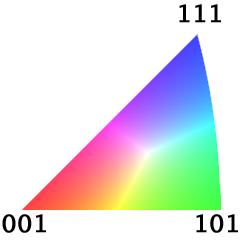
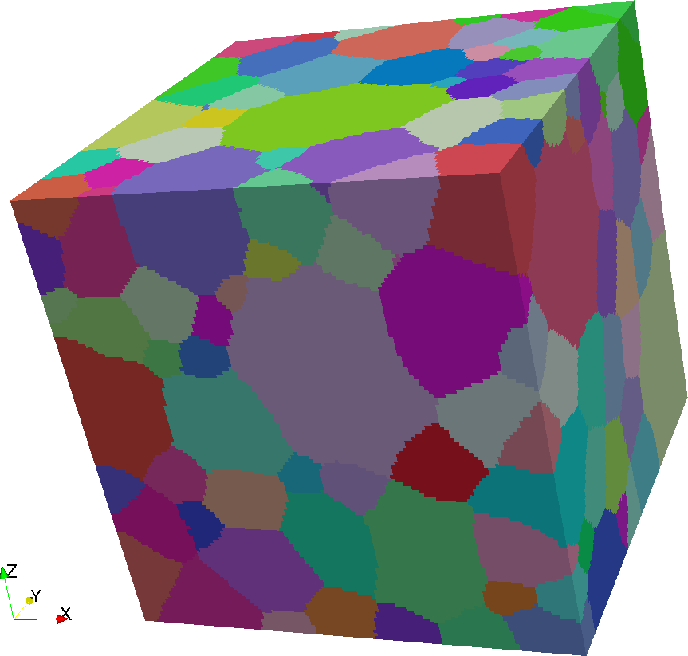
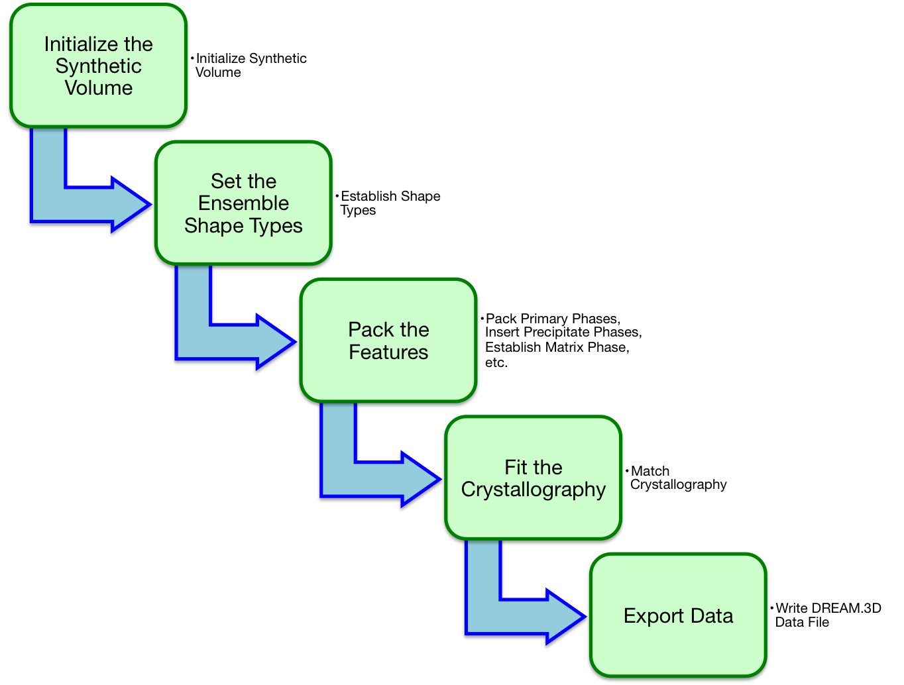
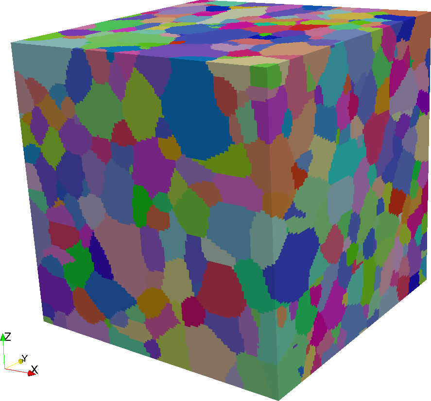

Synthetic Microstructure Generation {#tutorialsyntheticsingle}
=========

This tutorial uses a **Prebuilt Pipeline** to explain the concepts behind _sythentic microstructure_ generation in DREAM.3D. Begin by finding the **Prebuilt Pipeline** <i>(01) Single Cubic Phase Equiaxed</i> in the **Prebuilt Pipelines View** and double click on it. This will open that **Pipeline** in a new DREAM.3D window. In order to generate a synthetic microstructure, DREAM.3D needs a set of statistics that define the stochastic properties of the structure. In this case, the statistics have been generated _synthetically_ using the [StatsGenerator](@ref statsgeneratorfilter) **Filter**. To learn how to generate your own microstructure statistics, visit the [StatsGenerator documentation](@ref statsgeneratorfilter).

The <i>(01) Single Cubic Phase Equiaxed</i> **Prebuilt Pipeline** reads in a statistics file that was distributed with DREAM.3D. This simple set of statistics defines a single phase microstructure with equiaxed grains, cubic crystal symmetry, and generally random texture. To generate a synthetic microstructure that represents an instance of these statistics, simply click the _Go_ button. After the **Prebuilt Pipeline** has finished, it will write a .dream3d file and a .xdmf file to the *Data/Output* directory. The synthetic structure can be visualized by opening the .xdmf file in [ParaView](http://www.paraview.org). Note that if you re-run the **Prebuilt Pipeline**, you will overwrite your previous files and generate a _completely new_ synthetic microstructure. The microstructure is different each time running the **Pipeline** because the synthetic structure generation process is inherently _stochastic_. The resulting microstructure is locally different on each run, but its _descriptive statistics_ are indistinguishable each time.

-------------------

@image latex Images/IPFFilterLegend.png "IPF Triangle for Cubic Symmetry" width=6in

-------------------

-------------------

@image latex Images/Synthetic.png "Example Generated Synthetic Microstructure" width=6in

-------------------

## The Synthetic Structure Generation Process ##
Assuming you have obtained a set of microstructure statistics (either by using [StatsGenerator](@ref statsgeneratorfilter) or by some other means), the first step of generating a synthetic structure is to [initialize the synthetic volume](@ref initializesyntheticvolume). During this process, you will set the overall _dimensions_, _resolution_, and _origin_ of the synthetic microstructure. Currently, all synthetic microstructures DREAM.3D creates will be instantiated on _regular grids_. Thus, the **Geometry** associated with a synthetic volume will be an **Image Geometry**. In order to create the synthetic microstructure, DREAM.3D will _pack_ **Features** of a pre-determined _shape type_ into the intialized volume. Think of it like tossing spheres into a box and swapping them about until they fill as much space as possible. During this process DREAM.3D will keep track of statistics such as the distribution of **Feature** sizes, shapes, neighbors, etc., to ensure that the resulting packed volume matches the _morphological_ statistics that were used as inputs.

In order to start this swapping process, DREAM.3D will need to know what [types of shapes need to be packed](@ref establishshapetypes). Shape types are shared by each **Ensemble**; in the materials vernacular, these would be termed the _phases_ of the structure. For example, if you have a single phase structure (such as for the <i>(01) Single Cubic Phase Equiaxed</i> **Prebuilt Pipeline**), then there is one **Ensemble**, and you will need to select one shape type class. Each **Ensemble** must have its shape type set, and every **Ensemble** can have a different shape type. 

------------

@image latex Images/EbsdReconstruction.png "General Workflow for Synthetic Building" width=6in

------------

After setting up the shape types, the next step is to [pack the primary phases](@ref packprimaryphases) of the microstructure. This process is the main step in creating a synthetic structure: it will actually pack all the shape types into the volume, swap them about until they pack nicely and meet the required statistics, and then get those shapes onto the **Image Geometry** by assigning every voxel a **Feature** Id.  The **Filter** that accomplishes this task is complex, and has a number of options, so it is encouraged to read its [documentation](@ref packprimaryphases) to learn more about how it works. But what does the _primary_ part of _pack primary phases_ mean? The primary phases can be thought of as those phases whose **Features** are the main components of the microstructure from a structural standpoint. Something that would not be a primary phase might be a _precipitate_ phase, or a _matrix_ phase. For example, if you want to create a two phase structure that has precipitates sitting at the boundaries of the primary phase, you would want to [pack the primary phase](@ref packprimaryphases) and then [insert precipitates](@ref insertprecipitatephases) on top of it. If you want to make a structure that has a contiguous matrix phase with some other **Features** thrown in, you would want to [establish that matrix phase](@ref establishmatrixphase) and then [insert the next phases as precipitates](@ref insertprecipitatephases). DREAM.3D comes with **Prebuilt Pipelines** that highlight these major types of microstructure creation.

After creating the morphological portion of your microstructure, you may want to [match its crystallography](@ref matchcrystallography) to a texture. For example, [StatsGenerator](@ref statsgeneratorfilter) allows you to define an orientation distribution function (ODF) that can be fit into your synthetic microstructure. Again, you can define your ODFs individually for each **Ensemble**. You can even define your misorientation distribution function (MDF) and your axis ODF, which is particularly useful if you are creating **Features** with high aspect ratios that you want aligned along some direction.

A synthetic structure will be a "perfect" structure with no inherent defects or noise. For example, a single orientation will be associated with each **Feature**. If you want to make a microstructure that better resembles what may be measure in a experiment, consider adding noise to the result. DREAM.3D has a couple filters that help [add noise in general](@ref addbaddata) or [add some noise to orientations](@ref addorientationnoise). You may also want to [swap around the orientations](@ref jumbleorientations) of your **Features** to add more randomness.

The ability to control the morphological and crystallographic statistics of a structure on a phase by phase basis enables the user to create a huge variety of synthetic microstructures with great fidelity. This power can also be a problem, however, since it is possible to create a set of statistics that _cannot be packed in any way that satisfies all boundary conditions_. The DREAM.3D **Filters** that participate in the synthetic building process are aware of this, and will silently stop their attempts to fit data if they find it simply cannot be done. This means that it is crucial to _validate_ that you got the statistics you wanted after creating a synthetic microstructure. Luckily, DREAM.3D has all the tools necessary to quantify those [statistics](@ref statisticsfilters) and allow a user to confirm they got what they expected.

To learn more about the specific tools involved in synthetic building, visit the [Synthetic Building](@ref syntheticbuildingfilters) section of the [Filter Documentation](@ref filterdocumentation). Also check out the [Statistics](@ref statisticsfilters) and [Orientation Analysis](@ref orientationanalysisfilters) sections for more information on **Filters** that can help anlayze synthetic microstructures.

## Generating Synthetic Structures from Experimental Data ##

DREAM.3D has all the necessary tools to compute the necessary statistics for synthetic building directly from imported experimental data.  For example, you can compute the various _morphological_ and _crystallographic_ statistics on a [reconstructued EBSD volume](@ref tutorialebsdreconstruction). In order to use the various synthetic building tools, you must create arrays of *Statistics Objects* and *Phase Types*. These arrays represent the fundamental inputs necessary to [initialize the synthetic volume](@ref initializesyntheticvolume) and start the synthetic microstructure generation process.  To create these arrays, you should use the [Generate Ensemble Statistics](@ref generateensemblestatistics) **Filter**. This **Filter** will compile a set of pre-computed values into the necessary *Statistics Objects* that are required for synthetic building.  Under the hood, the **Filter** will _fit_ sets of data to user-chosen statistical distributions.  Additionally, the user must also select the **Ensemble Attribute Matrix** that represents the collection of _phases_ that are to be packed, as well as the particular _phase type_ for each **Ensemble**.  The possible _phase types_ that are currently supported are *Primary*, *Precipitate* and *Matrix*.  

In order to utilize a complete synthetic building **Pipeline** that matches both the _morphological_ and _crystallographic_ properties of a volume, both the _Calculate Morphogical Statistics_ and the _Calculate Crystallographic Statistics_ checkboxes must be enabled. It is possible to build a synthetic structure with just _morphological_ statistics, but then no texture information can be built into the synthetic structure.  The [Generate Ensemble Statistics](@ref generateensemblestatistics) **Filter** requires a large number of input arrays that are generated from other various analysis **Filters**.  A **Prebuilt Pipeline** named <i>(06) SmallIN100 Synthetic</i> has been provided that shows the necessary **Filters** that must be run to generate the inputs for the [Generate Ensemble Statistics](@ref generateensemblestatistics) **Filter**. This **Prebuilt Pipeline** uses the reconstructed Small IN100 data set as the input experimental microstructure, but the process is the same for any generic experimental structure.

------------

@image latex Images/SmallIN100Synthetic.png "Example Small IN100 Synthetic Microstructure" width=6in

------------
