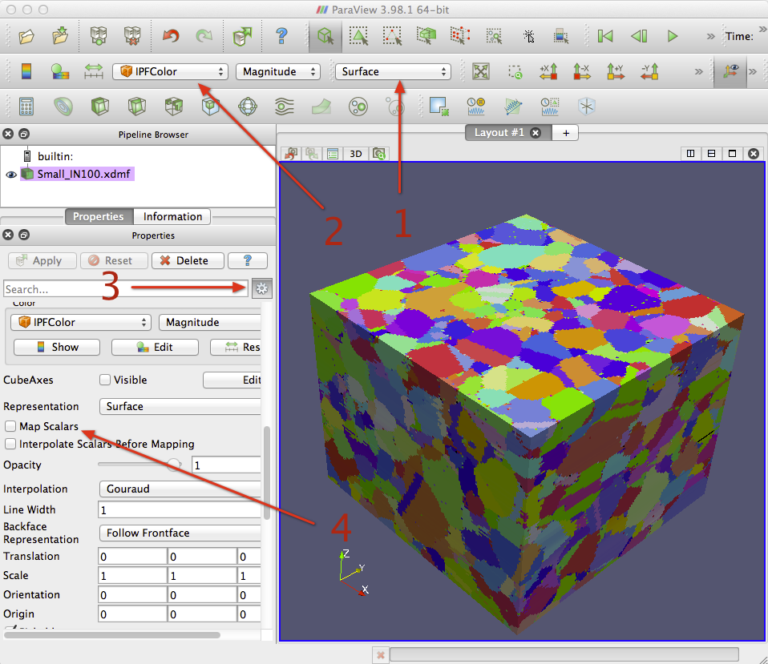

Synthetic Microstructure Generation {#tutorialsyntheticsingle}
=========

Launch DREAM3D and open the "Prebuilt Pipelines" area then the "Workshop" area (See image) and then double click the "(01) Single Cubic Phase Equiaxed" prebuilt pipeline. This will clear any filters currently in the pipeline and then populate the pipeline with the proper pipeline to build this synthetic microstructure.

-------------------

@image latex Images/synth-1.png "DREAM3D Gui showing correct selection of the prebuilt pipeline" width=3in

-------------------

## Pipeline ##

+ Initialize Synthetic Volume
  - 128 Voxels in X,Y & Z
  - 0.500 micron resolution in X, Y & Z
+ Pack Primary Phases
+ Find Field Neighbors
+ Find Number of Fields
+ Match Crystallography
+ Generate IPF Colors (Optional)
    - This filter is Optional
    - It will generate actual colors corresponding to the standard IPF Color Triangle
+ Write DREAM3D Data File

-------------------

@image latex Images/IPFFilterLegend.png "IPF Triangle for Cubic" width=1.75in

-------------------

## Notes ##
All the inputs should be properly set. The default location for the output file will be in the "Data/Output" directory that is located in the DREAM3D distribution directory. If you choose to save the output to another location be sure not to save the output in such a way as to over write the input file.

## Executing the Pipeline ##

When you have everything setup, click the "Go" button to start the pipeline. The pipeline should finish fairly quickly, within a few minutes for the default settings.

## Visualization ##

After the pipeline is complete a .dream3d file and its supporting .xdmf file will be created. In order to visualize the data launch [ParaView](http://www.paraview.org) open the .xdmf file and select the "Grain Ids" and "IPFColors" data sets. Then click the "Apply" button. The microstructure should look something like the image below, which is shown with IPF coloring with a 001 reference direction.

-------------------

@image latex Images/synth-2.png "Generated Synthetic Microstructure" width=3in

-------------------

### ParaView Notes ###

If you color by the IPFColors then a few additional steps need to be taken to force ParaView to use the generated colors. The image below shows the settings that need to be set in order to use the generated colors. If you would like to view internal grains then use the "Slice" and "Clip" filters to view to make cuts through the structure. [ParaView](http://www.paraview.org)  offers many tutorials on their website.

@image latex Images/ex_reconstruction_50.png "ParaView OverView" width=6in

-------------------

