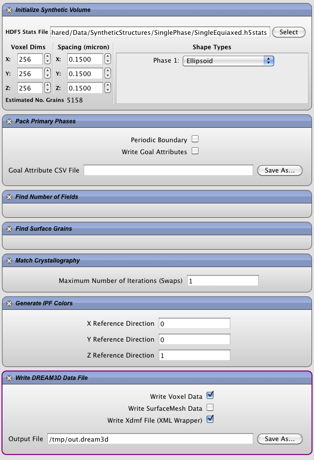
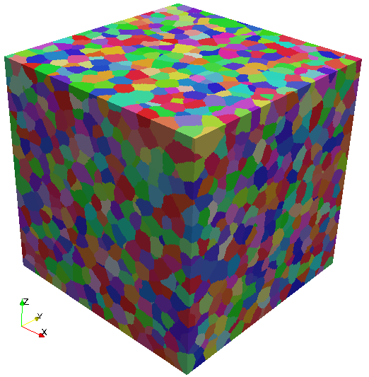
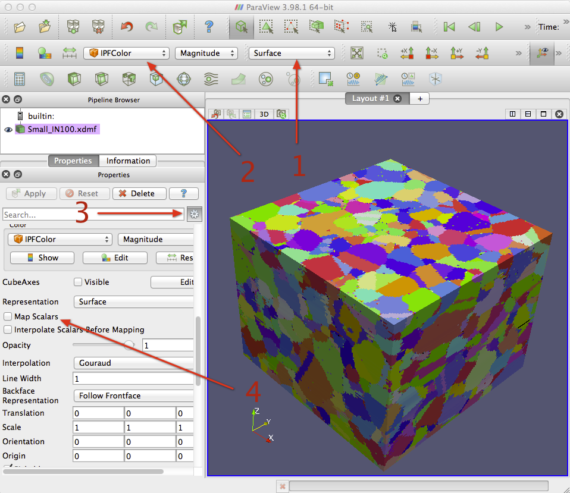

Synthetic Microstructure Generation {#tutorialsyntheticsingle}
=========

Launch DREAM3D and create the pipeline that is displayed in the following image.

-------------------

@image latex Images/synth-1.png "DREAM3D Gui showing complete pipeline" width=6in

-------------------

 Note that you need to fill out the Voxel Dims and the Spacing with NON-Zero values in order for the generation to complete successfully.

## Pipeline ##

+ Initialize Synthetic Volume
	- 256 Voxels in X,Y & Z
	- 0.15 micron resolution in X, Y & Z
+ Pack Primary Phases
+ Find Number of Fields
+ Find Surface Grains
+ Match Crystallography
+ Generate IPF Colors (Optional)
  	- This filter is Optional
  	- It will generate actual colors corresponding to the standard IPF Color Triangle
+ Write DREAM3D Data File

-------------------

@image latex Images/IPFFilterLegend.png "IPF Triangle for Cubic" width=1.75in

-------------------

## Notes ##
Be sure to properly select the .h5stats (or .dream3d) input file and to properly select an output file to save the data. We will save the data as a .dream3d file with the XDMF file wrapper enabled. **Make sure you do NOT name the output file the same as the input file or it will be over-written**. 

## Visualization ##
From ParaView open the .xdmf file and select the "Grain Ids" and "IPFColors" data sets. Then click the "Apply" button. The microstructure should look something like the image below, which is shown with IPF coloring with a 001 reference direction.

-------------------

@image latex Images/synth-2.png "Generated Synthetic Microstructure" width=3in

-------------------

@image latex Images/ex_reconstruction_3.png "ParaView OverView" width=6in

-------------------

