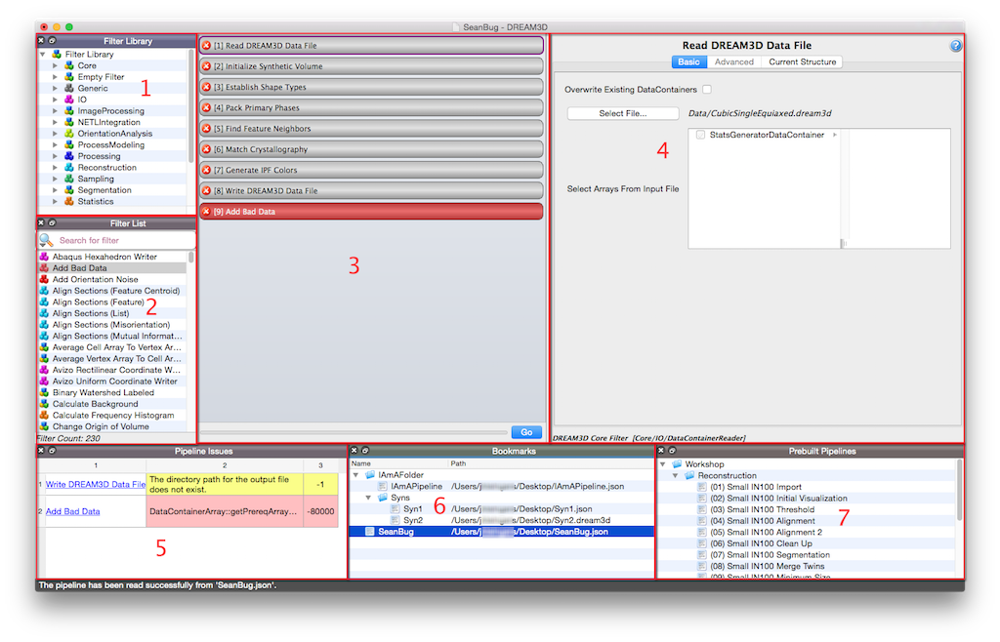
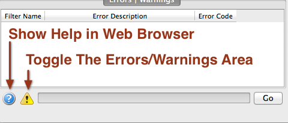
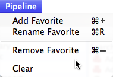
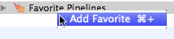
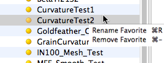
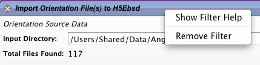

Overview of the User Interface {#userinterface}
=========

DREAM3D has 7 main areas of its user interface:

1. The Filter Library
2. The Filter List
3. The Pipeline View
4. The Filter Input View
5. The Pipeline Error Table
6. The Bookmarks View
7. The Prebuilt Pipelines View

------

@image latex Images/OverView-1.png "Overview of DREAM3D user interface " width=6in

------

## 1. The Filter Library ##

The _Filter Library_ section organizes the filters of DREAM3D according to the plugin that they belong to. The user can expand a specific plugin group (and possibly a sub-group), and the filters associated with that plugin will be displayed.  This makes it easy to find filters based on the plugin that they are associated with.

--------------

## 2. The Filter List ##
The _Filter List_ section organizes the filters of DREAM3D alphabetically by name.  

--------------

## 3. The Pipeline View ##

--------------

## 4. The Filter Input View ##

--------------

## 6. The Bookmarks View ##
After the user builds a pipeline that they may want to save for later the user can use the _Pipeline_ menu and select the "Add Favorite" menu to save that specific pipeline configuration. If at a future point in time the user wants to remove the favorite from the _Favorites_ list they user can select from the "Add Favorite" menu and choose *Remove Favorite* to remove it from the list.

--------------

## 7. The Prebuilt Pipelines View ##
DREAM3D provides several _Prebuilt Pipelines_ that can aid the new user in getting started with DREAM3D. Double clicking a preset will clear any current filters in the pipeline area and populate the pipeline area with the filters from the Pipeline Preset. 

--------------

@image latex Images/PipelineMenu.png "Pipeline Menu " width=2in

--------------

 Additional shortcuts are available by _right clicking_ on the *Favorite Pipelines* tree item which will display a contextual menu to create a new favorite pipeline entry. 

--------------

@image latex Images/FavoritesContextualMenu.png "Favorite Pipeline Contextual Menu " width=2in

--------------

The user can also rename a _Favorite Pipeline_ entry by right clicking on the entry item and selecting the desired action. The only valid characters that can be used are AlphaNumeric, the underscore (_) and the dash (-).

--------------

@image latex Images/FavoritesContextualMenu-2.png "Renaming/Removing a Favorite " width=2in

--------------

The user should also note that simply selecting a _Favorite Pipeline_ from the list will display the filters in order of operation in the *Filter List* area.

### Getting Help for a Filter ###
The user can _Right Click_ in the title area of the filter to display a menu where the user can select the "Show Filter Help" menu selection. The user's default web browser will be opened to the page containing the documentation for the current filter.

--------------

@image latex Images/FilterContextMenu.png "Getting Help for a filter" width=4in

--------------

## Filter List
  **Area 2**: This section lists the filters that are associated with a specific group that is selected in the _Filter Library_ area. If the _Filter Library_ is itself selected, then all filters will be shown in this list. The user typically will select a filter from this list and drag it over to the pipeline area.

##  Errors & Warnings Tab
 **Area 3**: This area displays any errors and/or warnings associated with the filter when it is actively being used in a pipeline. The display of the errors can be toggled on and off by pressing the appropriate buttons. Also clicking the **?** icon will display all of the help (including filter reference, tutorials and user manual) in the users default web browser.

@image latex Images/OverView-1.png "Errors and Warnings Tab" width=6in

## Pipeline Area
  **Area 4**:This area is where the user will construct their pipeline by either double clicking on a filter in the filter list area or dragging a filter from the filter list and dropping the filter into the pipeline area. Filters in this section can be rearranged by dragging the filter into a new location. As the user updates the pipeline a process called the **Preflight** will be executed to make sure that the pipeline will have all the necessary data available during the actual execution of the processing pipeline.

@image latex Images/OverView-1.png "Pipeline area populated with filters" width=6in

@htmlonly
|   | Navigation |    |
|----|---------|------|
| [Back](supportedfileformats.html) | [Top](usermanual.html) | [Next Section](creatingpipeline.html) |
@endhtmlonly