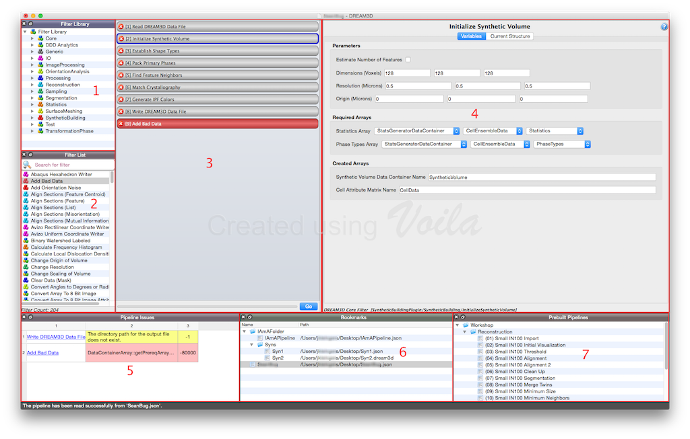
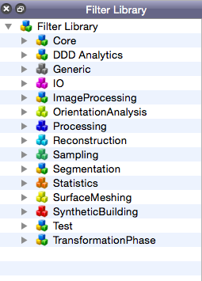
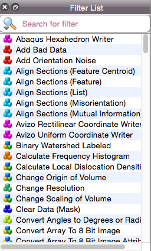
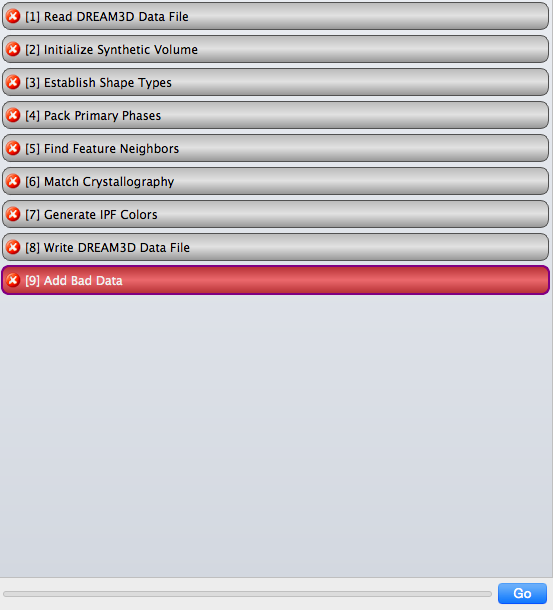
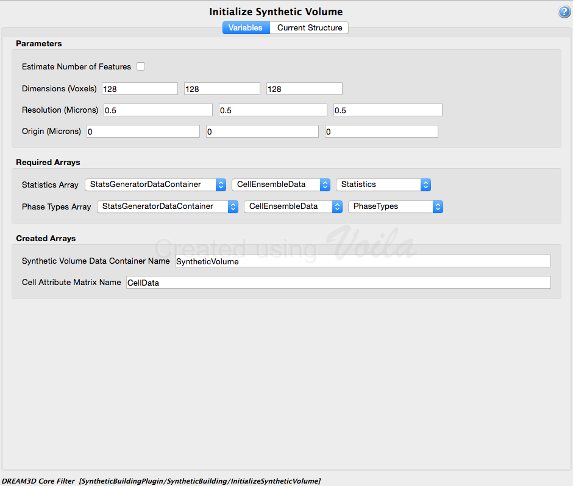
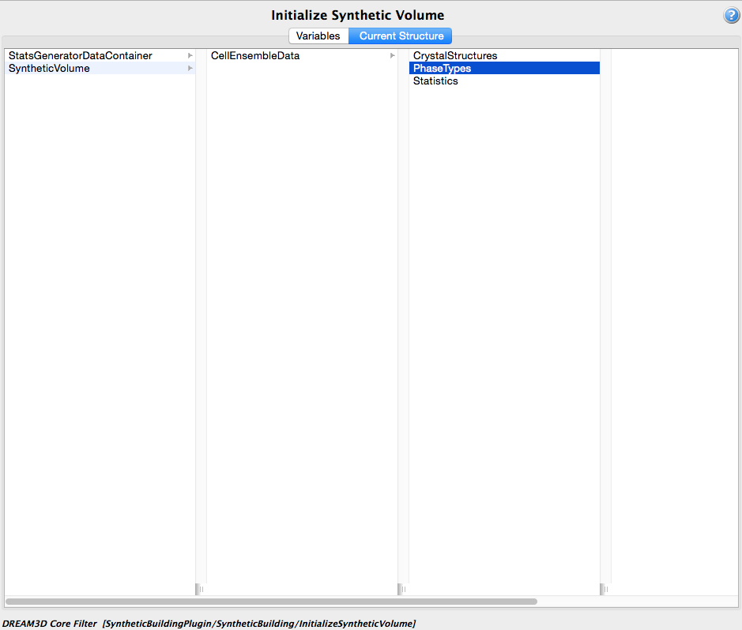
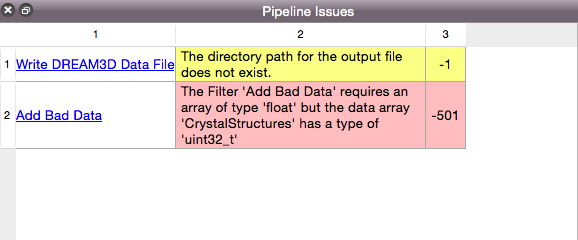
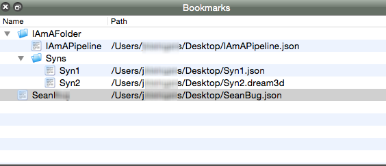
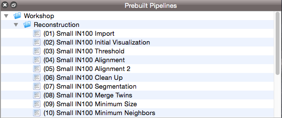

Overview of the User Interface {#userinterface}
=========

DREAM3D has 7 main sections of its user interface:

1. The Filter Library
2. The Filter List
3. The Pipeline View
4. The Filter Input View
5. The Pipeline Error Table
6. The Bookmarks View
7. The Prebuilt Pipelines View

All sections, except the **Pipeline View** and the **Filter Input View**, can be undocked from the main window and rearranged into any order that the user prefers.  Sections can also be dragged and dropped on top of each other, which then automatically puts those sections into a tabbed interface.

All sections, except the **Pipeline View** and the **Filter Input View**, can have their visibility toggled by the appropriate buttons found in DREAM3D's **View** menu.

------

@image latex Images/OverView-DREAM3D.png "Overview of DREAM3D user interface " width=6in

------

## 1. The Filter Library ##

### Overview ###
The **Filter Library** section organizes the filters of DREAM3D according to the plugin that they belong to. The user can expand a specific plugin group (and possibly a sub-group), and the filters associated with that plugin will be displayed.  This makes it easy to find filters based on the plugin that they are associated with.

The **Filter Library** section can be docked/undocked from the main window and its visibility can be toggled from DREAM3D's **View** menu.

--------------

## 2. The Filter List ##

### Overview ###
The **Filter List** section organizes the filters of DREAM3D alphabetically by name.

Using the search bar, the user can search for filters based on the name.

### Searching Algorithms ###
Clicking on the magnifying glass icon in the search bar allows the user to pick between three different search algorithms.

The **All Words** algorithm will search for filters with names that contain all the words in the search bar, in any order.

The **Any Words** algorithm will search for filters with names that contain any of the words in the search bar, in any order.

The **Exact Phrase** algorithm will search for filters with names that match the phrase that is written in the search bar.

The **Filter List** section can be docked/undocked from the main window and its visibility can be toggled from DREAM3D's **View** menu.

--------------

## 3. The Pipeline View ##

### Overview ###
The **Pipeline View** section displays which filters are in the current pipeline, and in what order.

This section is where the user will construct their pipeline by double-clicking on a filter in the **Filter List** or the **Filter Library**.  It is also possible to drag a filter from these areas and drop it into the **Pipeline View**.

Filters in this section can be rearranged into different orders via dragging and dropping the filter objects.

### Preflights and Errors ###
As the user updates the pipeline, a process called **Preflight** will be executed to make sure that the pipeline will have all the necessary data available during the actual execution of the pipeline.  If there are any issues, the pipeline view will display either errors or warnings.

If a filter object in the pipeline has an error, the filter object itself will be colored red (Example:  Add Bad Data).  If this is the case, check the **Pipeline Error Table** to see the error message and error code.

### Selecting A Filter Object ###
Click on a filter object to select it.

### Getting Help For A Filter ###
To view the help page for a filter, right-click on the filter object to display a contextual menu and select the *Filter Help* option.

### Removing A Filter Object From The Pipeline View ###
Click the red X icon on a filter object to remove it from the pipeline.

### Clearing The Pipeline View ###
To clear the entire pipeline, either choose *Clear Pipeline* from the *Pipeline* menu, or right-click in an empty area of the **Pipeline View** to make a contextual menu appear with the *Clear Pipeline* option.

### Running the Pipeline ###
When the pipeline is correct, has no errors, and is ready to run, press the **Go** button to start the pipeline.

--------------

## 4. The Filter Input View ##

### Overview ###
The **Filter Input View** contains all the inputs for the selected filter.

There are two sections: **Variables** and **Current Structure**.

### Variables ###
The **Variables** tab contains filter inputs, such as a field for an output path or a series of combo boxes to select an attribute array path.

### Current Structure ###
The **Current Structure** tab contains the current data container array structure.

### Viewing A Filter's Help Page ###
To view the help page for the displayed filter, press the **?** icon.

--------------

## 5. The Pipeline Error Table ##

### Overview ###
The **Pipeline Error Table** displays any errors and/or warnings associated with filters that are actively being used in the **Pipeline View**.

### Preflights and Table Re-Population ###
This section gets re-populated every time the pipeline runs its **Preflight** process, which makes sure that the pipeline will have all the necessary data available during the actual execution of the pipeline.  The **Preflight** process is re-run any time the user changes the **Pipeline View** or **Filter Input View** sections.

The **Pipeline Error Table** section can be docked/undocked from the main window and its visibility can be toggled from DREAM3D's **View** menu.

--------------

## 6. The Bookmarks View ##

### Overview ###
The **Bookmarks View** is a section where the user can bookmark any pipelines that they have saved on the file system for later use.  This section allows the user to bookmark the pipelines in any structure that they want, using virtual folders.

It is also possible to drag pipelines and folders containing pipelines from the file system into the **Bookmarks View**.

The user can right-click anywhere in the **Bookmarks View** to make a contextual menu appear with additional options.

### Adding A Bookmark ###
To add a bookmark to the **Bookmarks View**, open the *Bookmarks* menu and choose *Add Bookmark*.

Users can also use the **Bookmarks Contextual Menu** to add a bookmark by right-clicking on an existing virtual folder or empty space and selecting *Add Bookmark*.

### Renaming A Bookmark or Virtual Folder ###
To rename a bookmark or virtual folder in the **Bookmarks View**, use the **Bookmarks Contextual Menu** by right-clicking on a bookmark or virtual folder and select *Rename Bookmark* or *Rename Folder*.

### Updating A Bookmark ###
To update a bookmark in the **Bookmarks View**, use the **Bookmarks Contextual Menu** by right-clicking on a bookmark and select *Update Pipeline*.

The bookmark that was right-clicked will be updated with the pipeline that is currently in the **Pipeline View**.

### Removing A Bookmark or Virtual Folder ###
To remove a bookmark or virtual folder in the **Bookmarks View**, use the **Bookmarks Contextual Menu** by right-clicking on a bookmark or virtual folder and select *Remove Bookmark* or *Remove Folder*.

**WARNING:**  Removing a virtual folder will also remove all of its contents.

### Adding A Virtual Folder ###
To add a virtual folder to the **Bookmarks View**, open the *Bookmarks* menu and choose *New Folder*.

Users can also use the **Bookmarks Contextual Menu** by right-clicking on a bookmark, virtual folder, or empty space, and selecting *New Folder*.

### Viewing A Bookmark's Location On The File System ###
To view a specific bookmark's location on the file system, use the **Bookmarks Contextual Menu** by right-clicking on a bookmark, and select *Show In Finder* (Mac OS X) or *Show In Windows Explorer* (Windows).

### Opening A Bookmark ###
To open a bookmark in the **Pipeline View**, either double-click on the bookmark or drag and drop it in the **Pipeline View**.

The **Bookmarks View** section can be docked/undocked from the main window and its visibility can be toggled from DREAM3D's **View** menu.

--------------

## 7. The Prebuilt Pipelines View ##

### Overview ###
DREAM3D provides several *Prebuilt Pipelines* that can aid the new user in getting started with DREAM3D.  These pipelines are displayed in the **Prebuilt Pipelines View**.

### Opening A Prebuilt Pipeline ###
To open a prebuilt pipeline, either double-click on the prebuilt or drag and drop it in the **Pipeline View**. 

The **Prebuilt Pipelines View** section can be docked/undocked from the main window and its visibility can be toggled from DREAM3D's **View** menu.

--------------

@htmlonly
|   | Navigation |    |
|----|---------|------|
| [Back](supportedfileformats.html) | [Top](usermanual.html) | [Next Section](creatingpipeline.html) |
@endhtmlonly