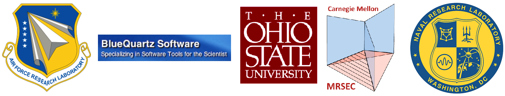

Brief History and Acknowledgements {#acknowledgements}
========

## History of DREAM.3D ##
The history of DREAM.3D is rooted in two parallel research efforts:  

+ The first was the graduate research project of Michael Groeber, under the advisement of Dr. Somnath Ghosh, at The Ohio State University (2003-2007).  The key developments under this project were the creation of many of DREAM.3D's current filters for reconstructing serial-section experimental datasets, quantifying microstructural features in 3D and generating statistically equivalent microstructures. 
+ The second research effort was carried out by the research group of Tony Rollett at Carnegie Mellon University over a number of graduate student projects (see names below) and years (~2000-2011).  The key developments under these projects were the development of a synthetic microstructure builder, microstructure clean-up tools, surface mesh generation and quantification tools for microstructural features.

## Funding Sources ##
Parts of DREAM3D were written under US Air Force (AFRL) Contract FA8650-07-D-5800 and Navy Research Labs (NRL) Contract N00173-07-C-2068. Many others have contributed to the code including the following:

## Major Contributing Institutions ##

@image latex Images/All_Logos.png "User Interface" width=3.0in

## List of Code Contributors (CC) and Vision Contributiors (VC) ###

### Air Force Research Laboratory (AFRL) ###
+ Dr. Michael A. Groeber (VC, CC)
+ Dr. Adam Pilchak (VC, CC)
+ Dr. Megna Shah (VC, CC)
+ Dr. Michael Uchic (VC)
+ Dr. Chris Woodward (VC)
+ Dr. Dennis Dimiduk (VC)

### BlueQuartz Software ###
+ Mr. Michael A. Jackson (VC, CC)

### Ohio State University/Johns Hopkins University ###
+ Dr. Somnath Ghosh (VC)

### Carnegie Mellon University ###
+ Dr. Tony Rollett (VC, CC)
+ Dr. Greg Rohrer (CC)
+ Dr. Marc De Graef (CC)
+ Dr. Sukbin Lee (CC)
+ Dr. Joe Tucker (CC)
+ Dr. Lisa Chan (CC)
+ Dr. Stephen Sintay (CC)
+ Dr. Abhijeet Brahme (CC)
+ Dr. David Saylor (CC)
+ Dr. Joe Fridy (CC)
+ Dr. Patrick Callahan (CC)
+ Dr. Shlomo Taasan (CC)

### Navy Research Laboratory (NRL) ###
+ Dr. Dave Rowenhorst (VC, CC)

### Other Insitituations ###
+ Mr. Jarrell Waggoner (CC) (Univ. South Carolina)

>

|   | Navigation |    |
|----|---------|------|
| --| [Top](@ref usermanual) | [Next Section](@ref datastructure) |