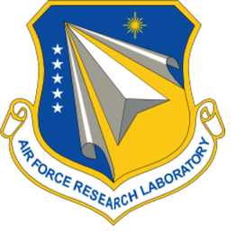

Acknowledgements {#acknowledgements}
========

## Funding Sources ##
Parts of DREAM3D were written under US Air Force (AFRL) Contract FA8650-07-D-5800 and Navy Research Labs (NRL) Contract N00173-07-C-2068. Many others have contributed to the code including the following:

## AFRL ###

@image latex Images/AFRL_Logo.png "User Interface" width=1.5in
Dr. Michael A. Groeber

## BlueQuartz Software ###

@image latex Images/BlueQuartzSoftware_Logo.png "User Interface" width=1.5in
Mr. Michael A. Jackson

## Carnegie Mellon University ###

@image latex Images/CMU_MRSEC_Logo.png "User Interface" width=1.5in

+ Dr. Tony Rollett
+ Dr. Greg Rohrer
+ Dr. Marc De Graef

## Code Developers & Contributors ###

+ Dr. Sukbin Lee
+ Dr. Joe Tucker
+ Dr. Lisa Chan
+ Dr. Stephen Sintay
+ Dr. Abhijeet Brahme
+ Dr. David Saylor
+ Dr. Joe Fridy
+ Dr. Patrick Callahan
+ Dr. Jarrell Waggoner
+ Dr. Megna Shah

## Vision ###

+ Dr. Somnath Ghosh
+ Dr. Chris Woodward
+ Dr. Tony Rollett

## Initial Work Completed Under ##
Dr. Somnath Ghosh (The Ohio State University)

|   | Navigation |    |
|----|---------|------|
| --| [Top](@ref usermanual) | [Next Section](@ref userinterface) |