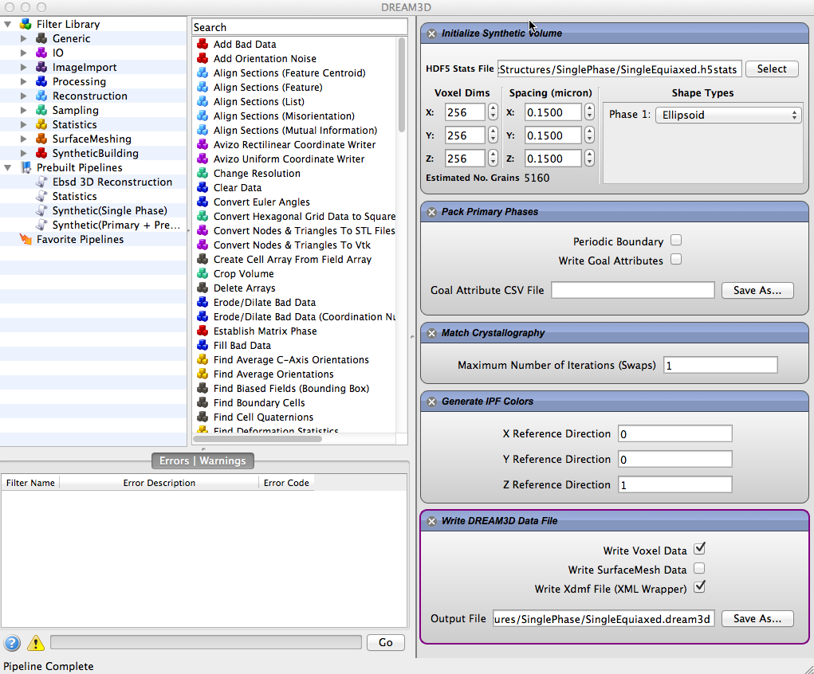

Synthetic Microstructure Generation {#tutorialsyntheticsingle}
=========

Launch DREAM3D and create the pipeline that is displayed in the following image. Note that you need to fill out the Voxel Dims and the Spacing with NON-Zero values in order for the generation to complete successfully.

@image latex Images/synth-1.png "User Interface" width=5in

Be sure to properly select the .h5stats input file and properly select an output file to save the data. We will save the data as a .dream3d file with the XDMF file wrapper enabled. From ParaView open the .xdmf file and select the "Grain Ids" and "IPFColors" data sets then click the "Apply" button.The microstructure should look something like below which is shown with IPF coloring with a 001 reference direction.

@image latex Images/synth-2.png "Generated Synthetic Microstructure" width=6in

