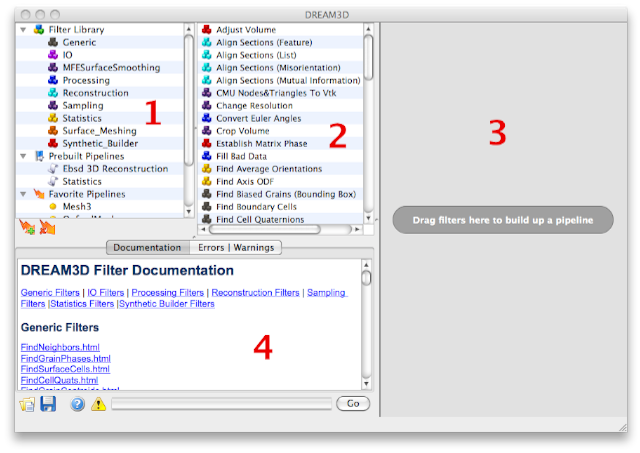
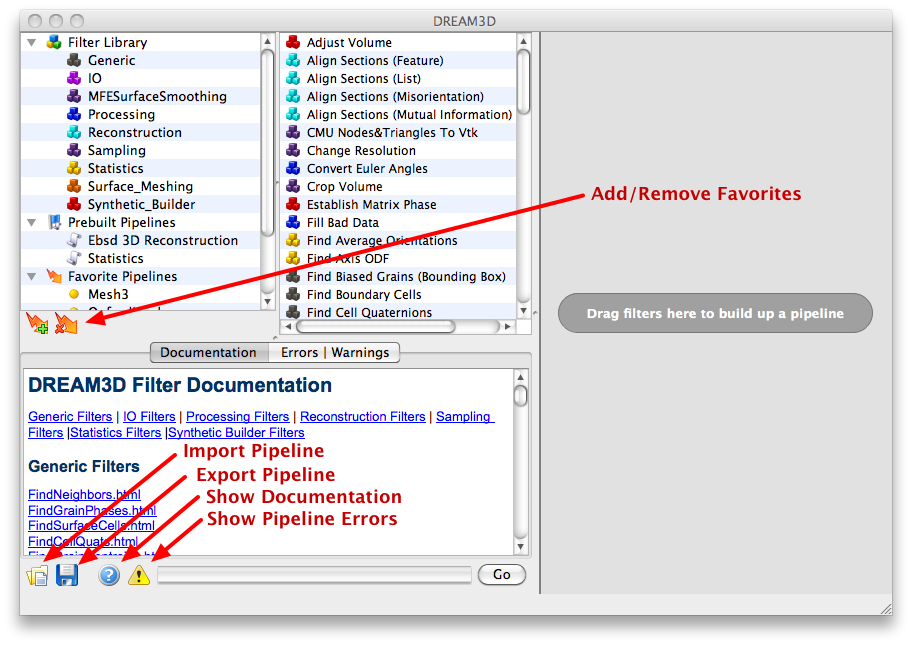

Overview of the User Interface {#userinterface}
=========

Locate the DREAM3D application and open the application in the normal method for your operating system. After DREAM3D successfully opens the user is presented with the user interface presented in figure 3.1. There are 4 main areas of the window which are:

@image latex Images/UI_1.png "User Interface" width=5in

## The Filter Library | Prebuilt Pipelines | Favorite Pipelines 
  **Area 1**: This area of the user interface is broken into 3 basic groups: Filter Library, Prebuilt Pipelines and Favorite pipelines. The _Filter Library_ section contains the various groups that the filters are organized into. The user can click a specific group and just the filters associated with that group will be displayed in the _Filter List_ area of the user interface. DREAM3D provides several _Prebuilt Pipelines_ that can aid the new user in getting started with DREAM3D. Simply double clicking a preset will clear any current filters in the pipeline area and populate the pipeline area with the filters from the Pipeline Preset. After the user builds a pipeline that they may want to save for later the user can click the "Add Favorites" button to save that specific pipeline configuration.

## Filter List
  **Area 2**:This section lists the filters that are associated with a specific group that is selected in the _Filter Library_ area. If the _Filter Library_ is itself selected then all filters will be shown in this list.

## Pipeline Area
  **Area 3**:This area is where the user will construct their pipeline by either double clicking on a filter in the library area or dragging a filter from the Filter List and dropping the filter into the pipeline area. Filters in this section can be rearranged by simply dragging the filter into a new location.

##  Errors area
 **Area 4**: This area displays any errors associated with the filter if it is actively being used in a pipeline. The display of the errors can be toggled on and off by pressing the appropriate buttons.

@image latex Images/UI_2.png "User Interface" width=5in

