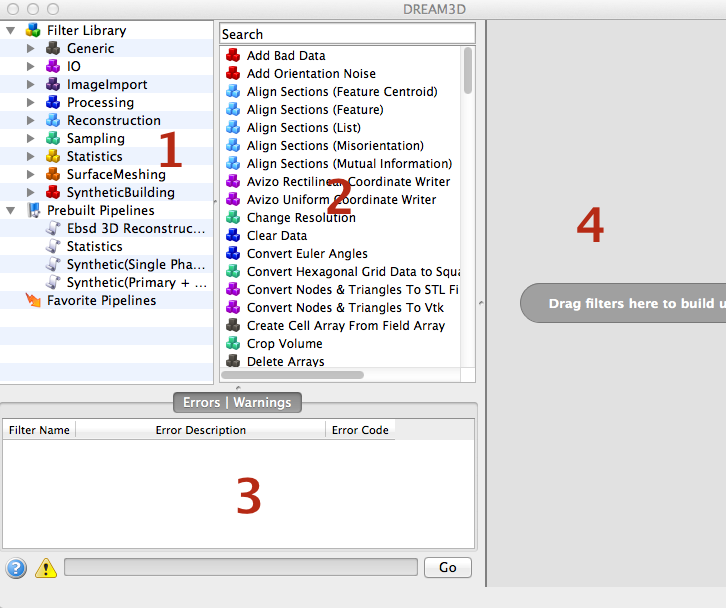
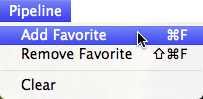
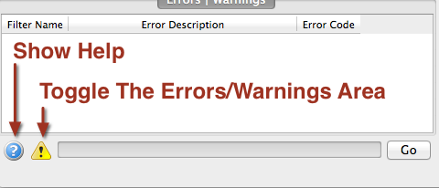
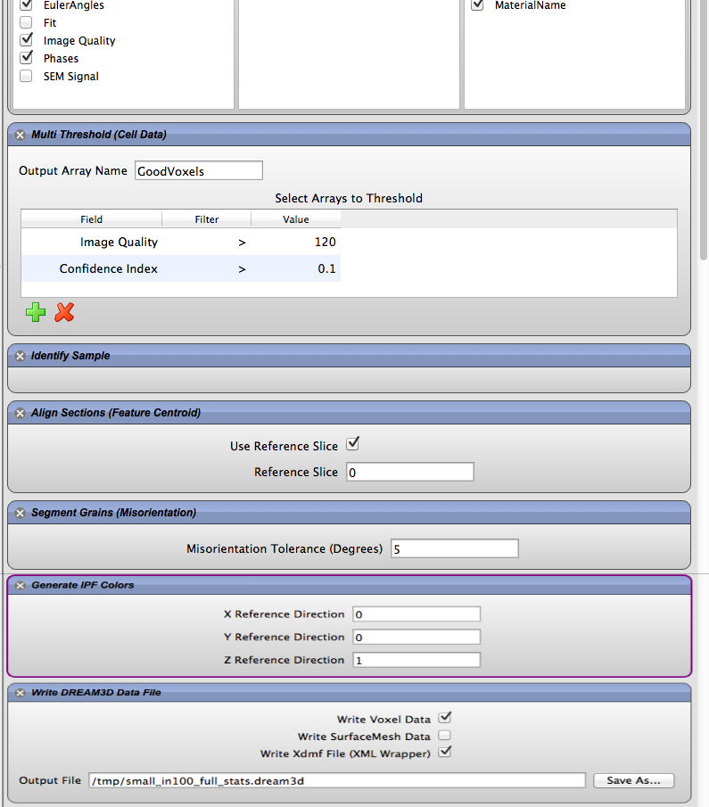

Overview of the User Interface {#userinterface}
=========

DREAM3D has 4 main areas of it's user interface:

1. The Filter Library
2. The Filter List
3. The Errors Tab
4. The Pipeline Area

------

------

## The Filter Library
  **Area 1**: This area of the user interface is broken into 3 basic groups: _Filter Library_, _Prebuilt Pipelines_ and _Favorite Pipelines_. The _Filter Library_ section contains the various groups that the filters are organized into. The user can click a specific group and just the filters associated with that group will be displayed in the _Filter List_ area of the user interface. 

### Prebuilt Pipelines ##
DREAM3D provides several _Prebuilt Pipelines_ that can aid the new user in getting started with DREAM3D. Simply double clicking a preset will clear any current filters in the pipeline area and populate the pipeline area with the filters from the Pipeline Preset. 

### Favorite Pipelines ##
After the user builds a pipeline that they may want to save for later the user can use the _Pipeline_ menu and select the "Add Favorite" menu to save that specific pipeline configuration. If at a future point in time the user wants to remove the favorite from the _Favorites_ list they user can select from the "Add Favorite" menu and choose *Remove Favorite* to remove it from the list.

## Filter List
  **Area 2**: This section lists the filters that are associated with a specific group that is selected in the _Filter Library_ area. If the _Filter Library_ is itself selected then all filters will be shown in this list. The user typically will select a filter from this list and drag it over to the pipeline area.

##  Errors & Warnings Tab
 **Area 3**: This area displays any errors and/or warnings associated with the filter if it is actively being used in a pipeline. The display of the errors can be toggled on and off by pressing the appropriate buttons. Also clicking the **?** icon will display all of the help (including filter reference, tutorials and user manual) in the users default web browser.

## Pipeline Area
  **Area 4**:This area is where the user will construct their pipeline by either double clicking on a filter in the filter list area or dragging a filter from the filter list and dropping the filter into the pipeline area. Filters in this section can be rearranged by simply dragging the filter into a new location. As the user updates the pipeline a process called the **Preflight** will be executed to make sure that the pipeline will have all the necessary data available during the actual execution of the processing pipeline.

|   | Navigation |    |
|----|---------|------|
| [Back](@ref acknowledgements) | [Top](@ref usermanual) | [Next Section](@ref creatingpipeline) |