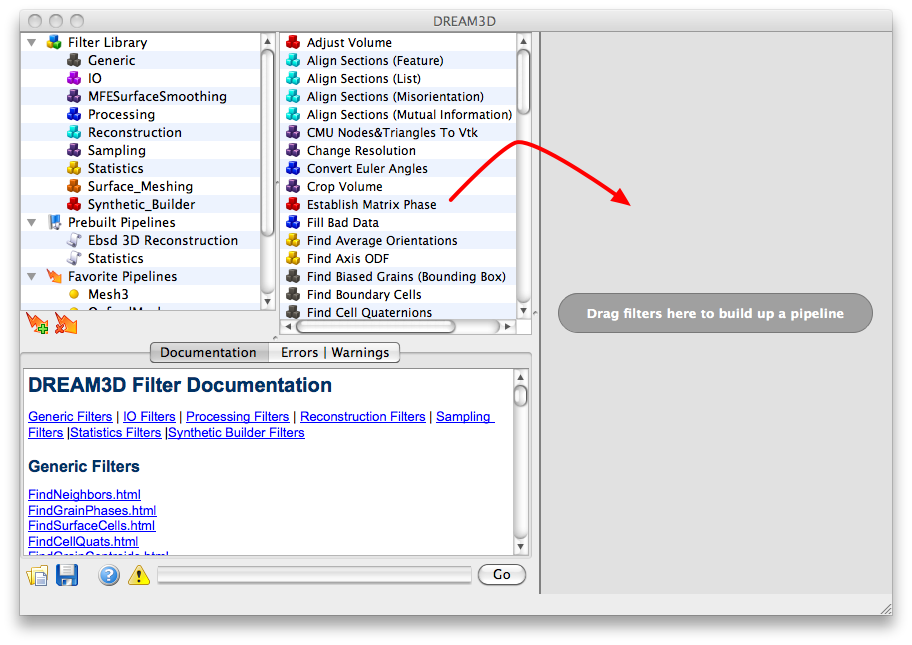
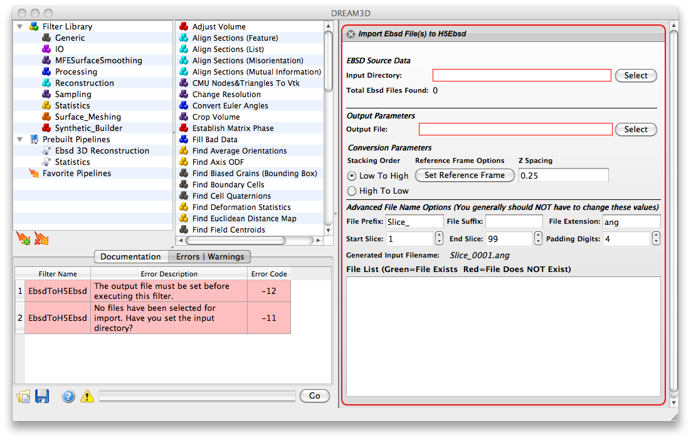
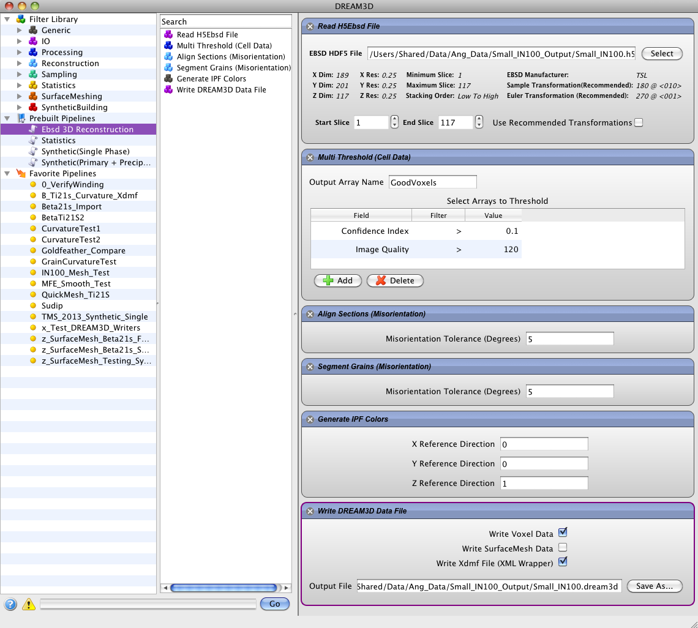
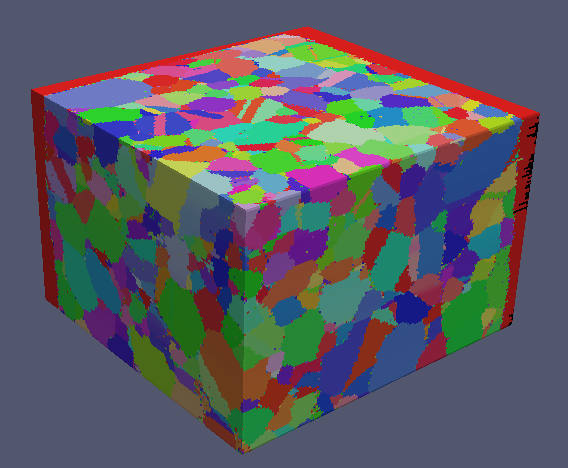
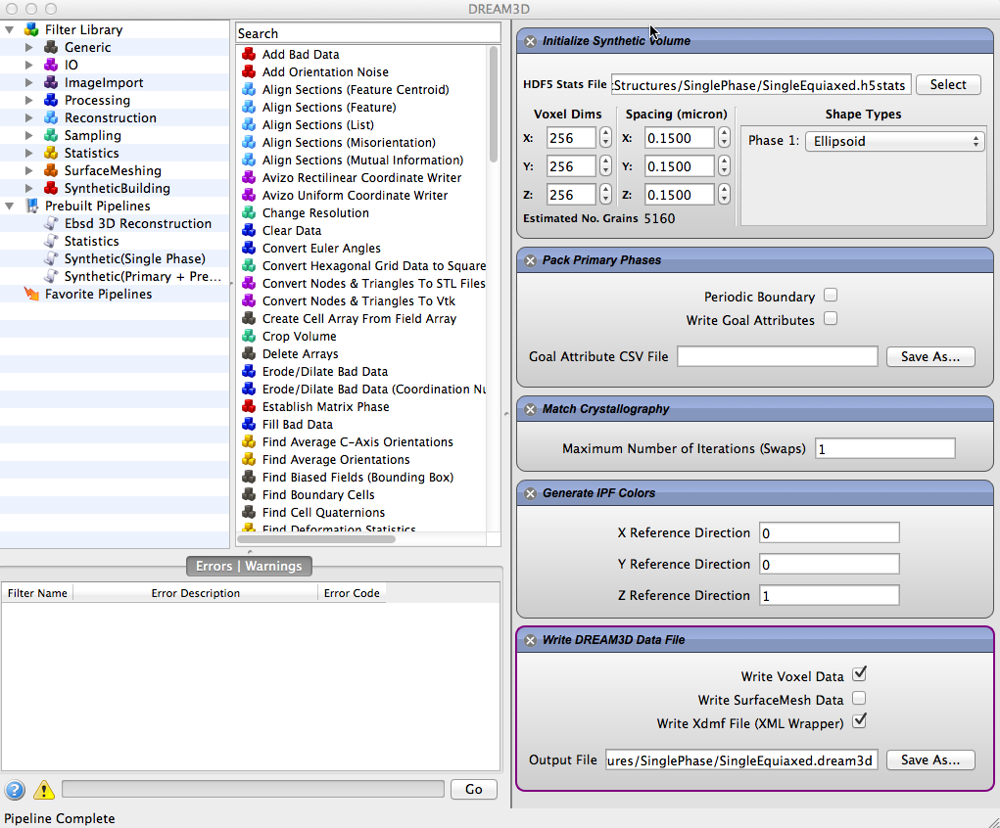
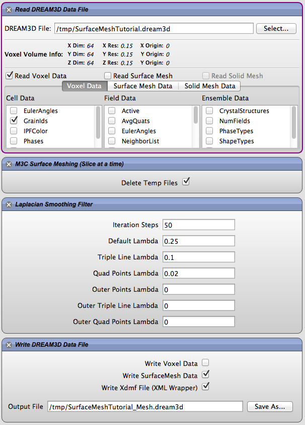
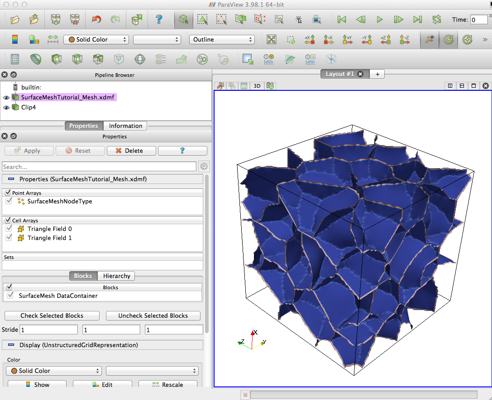

DREAM3D User Manual {#usermanual}
========

# Acknowledgements / Funding  {#um_ack} #
  Parts of DREAM3D were written under US Air Force (AFRL) Contract FA8650-07-D-5800 and Navy Research Labs (NRL) Contract N00173-07-C-2068. Many others have contributed to the code including the following:

## AFRL ###

@image latex Images/AFRL_Logo.png "User Interface" width=1.5in
Dr. Michael A. Groeber

## BlueQuartz Software ###

@image latex Images/BlueQuartzSoftware_Logo.png "User Interface" width=1.5in
Mr. Michael A. Jackson

## Carnegie Mellon University ###

@image latex Images/CMU_MRSEC_Logo.png "User Interface" width=1.5in

+ Dr. Tony Rollett
+ Dr. Greg Rohrer
+ Dr. Marc De Graef

## Code Developers & Contributors ###

+ Dr. Sukbin Lee
+ Dr. Joe Tucker
+ Dr. Lisa Chan
+ Dr. Stephen Sintay
+ Dr. Abhijeet Brahme
+ Dr. David Saylor
+ Dr. Joe Fridy
+ Dr. Patrick Callahan
+ Dr. Jarrell Waggoner
+ Dr. Megna Shah

## Vision ###

+ Dr. Somnath Ghosh
+ Dr. Chris Woodward
+ Dr. Tony Rollett

## Initial Work Completed Under ##
Dr. Somnath Ghosh (The Ohio State University)

# Introduction {#um_intro} #
Welcome to DREAM.3D, an open and modular software package that allows users to reconstruct, instantiate, quantify, mesh, handle and visualize microstructure digitally. The core software package has four (4) major functionalities. First, a series of EBSD data files (either TSL .ang or HKL .ctf) can be read and packed into a single HDF5 data file in order to reduce data size and clutter.  Second, the sections can be aligned, cleaned, reconstructed, segmented and statistically characterized. Third, the statistics can be read in and used to generate statistically equivalent, synthetic microstructures. Fourth, the reconstructed volumes and the synthetic volumes can be surfaced meshed using a multi-material marching cubes algorithm.

# DREAM3D User Interface {#um_ui} #
Locate the DREAM3D application and open the application in the normal method for your operating system. After DREAM3D successfully opens the user is presented with the user interface presented in figure 3.1. There are 4 main areas of the window which are:

@image latex Images/UI_1.png "User Interface" width=5in

## The Filter Library | Prebuilt Pipelines | Favorite Pipelines 
  **Area 1**: This area of the user interface is broken into 3 basic groups: Filter Library, Prebuilt Pipelines and Favorite pipelines. The _Filter Library_ section contains the various groups that the filters are organized into. The user can click a specific group and just the filters associated with that group will be displayed in the _Filter List_ area of the user interface. DREAM3D provides several _Prebuilt Pipelines_ that can aid the new user in getting started with DREAM3D. Simply double clicking a preset will clear any current filters in the pipeline area and populate the pipeline area with the filters from the Pipeline Preset. After the user builds a pipeline that they may want to save for later the user can click the "Add Favorites" button to save that specific pipeline configuration.

## Filter List
  **Area 2**:This section lists the filters that are associated with a specific group that is selected in the _Filter Library_ area. If the _Filter Library_ is itself selected then all filters will be shown in this list.

## Pipeline Area
  **Area 3**:This area is where the user will construct their pipeline by either double clicking on a filter in the library area or dragging a filter from the Filter List and dropping the filter into the pipeline area. Filters in this section can be rearranged by simply dragging the filter into a new location.

##  Errors area
 **Area 4**: This area displays any errors associated with the filter if it is actively being used in a pipeline. The display of the errors can be toggled on and off by pressing the appropriate buttons.

@image latex Images/UI_2.png "User Interface" width=5in

### Building a Pipeline
In order the build a pipeline the user can either double click on a particular filter or drag the filter from the _Filter List_ into the _Pipeline Area_.

@image latex Images/UI_3.png "User Interface" width=5in

After placing a filter into the Pipeline area the user interface will look like the next figure. The user should note the red outline of the filter widget which indicates that one or more of the input parameters has an error. By looking at the error table the user can read the error message from the pipeline and act accordingly. In the figure shown the error message is indicating that the input file for the filter is missing or has not been filled into the Text Edit (the widget with the Red outline).

@image latex Images/UI_4.png "User Interface" width=5in

The user can place multiple filters into the pipeline to generate a workflow of data and analysis filters culminating in the output of one or several data files. The user can reorder the filters by simply using drag-and-drop of a selected filter in the pipeline and moving it into a new position in the pipeline. As filters are placed into the pipeline a basic error checking algorithm called the **Preflight** is executed on the entire pipeline. During the preflight stage the pipeline will have each filter check its input parameters and the availability needed data arrays. If the user places a filter that requires data that is **not** available an error will be added to the error table. The user will need to insert a filter into the pipeline before the error'ed filter that generates the missing data array.

# Example Pipelines {#um_examplepipeline} #
DREAM3D is capable of a wide variety of reconstruction, data analysis and synthetic microstructure which can present issues to the new user with regards to how to get started contructing a working pipeline. In the section a few sample pipelines are presented which will hopefully allow the new user to get started quickly.

## EBSD Reconstruction {#um_ebsdreconstruction} ##
With the advent of 3D EBSD data collection systems the visualization of the collected data is typically the first order of business. Using the sample data set _Small IN100_ which is a Nickel based super alloy we can use DREAM3D to build a 3D reconstruction of the 2D slices. The order of operations for this type of work flow is the following:

    Read H5Ebsd file
    Determine which voxels are considered _good_.
    Align the sections using a Misorientation Alignment filter
    Segment the grains using a Misorientation Algorithm
    Generate the IPF (Inverse Pole Figure) colors based on the Euler Angles
    Write out a DREAM3D data file (with optional Xdmf file>

@image latex Images/ex_reconstruction.png "EBSD Reconstruction Pipeline" width=6in

After running the pipeline ParaView can be used to display the generated VTK file.

@image latex Images/ex_reconstruction_2.png "EBSD Orientation Data 3D Reconstruction" width=6in

## Synthetic Microstructure Generation {#um_syntutorial}

Launch DREAM3D and create the pipeline that is displayed in the following image. Note that you need to fill out the Voxel Dims and the Spacing with NON-Zero values in order for the generation to complete successfully.

@image latex Images/synth-1.png "User Interface" width=5in

Be sure to properly select the .h5stats input file and properly select an output file to save the data. We will save the data as a .dream3d file with the XDMF file wrapper enabled. From ParaView open the .xdmf file and select the "Grain Ids" and "IPFColors" data sets then click the "Apply" button.The microstructure should look something like below which is shown with IPF coloring with a 001 reference direction.

@image latex Images/synth-2.png "Generated Synthetic Microstructure" width=6in

## Surface Meshing Tutorial ## {#um_surfacemeshingtutorial}
For this tutorial we are going to be using a pre-made DREAM3D data file. The file is simply a Single Phase Synthetic Structure that was quickly generated using the Synthetic Microstructure Creation abilities of DREAM3D. There are other options that exist to create a surface mesh. One can read in a Ph or Dx file, use the Raw Binary Reader to read in the Raw Grain Ids from a binary file or have an already existing set of Grain Ids from a DREAM3D pipeline that segmented the grains for you.

@image latex Images/SurfaceMeshingPipeline.png "Surface Meshing Pipeline" width=5.5in

After downloading the example file launch DREAM3D and clear out any existing filters. Start by adding the "Read DREAM3D Data File" filter. Select the file that you just downloaded an then only check the "GrainIds" data under the "Cell Data" section. This will ensure that this is the only data that is loaded from the file. Since creating the mesh can take large amounts of memory we only want to load the data necessary. 

Next add in the "M3C Surface Meshing (Slice at a time)" filter which will create the actual surface mesh. Leave the option to "Delete Temp Files" checked on. The files are in a binary format meant for debugging if things go wrong during the meshing.

After we get the surface mesh we could simply write out a DREAM3D file or a VTK legacy file but we are selecting to also smooth the surface mesh to prepare it for other analysis.

In order to smooth the mesh we now add the "Laplacian Smoothing Filter" which takes 7 arguments. The first argument is the number of iterations of smoothing to use. The remaining 6 arguments are 2 sets of 3 arguments where you can set the lambda value for the bulk nodes, triple line nodes and quad point nodes for both the "inside triangles" and those triangles that touch the outer surface of the model. The user should understand that a side effect of the Laplacian smoothing algorithm is shrinkage of the actual value due to movement of the nodes. If enough iterations are run and all 6 arguments have valid value (0 to 1) then the volume can collapse on itself. This is why we have the 6 arguments to alleviate some of the shrinkage by pinning the outer shell of triangles in place and only allowing the internal triangles to move. We can also allow the bulk triangles to move more than the triple line or quad point nodes.

Finally after the Smoothing filter add a "Write DREAM3D Data File" filter. Be sure to check the option to write the SurfaceMesh Data and also make sure the "Write Xdmf File" is also checked. After smoothing the mesh can be viewed with ParaView as seen in the image below. See the DREAM3D documentation for more details on the exact storage layout of the mesh within the DREAM3D data file.

@image latex Images/SurfaceMeshingResult.png "Surface Meshing Resulting Mesh" width=6in
