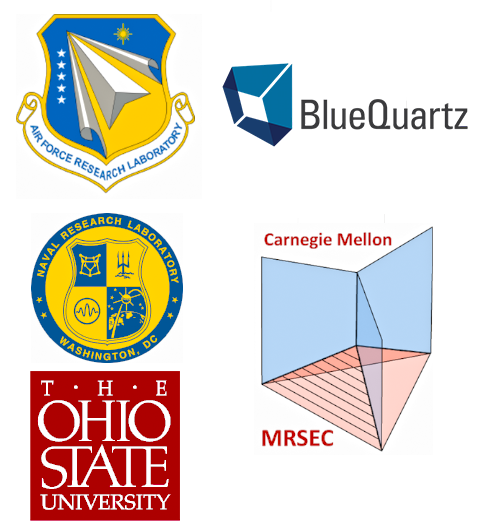

Funding and Contribution Acknowledgements 
========

## Funding Sources ##

Parts of DREAM.3D were written using the following funding sources:

+ US Air Force (AFRL) Contract FA8650-07-D-5800
+ Naval Research Labs (NRL) Contract N00173-07-C-2068.
+ US Air Force (AFRL) Contract FA8650-15-D-5231

Many others have contributed to the code including the following (non-exhaustive) list:

## Major Contributing Institutions ##

## List of Code Contributors (CC) and Vision Contributors (VC) ###

### Air Force Research Laboratory (AFRL) ###

+ Dr. Michael A. Groeber (VC, CC)
+ Dr. Adam Pilchak (VC, CC)
+ Dr. Megna Shah (VC, CC)
+ Dr. Michael Uchic (VC)
+ Dr. Chris Woodward (VC)
+ Dr. Sean P. Donegan (VC, CC)

### BlueQuartz Software ###

+ Mr. Michael A. Jackson (VC, CC)
+ Dr. Dennis Dimiduk (VC)
+ Mr. Joseph B. Kleingers (CC)
+ Mr. Matthew Marine (CC)
+ Dr. Megna Shah (VC, CC)

### Carnegie Mellon University ###

+ Dr. Tony Rollett (VC, CC)
+ Dr. Greg Rohrer (CC)
+ Dr. Marc De Graef (CC)
+ Dr. Sukbin Lee (CC)
+ Dr. Joseph C. Tucker (VC, CC)
+ Dr. Lisa Chan (CC)
+ Dr. Stephen Sintay (CC)
+ Dr. Abhijeet Brahme (CC)
+ Dr. David Saylor (CC)
+ Dr. Joe Fridy (CC)
+ Dr. Patrick Callahan (CC)
+ Dr. Shlomo Taasan (CC)

### Naval Research Laboratory (NRL) ###

+ Dr. Dave Rowenhorst (VC, CC)

### Ohio State University/Johns Hopkins University ###

+ Dr. Somnath Ghosh (VC)

### Other Institutions ###

+ Mr. William Lenthe (VC, CC) (University of California, Santa Barbara)
+ Mr. Matthew Priddy (CC) (Georgia Tech University)
+ Mr. Jarrell Waggoner (CC) (Univ. South Carolina)
