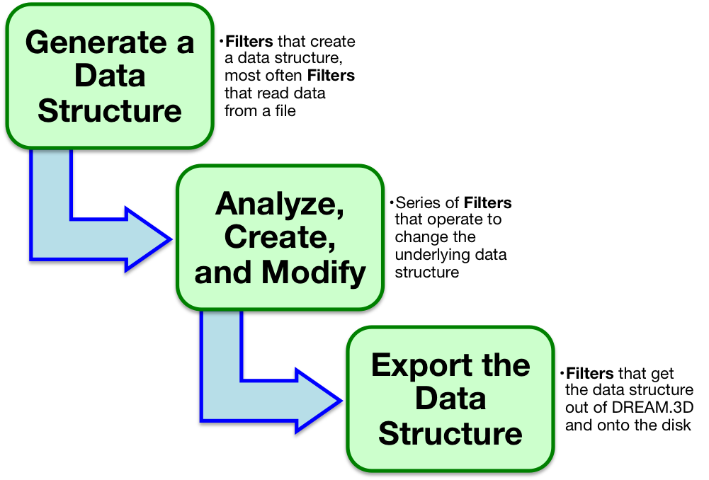

Creating a Pipeline {#creatingpipeline}
=========

In DREAM.3D, the user processes their data by creating what is known as a **Pipeline** which is constructed out of a series of **Filters**. By chaining together a series of **Filters**, the underlying data structure is processed and modified in quick succession. The user should be aware that all processing on the data is done **in place**, i.e., there is only a single copy of the data resident in memory at any one time. While this reduces the overall memory footprint, the user will have to be aware that their data may be modified from its original form. To help the user avoid accidentally overwriting data, all objects at a given hierarchy level in the [data structure](@ref datastructure) are not allowed to share the same name. For example, a data structure can have an **Attribute Matrix** named _foo_ that holds an **Attribute Array** named _bar_, but if the user tries to create a new **Attribute Matrix** named _foo_, an error will be presented in the **Pipeline Error Table**. The user _is allowed_ to create another **Attribute Array** named _bar_, however, as long as that **Attribute Array** belongs to a different **Attribute Matrix**. In other words, no two children of a given data structure object can share the same name!  

## Building a Pipeline ##
The interface mechanics of building a **Pipeline** are discussed in the [Overview of the User Interface](@ref userinterface) section. The concepts behind creating a **Pipeline** are presented here.  In an abstract sense, a **Pipeline** can be thought of as a series of _tubes_, where the individial pieces of _pipe_ are the **Filters**. The _fluid_ traversing the **Pipeline** is the underlying data structure. The **Filters** can change the overall direction of the data structure, compress it, morph it, modify it, and add to it, until finally the data structure comes out the other side. Each individual **Filter** will require certain kinds of inputs, which means that some **Filter** further up in the **Pipeline** must, at some point, create those necessary pieces of the data structure. DREAM.3D alerts the user if any of these pieces are missing by executing a process called **Preflight**. Think of **Preflight** as compiling a computer program: any compiler errors are populated in the **Pipeline Error Table**. Using this feedback, a user can modify the parameters of existing **Filters** and add new **Filters** to the **Pipeline** until all errors are silenced. It is then safe to run the **Pipeline** by clicking _Go_! While the **Pipeline** is running, you can click on **Filters** in the **Pipeline View** and inspect the items in the **Filter Input View**. Also, the _Start Pipeline_ button will change to a _Cancel Pipeline_ button when a **Pipeline** is running. Clicking _Cancel Pipeline_ will stop the **Pipeline** execution. Note that some **Filters** may not check for this _Cancel Pipeline_ click at any point during their operation. If this is the case, the **Pipeline** may wait to quit until after the current **Filter** has finished running. 

------

@image latex Images/PipelineAnatomy.png "Anatomy of a Pipeline" width=6in

------

But how do you know what kind of **Pipeline** to create? What are the primary ingredients of a useful **Pipeline**? First, it is important to become familiar with the DREAM.3D ontology. The best place to start is by reading and understanding the [DREAM.3D Data Structure](@ref datastructure) section. The terms presented to the user on **Filters** will use the same language as explained in the [DREAM.3D Data Structure](@ref datastructure) section. Once you are familiar with the DREAM.3D language, understanding the functions of **Filters** becomes much easier. The [Filter Documentation](@ref filterdocumentation) is also useful for getting to know specific **Filters**. 

When constructing a **Pipeline**, try to think about your data in terms of the DREAM.3D language. What kind of **Geometry** are you working? Is it a 2D picture made up of pixels (an **Image Geometry**)? A triangulated surface mesh (a **Triangle Geometry**)? What are the _unit elements_ of your **Geometry**? More importantly, where on your **Geometry** does your data lie? The _dimensional topology_ of the **Elements** the data lie on determines the type of **Attribute Matrix** to which that data will ultimately belong. For example, a 3D stack of images with grayscale data at every voxel would have a grayscale **Attribute Array** located in a **Cell Attribute Matrix**. 

Once you've translated your data into the DREAM.3D ontology, you can start thinking about constructing a **Pipeline** to do something interesting. All **Pipelines** will need to start by creating an instance of the DREAM.3D [data structure](@ref datastructure) in some fashion. This is usually accomplished by reading in some data from a file. Visit the [Supported File Formats](@ref supportedfileformats) section for information on the kinds of files DREAM.3D can understand. Next, you'll want to string together **Filters** to accomplish an analysis.  This is the interesting part about building a **Pipeline**. You can begin anlayzing the underlying data that lies on your **Geometry**, or think about grouping **Geometry** elements to form **Features**. For example, in the 3D grayscale image stack example, you may wish to group all elements into two classes by applying a threshold. This would group the **Geometry** elements into 2 **Features**. There are a host of **Filters** used to analyze your newly created **Features**, calculating information like their sizes and shapes (and much more!). At all steps in creating a **Pipeline**, try to think about your data using the abstract DREAM.3D ontology. This will not only help you in understanding what **Filters** do, but also allow you to remain flexible. Be imaginative!

After you've constructed the analysis portion of a **Pipeline**, you'll probably want to export your new data structure to your disk. Again, the [Supported File Formats](@ref supportedfileformats) section explains what sorts of files you can export. In particular, the native .dream3d file format is very useful, since it was designed to handle the abstract data structure. Also, the file is based on open source [HDF5](https://www.hdfgroup.org/HDF5/), meaning anyone can read the data!

Over time, you'll probably want to start saving your **Pipelines** so you can streamline the **Pipeline** creation process or share your workflow. The [Saving & Opening Pipelines](@ref importexportsavepipeline) section gives more details on this process.