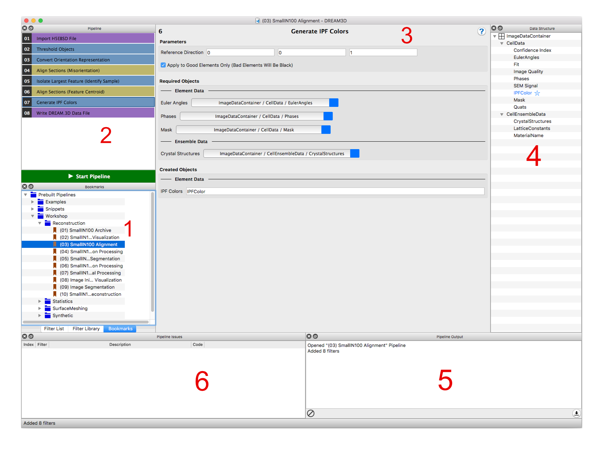
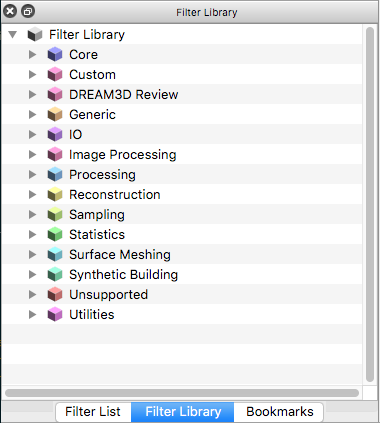
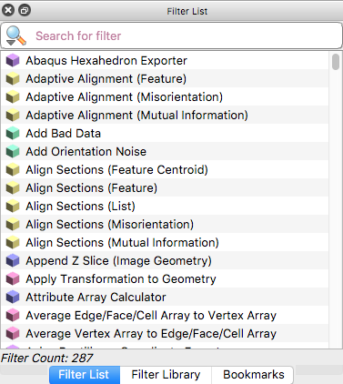
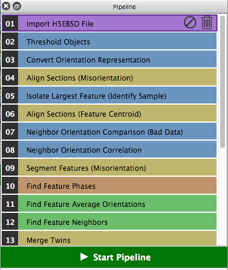
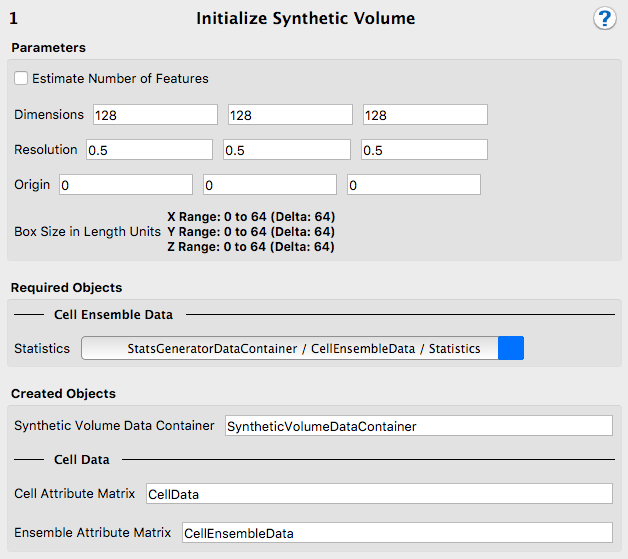
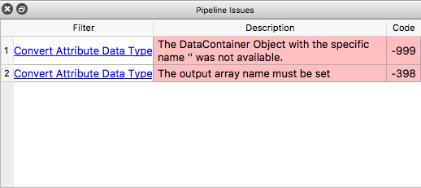

Overview of the User Interface {#userinterface}
=========

DREAM.3D has 7 main sections of its user interface:

1. [Filter Library](#filterlibrary)
2. [Filter List](#filterlist)
3. [Pipeline View](#pipelineview)
4. [Filter Input View](#filterinputview)
5. [Pipeline Error Table](#pipelineerrortable)
6. [Bookmarks View](#bookmarksview)
7. [Prebuilt Pipelines View](#prebuiltpipelinesview)

All sections, except the **Pipeline** View and the **Filter** Input View, can be _undocked_ from the main window and rearranged into any order that the user prefers.  Sections can also be dragged and dropped on top of each other, which then automatically puts those sections into a tabbed interface. Additionally, the sections that can be _undocked_ can also have their visibility toggled by the appropriate buttons found in DREAM.3D's **View** menu.

DREAM.3D allows the user to spawn as many _main windows_ as desired. To open a new DREAM.3D instance, click the _New..._ option in the _File_ menu. Each instance of DREAM.3D can act independently, and the user is allowed to run different **Pipelines** in each _main window_ at the same time.

In order to keep the size of the DREAM.3D exeuctable manageable, most of the libraries it depends on are distributed as loose files. This means that the actual DREAM.3D exeuctable **cannot be moved** outside of the folder it came in **unless all other contents of that folder are moved with it**.

------

@image latex Images/OverView-DREAM3D.png "Overview of the DREAM.3D User Interface" width=6in

------

<a name="filterlibrary">
## Filter Library ##
</a>

@image latex Images/OverView-FilterLibrary.png "Filter Library" width=6in

The **Filter Library** section organizes the **Filters** of DREAM.3D according to their _group_ and _subgroup_. The user can expand a specific _group_ (and possibly a _subgroup_) to expose the **Filters**. **Filters** are placed into groups and subgroups based on their _functionality_. This makes it easy to find **Filters** based on a desired function. In general, the **Filter** group will correspond to the **Plugin** that **Filter** resides in, but this may not always be the case.

------

<a name="filterlist">
## Filter List ##
</a>

@image latex Images/OverView-FilterList.png "Filter List" width=6in

The **Filter List** section organizes the **Filters** of DREAM.3D alphabetically by name. Using the search bar, the user can search for **Filters** based on the name.

### Searching Algorithms ###
Clicking on the magnifying glass icon in the search bar allows the user to pick between three different search algorithms:

+ **All Words**: Search for **Filters** with names that contain all the words in the search bar, in any order 
+ **Any Words**: Search for **Filters** with names that contain any of the words in the search bar, in any order
+ **Exact Phrase**: Search for **Filters** with names that match the phrase that is written in the search bar exactly

------

<a name="pipelineview">
## Pipeline View ##
</a>

@image latex Images/OverView-PipelineView.png "Pipeline View" width=6in

The **Pipeline View** section displays which **Filters** are in the current pipeline, and in what order. This section is where the user will construct their **Pipeline** by double clicking on a **Filter** in the **Filter List** or the **Filter Library**.  It is also possible to drag a **Filter** from these areas and drop it into the **Pipeline View**. **Filters** in this section can be rearranged into different orders via dragging and dropping the **Filter** objects. More information on creating **Pipelines** can be found in the [Creating a Pipeline](@ref creatingpipeline) section.

### Preflights & Errors ###
As the user updates the **Pipeline**, a process called **Preflight** will be executed to make sure that the **Pipeline** will have all the necessary data available during execution. If a **Filter** object in the **Pipeline** has an error, it will be colored red. If this is the case, check the [Pipeline Error Table](#pipelineerrortable) for an explanation of the error.

### Interacting With Filters & Pipelines ###
A **Filter** can be selected by single left clicking. Right clicking on a **Filter** opens a menu that allows the help for that **Filter** to be displayed by clicking _Filter Help_. **Filters** can be removed from the **Pipeline** by clicking the red _X_ icon on the **Filter** object. The entire **Pipeline View** can be cleared by either choosing *Clear Pipeline* from the *Pipeline* menu, or right clicking in an empty area of the **Pipeline View** to make a contextual menu appear with the *Clear Pipeline* option. After solving any **Preflight** errors and creating a satisfactory **Pipeline**, click the _Go_ button to start running.

------

<a name="filterinputview">
## Filter Input View ##
</a>

@image latex OverView-FilterInputView1.png "Filter Input View - Variables Tab" width=6in

@image latex Images/OverView-FilterInputView2.png "Filter Input View - Current Structure Tab" width=6in

The **Filter Input View** contains all the parameters for the selected **Filter**. There are two sections: **Variables** and **Current Structure**:

+ **Variables**: Contains **Filter** _Parameters_, _Required Arrays_, and _Created Arrays_:
	- _Parameters_ are generally inputs that influence the functionality of the **Filter**
	- _Required Arrays_ are data structure objects that are needed for the **Filter** to function
	- _Created Arrays_ are data structure objects that the **Filter** will create during its execution
+ **Current Structure** Displays the state of the data structure as it would look after the selected **Filter** has executed

### Viewing A Filter's Help Page ###
To view the help page for the selected **Filter**, press the _?_ icon.

------

<a name="pipelineerrortable">
## Pipeline Error Table ##
</a>

@image latex Images/OverView-PipelineErrorTable.png "Pipeline Error Table" width=6in

The **Pipeline Error Table** displays any errors and/or warnings associated with **Filters** that are actively being used in the **Pipeline View**.

### Preflights and Table Repopulation ###
This section gets repopulated every time the **Pipeline** runs its **Preflight** process, which makes sure that the **Pipeline** will have all the necessary data available to execute normally.  The **Preflight** process is run any time the user modifies the **Pipeline View** or **Filter Input View** sections.

------

<a name="bookmarksview">
## Bookmarks View ##
</a>

@image latex Images/OverView-BookmarksView.png "Bookmarks View" width=6in

The **Bookmarks View** is a section where the user can _bookmark_ any **Pipelines** that they have saved on the file system for later use.  This section allows the user to bookmark the pipelines in any structure that they want, using _virtual folders_. Visit the [Saving & Opening Pipelines](@ref importexportsavepipeline) section for more information on handling saved **Pipelines**.

**Pipelines** and folders containing **Pipelines** can be dragged from the file system into the **Bookmarks View**. The user can right click anywhere in the **Bookmarks View** to make a contextual menu appear with additional options.

@image latex Images/OverView-BookmarksViewMenu.png "Bookmarks Contextual Menu" width=6in

### Interacting With Bookmarks ###
To add a bookmark to the **Bookmarks View**, open the *Bookmarks* menu and choose *Add Bookmark*. Users can also use the **Bookmarks Contextual Menu** to add a bookmark by right clicking on an existing virtual folder or empty space and selecting *Add Bookmark*. **Bookmarks** and virtual folders can be renamed by right clicking on them and selecting the *Rename Bookmark* or *Rename Folder* option. To update a bookmark in the **Bookmarks View**, use the **Bookmarks Contextual Menu** by right clicking on a bookmark and select *Update Pipeline*. The **Bookmark** that was right clicked will be updated with the pipeline that is currently in the **Pipeline View**. To remove a **Bookmark** or virtual folder from the **Bookmarks View**, use the **Bookmarks Contextual Menu** by right clicking on a bookmark or virtual folder and select *Remove Bookmark* or *Remove Folder*. This procedure _does not_ delete the **Pipeline** files themselves, but only removes them from the **Bookmarks View**.

**WARNING:**  Removing a virtual folder will also remove all of its contents!

To add a virtual folder to the **Bookmarks View**, open the *Bookmarks* menu and choose *New Folder*. Users can also use the **Bookmarks Contextual Menu** by right clicking on a bookmark, virtual folder, or empty space, and selecting *New Folder*. A specific **Bookmark's** location on the file system can be viewed by by right clicking on a **Bookmark** and selecting *Show In Finder* (Mac OS X) or *Show In Windows Explorer* (Windows). To open a **Bookmark** in the **Pipeline View**, drag and drop it into the **Pipeline View**. **Bookmarks** can be dropped into the middle of existing **Pipelines** if desired. Double clicking on a **Bookmark** will open the **Pipeline** in a new _main window_.

------

<a name="prebuiltpipelinesview">
## Prebuilt Pipelines View ##
</a>

@image latex Images/OverView-PrebuiltPipelinesView.png "Prebuilt Pipelines View" width=6in

DREAM.3D provides several _prebuilt_ **Pipelines** that can aid new users in getting started with DREAM.3D.  These **Pipelines** are displayed in the **Prebuilt Pipelines View**. To open a prebuilt **Pipeline** in the **Pipeline View**, drag and drop it into the **Pipeline View**. Just as with **Bookmarks**, prebuilt **Pipelines** can be dropped into the middle of existing **Pipelines**. Double clicking on a prebuilt **Pipeline** will open the **Pipeline** in a new _main window_.

------