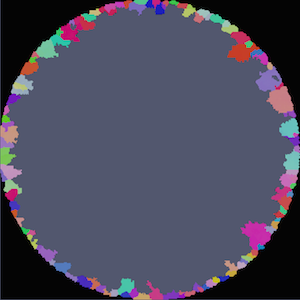
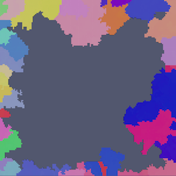

Find Surface Features {#findsurfacefeatures}
=============

## Group (Subgroup) ##
Generic (Spatial)

## Description ##
This **Filter** determines whether a **Feature** touches an outer surface of the sample. This is accomplished by simply querying the **Feature** owners of the **Cells** that sit at either . Any **Feature** that owns one of those **Cells** is said to touch an outer surface and all other **Features** are said to not touch an outer surface of the sample.

This **Filter** determines whether a **Feature** touches an outer _Surface_ of the sample volume. A **Feature** is considered touching the _Surface_ of the sample if either of the following conditions are met:

+ Any cell location is xmin, xmax, ymin, ymax, zmin or zmax
+ Any cell has **Feature ID = 0** as a neighbor.

The output of this filter is a **Feature** level array of booleans where 0=Interior/Not touching and 1=Surface/Touching.

*Note*: If there are voxels within the volume that have **Feature ID=0** then any feature touching those voxels will be considered a _Surface_ feature.

### 2D Image Geometry ###

If the structure/data is actually 2D, then the dimension that is planar is not considered and only the **Features** touching the edges are considered surface **Features**.

### Example Output ###

|  |   |
|-------|--------|
|  |   |
| Example showing features touching Feature ID=0 (Black voxels) | Example showing features touching the outer surface of the bounding box |

## Parameters ##

None

## Required Geometry ##

Image

## Required Objects ##

| Kind | Default Name | Type | Component Dimensions | Description |
|------|--------------|------|----------------------|-------------|
| **Cell Attribute Array** | FeatureIds | int32_t | (1) | Specifies to which **Feature** each **Cell** belongs |

## Created Objects ##

| Kind | Default Name | Type | Component Dimensions | Description |
|------|--------------|------|----------------------|-------------|
| **Feature Attribute Array** | SurfaceFeatures | bool | (1) | Flag of 1 if **Feature** touches an outer surface or of 0 if it does not |

## License & Copyright ##

Please see the description file distributed with this **Plugin**

## DREAM.3D Mailing Lists ##

If you need more help with a **Filter**, please consider asking your question on the [DREAM.3D Users Google group!](https://groups.google.com/forum/?hl=en#!forum/dream3d-users)

