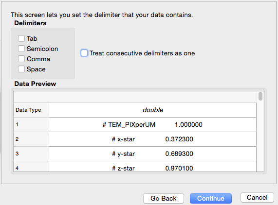

ImportASCIIData {#importasciidata}
=============

## Group (Subgroup) ##
IO (Input)

## Description ##
This **Filter** reads ASCII data from any text-based file and imports the data into DREAM.3D-style arrays.  The user uses the **Filter's** wizard to specify which file to import, how the data is formatted, what to call each array, and what type each array should be.

*Note:* This **Filter** is intended to read data that is column-oriented, such that each created DREAM.3D array corresponds to a column of data in the ASCII file. 

### Separating the Data ###

After clicking the **Import Data...** button and selecting a file, a wizard appears.  The user can choose whether their data is **Delimited** or **Fixed Width**:

### Selecting the Delimiter ###

If the user chose **Delimited**, the next screen allows the user to pick delimiters.  The options are **Tab**, **Semicolon**, **Comma**, and **Space**.  The user may also elect to treat consecutive delimiters as one delimiter.

### Selecting Import Rows, Data Representation and Column Headers ###

On the last page, the user can set the following information:

+ Row index to start the import
+ Header names, either from a line number in the file or manually
+ Tuple dimensions
+ Column data format (choosing the data type or deciding to skip the column)

If the data does not have any headers, the user can set a string value for each column. These values will be used as the name of the **Attribute Array** in DREAM.3D.

## Parameters ##
| Name | Type | Description |
|------|------|------|
| Wizard Data Object | ASCIIWizardData | The object that holds all relevant data collected from the wizard |

## Required Geometry ##
Not Applicable

## Required Objects ##
| Kind | Default Name | Type | Component Dimensions | Description |
|------|--------------|-------------|---------|-----|
| **Attribute Matrix** | None | Any | 1 | The path to the attribute matrix to store the arrays that will be imported |

## Created Objects ##
| Kind | Default Name | Type | Component Dimensions | Description |
|------|--------------|-------------|---------|-----|
| One or more **Element/Feature/Ensemble/etc. Attribute Array** | None | Any | 1 | One or more arrays that are created due to importing ASCII data via the wizard |

## License & Copyright ##

Please see the description file distributed with this plugin.

## DREAM3D Mailing Lists ##

If you need more help with a filter, please consider asking your question on the DREAM3D Users mailing list:
https://groups.google.com/forum/?hl=en#!forum/dream3d-users