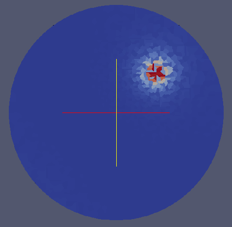
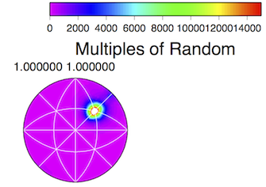

Visualize GBCD {#visualizegbcdgmt}
======

## EXPERIMENTAL FILTER WARNING ##

__This filter is highly experimental and under heavy development. Future versions of DREAM3D may not have this filter or output completely different files. Please do not depend on this filter for long term research use.__

## Group (Subgroup) ##
I/O Filters (Output)

## Description ##

**This is an experimental filter** that creates a few different types of visualization files based on regular and irregular grids of the GBCD data for DREAM3D. Currently there are 3 different types of output files that are created all of which can be visualized in ParaView.

-----

1: Stereographic Projection on a Regular Grid

-----

2: Stereographic Projection on an Irregular Grid

To generate this view in ParaView the user should load the .vtk file and then apply the Delauney 2D filter to the data.

-----

3: The GBCD Data where all the points are on a unit sphere but on an irregular grid.

To generate this view in ParaView the user should load the .vtk file and then apply the Delauney 3D filter to the data.

-----

4: The GBCD Data plotted using the [GMT](http://gmt.soest.hawaii.edu) package

------------

## Parameters ##
| Name | Type | Description |
|------|------|-------------|
| Crystal Structure | Enumeration | Chose from Hexagonal-High 6/mmm or Cubic-High m-3m |
| Misorientation Angle | float | Floating Point value in DEGREES |
| Misorientation Axis | float | Floating point 1x3 vector that is the rotation axis |
| Regular Grid Pole Figure | File Path | GMT Output File |

## Required Geometry ##
Triangle

## Required Arrays ##
| Type | Default Name | Type | Component Dimensions | Description |
|------|--------------|-------------|---------|-----|
| Ensemble | GBDC | Double | (5) | 5 parameter GBCD data. Currently stored as Ensemble data in the Surface Mesh Data Container. Filters Known to Create Data: FindGBCD  |

## Created Arrays ##

None

## License & Copyright ##

Please see the description file distributed with this plugin.

## DREAM3D Mailing Lists ##

If you need more help with a filter, please consider asking your question on the DREAM3D Users mailing list:
https://groups.google.com/forum/?hl=en#!forum/dream3d-users

