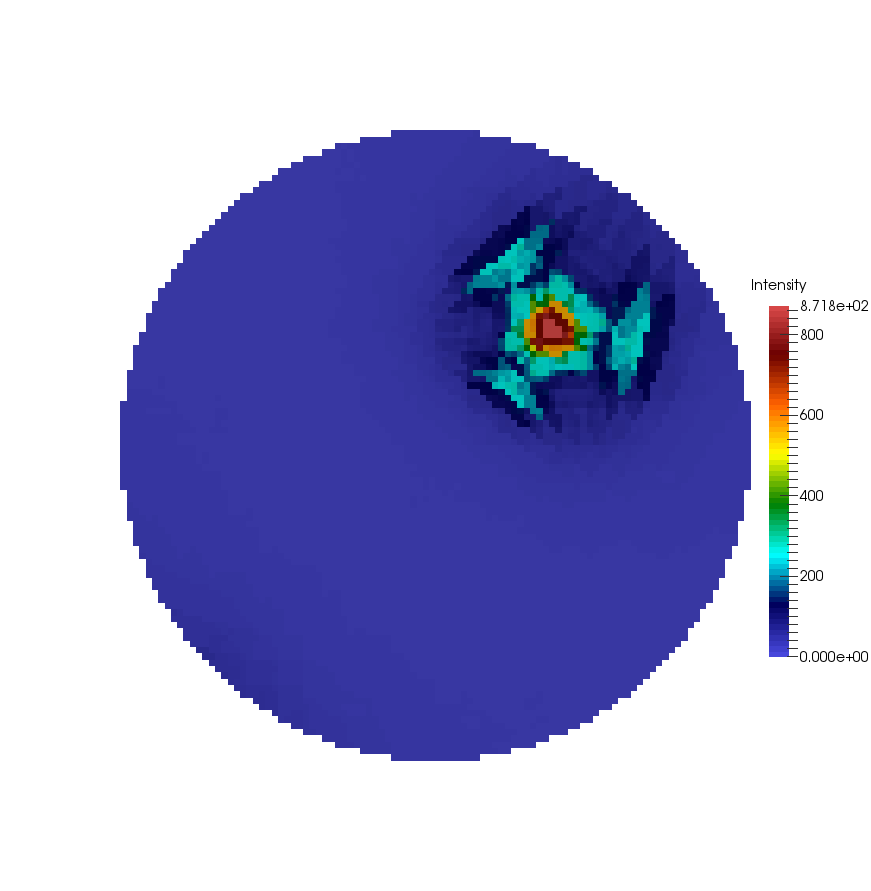

Write GBCD Pole Figure (VTK) {#visualizegbcdpolefigure}
============

## Group (Subgroup) ##
IO (Output)

## Description ##
This **Filter** creates a .vtk file that can be used in [ParaView](http://www.paraview.org/) to visualize a Grain Boundary Character Distribution (GBCD) pole figure.

-----

@image latex Small_IN00_GBCD_RegularGrid.png "Regular Grid Visualization of the Small IN100 GBCD results" width=6in 

@image latex Small_IN100_GBCD_Delaunay2D.png "Using ParaView's Threshold filter + Cells to Points + Delaunay2D Filters" width=6in 

-----

## Parameters ##
| Name | Type | Description |
|------|------|-------------|
| Crystal Structure | Enumeration | Crystal structure for GBCD. Currently supports from Hexagonal-High 6/mmm or Cubic-High m-3m symmetries |
| Misorientation Axis-Angle | Float (4x) | Axis-Angle pair values for drawing GBCD |
| Output Regular Grid VTK File | File Path | The output .vtk file path |

## Required Geometry ##
Triangle

## Required Objects ##
| Kind | Default Name | Type | Component Dimensions | Description |
|------|--------------|-------------|---------|-----|
| **Ensemble Attribute Array** | GBDC | Double | (n,m,l,o,q,r) | 5 parameter GBCD data. The 6th component is used internally to track the northern vs. southern hemisphere of the Lambert sphere |

## Created Objects ##
None

## License & Copyright ##

Please see the description file distributed with this **Plugin**

## DREAM.3D Mailing Lists ##

If you need more help with a **Filter**, please consider asking your question on the [DREAM.3D Users Google group!](https://groups.google.com/forum/?hl=en#!forum/dream3d-users)

